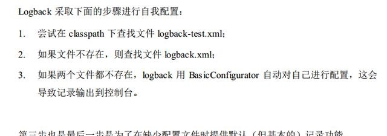
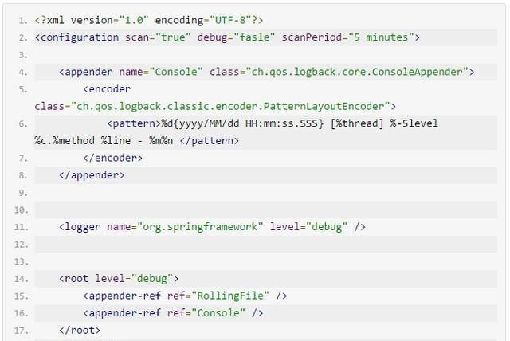

# logback不打印Spring日志？看这里两步解决

logback是在log4j基础上重写了内部的实现，在某些特定的场景上面，甚至可以比之前的速度快上10倍。在保证logback的组件更加快速的同时，同时所需的内存更加少。所以logback是一个不错的选择，当然你也可以选择其他的日志组件。

1、为了使logback能打印Spring的日志这里需要添加几个依赖，默认logback是不会打印Spring的日志

```
		<!--LOG begin-->
		<!--logback-ext-spring是由官方提供的对spring的支持-->
		<dependency>
			<groupId>org.logback-extensions</groupId>
			<artifactId>logback-ext-spring</artifactId>
			<version>0.1.4</version>
		</dependency>
		<!--jcl-over-slf4j是用来把spring源代码中大量使用到的commons-logging替换成slf4j，只有在添加了这个依赖之后才能看到spring框架本身打印的日志，否则只能看到开发者自己打印的日志-->
		<dependency>
			<groupId>org.slf4j</groupId>
			<artifactId>jcl-over-slf4j</artifactId>
			<version>1.7.25</version>
		</dependency>
		<!-- slf4j -->
		<dependency>
			<groupId>org.slf4j</groupId>
			<artifactId>slf4j-api</artifactId>
			<version>1.7.25</version>
		</dependency>

		<!-- logback -->
		<!--logback-classic包含了logback本身所需的slf4j-api.jar、logback-core.jar及logback-classic.jar -->
		<dependency>
			<groupId>ch.qos.logback</groupId>
			<artifactId>logback-classic</artifactId>
			<version>1.1.2</version>
		</dependency>
		<dependency>
			<groupId>ch.qos.logback</groupId>
			<artifactId>logback-core</artifactId>
			<version>1.1.2</version>
		</dependency>
		<dependency>
			<groupId>ch.qos.logback</groupId>
			<artifactId>logback-access</artifactId>
			<version>1.1.2</version>
		</dependency>
		<!--LOG end-->
```

2、编写logback.xml文件，然后将logback.xml直接放在classpath下面即可。Logback 可以通过编程式配置，或用 XML 格式的配置文件进行配置。




这里我们直接使用最熟悉的logback.xml来配置日志信息,




这样一来当你的项目启动的时候就可以看到详细的Spring的启动信息。就是简单的两步。

小提示：

1、如果你将logback.xml丢在classpath下面，是不需要在web.xml里面配置任何信息的，就上面的内容就足够了。千万别像log4j一样在web.xml里面配置一大堆。

2、下篇文章简单的介绍logback的使用，如果有兴趣，可以关注it浪子号，及时得到最新信息。


https://baijiahao.baidu.com/s?id=1563660845241703&wfr=spider&for=pc