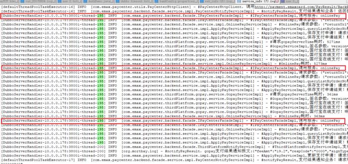
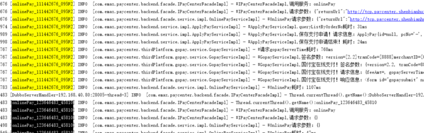

[TOC]


# logback 巧用CurrentThread.Name来统一标识日志记录

2017.08.23 14:30* 字数 801 阅读 40评论 0喜欢 2

java版本支付中心，日志组件使用的是logback。logback.xml里日志pattern配置如下：

```
<!--本地日志目录-->
<property name="USER_HOME" value="${catalina.base}/logs/logback-srv" />
<property name="LOG_MSG" value="%X{sid}%d{yyyy-MM-dd HH:mm:ss.SSS} [%t] %-5p [%c] - %m%n" />
<property name="LOG_DIR" value="${USER_HOME}/%d{yyyyMMdd}"/>
<!--2017-08-22 10:43:19.307 [DubboServerHandler-10.0.0.178:38001-thread-187] INFO  [com.emax.paycenter.backend.facade.IPayCenterFacadeImpl]-->
<appender name="STDOUT" class="ch.qos.logback.core.ConsoleAppender">
    <encoder>
        <pattern>${LOG_MSG}</pattern>
    </encoder>
</appender>

```

pattern里有%t，即代表的是线程Id（起初，我误认为这个%t指的是线程Id！！！），而每一笔交易请求的处理是在一个单独的线程里，那么它就可以标记每一笔交易请求对应的所有日志。日志文件截图如下：



logback-info

分析日志发现，这个线程标识如截图里的“DubboServerHandler-10.0.0.178:38001-thread-195”会被不同的交易请求重用，不能唯一标记一个线程处理，这显然加大了线上问题的排障难度。昨天晚上，项目组里我们2人决定要针对这一点不足做一次改进。

之前的.net版支付中心，我对统一标记一笔交易请求的所有日志做过一次重构，见《巧用CurrentThread.Name来统一标识日志记录》。显然，java的也有必要用一个唯一的标识来标记一笔交易请求的所有日志。

当前线程的线程Id是只读的，我们改不了。那该怎么实现呢？

经验告诉我用currentThread的Name属性来搞。可是问题来了，我在交易处理的第一个语句里给当前线程名赋值后，此后的各module各方法里的每一条log.info语句都要显式记录上当前线程名，改动太多了。而且，这样的代码不免有股怪怪的味道。

当然，另一个办法是按照.net版那种思路，做个日志代理类，对上面的调用log.info并显式记录当前线程名做个封装，然后，逻辑代码里记日志就调用这个代理类。这样实现的弊端与上面的方案半斤八两。

## 那怎么办呢？

问呗。
先问度娘，无解。
接着问同事，说要自己写一个apperder。对logback底层代码的未知会加大解决问题的难度。
*【百度：logback 自定义appender读logback源码系列文章（五）——Appender http://kyfxbl.iteye.com/blog/1173788】*

## 无心插柳

我早上上班后，先了解了一下构造一个唯一字符串标识来给当前线程名赋值。然后在交易处理的的第一个语句前，写了如下两行代码，

```
public BaseResponse invoke(String requestJSON, BaseRequest baseRequest) throws Exception {
    String threadName = String.format("%s_%s_%s",
            baseRequest.getMethod(),
            new SimpleDateFormat("HHmmssS").format(new Date()),
            UUID.randomUUID().toString().toUpperCase().substring(0, 5));
    Thread.currentThread().setName(threadName);

    log.info("#IPayCenterFacadeImpl,调用服务：{}", baseRequest.getMethod());
    log.info("#IPayCenterFacadeImpl,请求参数：{}", requestJSON);
    //1.获取API接口实现
    IPayCenterApi payCenterApi = (IPayCenterApi) payCenterServiceFactory.getService(baseRequest.getMethod());

    //2.处理业务逻辑
    BaseResponse result = payCenterApi.handle(requestJSON);

    return result;
}

```

不经意间，在运行代码时，我发现%t那段的线程信息标识是我给当前线程名设置的那个字符串标识。

这才发现，%t或%thread输出的原来是产生日志的线程名！！
*【调试代码可知 Thread.currentThread().getName():DubboServerHandler-192.168.40.80:28005-thread-2，Thread.currentThread().getId():246】*

经过了这个波折，我们的问题最终得到解决，兴奋异常。看看下面的日志截图，一股强烈的成就感油然而生 O(∩_∩)O




logback-变更线程名之后


https://www.jianshu.com/p/f84785952337