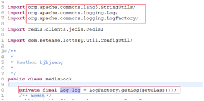
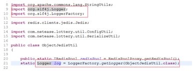
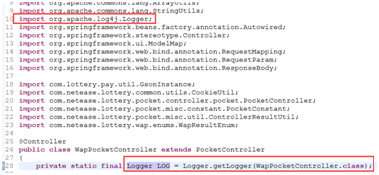
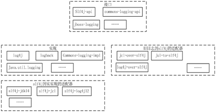

# 日志工具现状调研

## 1.日志应用现状

> 目前技术团队各应用系统中对log4j,slf4j,jcl等日志工具类的使用不够明确，导致出现日志类声明混乱、打印日志格式不统一、打印日志无法fatal报警等问题。我们现在主要采用jcl+log4j的方式，但是如果不经意间引入了slf4j，则会出现一些异常情况，如：引入jcl-over-slf4j会导致日志通过slf4j打出，没有fatal方法。

以某系统为例，当前系统中几种声明log实例对象的方式：

- Common-logging:

[](image-201712161746/1-1.png)

- Slf4j:

[](image-201712161746/1-2.png)

- Log4j(**不推荐直接使用实现类声明的方式**):

[](image-201712161746/1-3.png)

  针对这类问题，对当前java比较流行的一些日志工具进行了调研，以期能够在未来的开发使用中做到全组代码风格统一，日志写得好对于我们开发调试，线上问题追踪等都有很大的帮助。以下是对工具类的一些介绍和性能对比，日志易用性、日志输出的速度、日志输出对于系统内存、CPU的影响都会成为考量指标。

## 2.日志工具类介绍

  比较常用的工具类有Log4j、SLF4j、Commons-logging（简称jcl）、logback、log4j2(log4j升级版)、jdk logging。大致可分为两类：接口类，包括Commons-logging、SLF4j；实现类，Log4j、log4j2、logback，jdk自带的就先不考虑了。各框架之间对应关系如下：

[](image-201712161746/2-1.png)

### 2.1.日志接口类工具

  Java应用系统中的日志门面，即它们提供了一套通用的接口，具体的实现可以由开发者自由选择。一般我们在程序开发的时候，会选择使用commons-logging或者slf4j这些日志门面，而不是直接使用log4j或者logback这些实现。这样做的好处是，我们可以自由选择日志实现。 特别是对于一些开源框架来说更是如此，在提供给其他人使用的时候，使用我们框架的人使用的日志框架是复杂多变的，不确定的，所以如果我们开源框架里选择了一个具体的日志实现，而碰巧这个日志实现的可扩展性和兼容性又不好，那么使用我们开源框架的人为了满足我们框架的日志，就只能跟我们框架用一样的日志实现，否则打印日志可能就会有问题。这样一来，使用我们框架的开发者的自由度就降低了。

- **Commons-logging**

  Commons-loggin是apache最早提供的日志的门面接口。它的主要作用是提供一个日志门面，使用者可以使用不同的日志实现。用户可以自由选择第三方的日志组件作为具体实现，像log4j，或者jdk自带的logging， common-logging会通过动态查找的机制，在程序运行时自动找出真正使用的日志库。common-logging内部有一个Simple logger的简单实现，但是功能很弱。

- **SLF4j**

  SLF4j是Simple Logging Facade for Java的简称，即java的简单日志门面。类似于Apache Common-Logging，是对不同日志框架提供的一个门面封装，可以在部署的时候不修改任何配置即可接入一种日志实现方案。但是，它在编译时静态绑定真正的Log库。使用SLF4J时，如果你需要使用某一种日志实现，那么你必须选择正确的SLF4J的jar包的集合（各种桥接包，如slf4j-log4j12.jar、slf4j-jcl.jar等；**注意：如果有任意两个实现slf4j 的包同时出现，那么就可能出现问题**）。

  SLF4j相对于jcl接口能支持多个参数，并通过{} 占位符进行替换，避免logger.isXXXEnabled 这种无奈的判断，带来性能提升。

### 2.2. 日志实现类工具

- **Log4j**

  **Log4j：**经典的一种日志解决方案。内部把日志系统抽象封装成Logger 、appender 、pattern等实现。我们可以通过配置文件轻松的实现日志系统的管理和多样化配置。pache的一个开放源代码项目，通过使用Log4j，我们可以控制日志信息输送的目的地是控制台、文件、GUI组件、甚至是套接口服务器、NT的事件记录器、UNIXSyslog守护进程等；用户也可以控制每一条日志的输出格式；通过定义每一条日志信息的级别，用户能够更加细致地控制日志的生成过程。这些可以通过一个 配置文件来灵活地进行配置，而不需要修改程序代码。

- **log4j2**

  **Log4j2**是Log4j的升级版，与之前的版本Log4j 1.x相比、有重大的改进，在修正了Logback固有的架构问题的同时，改进了许多Logback所具有的功能。log4j2与log4j1发生了很大的变化，不兼容。log4j1仅仅作为一个实际的日志框架，slf4j、commons-logging作为门面，统一各种日志框架的混乱格局，现在log4j2也想跳出来充当门面了，也想统一大家了。哎，日志格局越来越混乱了。

  使用方式：Logger logger=LogManager.getLogger(Log4j2Test.class);

  具体功能和性能上的改进可以参考：<https://my.oschina.net/xianggao/blog/523020>

- **logback**

  **logback**:也是一种日志实现。Logback是由log4j创始人设计的又一个开源日记组件。logback当前分成三个模块：logback-core,logback-classic和logback-access。logback-core是其它两个模块的基础模块。logback-classic是log4j的一个改良版本。此外logback-classic完整实现SLF4J API使你可以很方便地更换成其它日记系统如log4j或JDK14Logging。logback-access访问模块与Servlet容器集成提供通过Http来访问日记的功能。

  LOGBack 作为一个通用可靠、快速灵活的日志框架，将作为Log4j 的替代和SLF4J 组成新的日志系统的完整实现。官网上称具有极佳的性能，在关键路径上执行速度是log4j 的10 倍，且内存消耗更少。比如判定是否记录一条日志语句的操作，其性能得到了显著的提高。这个操作在LogBack中需要3纳秒，而在Log4J中则需要30纳秒。 LogBack创建记录器（logger）的速度也更快：13微秒，而在Log4J中需要23微秒。更重要的是，它获取已存在的记录器只需94纳秒，而 Log4J需要2234纳秒，时间减少到了1/23。”。

### 2.3. 工具类相关jar包

- Jcl：commons-logging.jar
- Log4j: log4j.jar
- Logback: logback-core、logback-classic、logback-access
- Slf4j：slf4j-api（接口）、slf4j-log4j12(log4j适配实现)、slf4j-simple、jcl-over-slf4j(jcl日志打到slf4j接口上)、log4j-over-slf4j、slf4j-jcl

## 3.日志工具组合对比

  common-logging通过动态查找的机制，在程序运行时自动找出真正使用的日志库；slf4j在编译时静态绑定真正的Log库。以下是几种比较常见的日志方案组合：

### 3.1. Commons-logging+log4j

  这是我们系统内部现在日志主要声明方式，接口类为jcl，实现类为log4j。common-logging会通过动态查找的机制，在程序运行时自动找出真正使用的日志库。只要应用系统引入了log4j.jar包 并在classpath 配置了log4j.xml ，则commons-logging 就会使log4j 使用正常，而代码里不需要依赖任何log4j 的代码。需要的jar包：

- commons-logging
- log4j

### 3.2.Slf4j+logback

  SLF4J是编译时绑定到具体的日志框架，性能优于采用运行时搜寻的方式的commons-logging
SLF4J提供了更好的日志记录方式，带来下这几方面的好处：

1. 更好的可读性；

2. 不需要使用logger.isDebugEnabled()来解决日志因为字符拼接产生的性能问题。比如：

   logger.debug(“Processing trade with id: {} and symbol : {} “, id, symbol);

3. logback支持了更方便的自定义日志，便于后期的日志分析，可以将日志格式化保存到各种存储引擎中，请点击这里 可以将日志写入到HBase等。**但是SLF4J不支持FATAL级别！**

  需要的jar包：

- slf4j-api
- logback-core
- logback-classic(集成包)

### 3.3.Log4j2

  Log4j2的性能在某些关键领域比Log4j 1.x更快，而且大多数情况下与Logback相当；也支持占位符的方式去记录日志参数。log4j2需要的jar分成2个：

- log4j-api： 作为日志接口层，用于统一底层日志系统
- log4j-core : 作为上述日志接口的实现，是一个实际的日志框架

### 3.4.Commons-logging+log4j 2

  这种方式可以用到log4j的实现，效率比较高，但是不能因为接口使用的jcl，所以不能使用占位符方式去打印参数。需要jar包：

- commons-logging
- log4j-api
- log4j-core
- log4j-jcl（log4j2与commons-logging的集成包）

## 4.总结

  

### 4.1.哪种组合更好？

  为了考虑扩展性，一般我们在程序开发的时候，会选择使用commons-logging或者slf4j这些日志门面，而不是直接使用log4j或者logback这些实现。即我们写代码的时候导入的类一般都是来自门面框架中的类，然后将某个日志的实现框架加入到项目中，提供真正的日志输出功能。 现在的方式commons-logging+log4j组合在性能和部分功能上都比较弱，如果要改进可以考虑以下几点：

- **考虑性能和占位符等功能方面：**推荐slf4j+logback方式 或者log4j2方式，这种方式对现有系统迁移改动较大，无论是代码内log声明还是配置文件上，而且slf4j不支持fatal打印；
- **考虑系统迁移性：**推荐commons-logging+log4j2,代码不需要改动，只需要改动对应log4j配置文件即可，但是无法利用其占位符功能；
- **新系统搭建：**不涉及到系统迁移的情况，新系统搭建可以采用纯log4j2方式，其既提供了接口也提供了实现，在性能上也得到了比较大提升; Log4j 2使用了新一代的基于LMAX Disruptor的无锁异步日志系统。在多线程的程序中，异步日志系统吞吐量比Log4j 1.x和logback高10倍，而时间延迟却更低。

### 4.2.为什么我们系统有时不打fatal

  现有系统有时候在引入新的jar包后，会出现fatal日志无法打印的问题，查看maven jar包依赖发现：引入了jcl-over-slf4j.jar

```
Huluwa ---> log to Apache Commons Logging--->jcl-over-slf4j.jar --- (redirect) ---> SLF4j  ---> 输出日志

```

  Slf4j本身不提供fatal级别日志打印，所以fatal报警就没了。。。

### 4.3.总结

- 对现有系统，为了不大规模修改系统代码，可以采用jcl接口+log4j2实现的组合方案；修改现在系统中log4j和slf4j的声明方式为common-logging声明方式，日志实例声明方式统一为：private final static Log LOG = LogFactory.getLog(xxxx.class);
- 对未来新系统，可以直接采用log4j2的实现方案；
- 现有系统引入外来jar包时，一定要注意排除掉jcl-over-slf4j.jar包；最好将现在系统中slf4j相关jar包引用去掉，方便做到日志声明格式统一。

### 5.实际使用log4j2的一些发现

- log4j2使用原生的LogManager来获取LOG对象。
- 使用LogFactory(commons-logging)时除了要排除jcl-over-slf4j，还要加入一个log4j-jcl的依赖，否则LogFactory(commons-logging)不起作用。
- 使用LogManager(log4j2)、LogFactory(commons-logging)、LoggerFactory(slf4j)获得的日志对象都可以通过log4j2.xml来进行配置。
- spring boot提供的spring-boot-starter-log4j2直接整合了log4j2的一系列依赖，通过引入它，可以简化Maven配置。
- Spring、Mybatis、Curator、Zookeeper、EasyMQ、RocketMQ、Kafka、网易自研的alive-client都可以无感知地使用log4j2。
- Druid支持log4j2，但是需要做一些改动：首先，要在配置Datasource之前，调用System.setProperty(“druid.logType”,”log4j2”)，这一步也可以通过JVM参数来配置；其次，需要将Log4jFilter替换成Log4j2Filter。
- dubbo需要添加Logger配置以使用log4j2:或。
- log4j版本对于Jedis、Redisson没有影响。
- ZkClient需要升级到最新的0.10版本才能兼容log4j2，不升级的话则需要引入log4j依赖和配置文件。
- 网易自研的kafka-client、gather-data、cron直接使用了log4j（即通过Logger.getLogger()来获取Log对象），如果需要使用这些依赖，也必须引入log4j依赖和配置文件。
- 对于flume，log4j2提供了专门的appender，所以需要改变原有的集成方式。详见<http://logging.apache.org/log4j/2.x/manual/appenders.html#FlumeAppender。>

## 参考链接

<http://blog.onlycatch.com/post/cfbc30f8d1ba>

<http://www.cnblogs.com/digdeep/p/4778317.html>

<http://www.open-open.com/lib/view/open1430700956679.html>


image-201712161746/