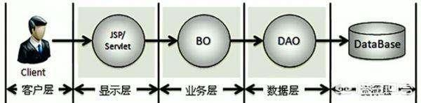

[TOC]

# vo、po、dto、bo、pojo、entity、mode如何区分？

称呼确实很多，我把我知道的总结一下：

## VO

value object：值对象

通常用于业务层之间的数据传递，由new创建，由GC回收。

主要对应界面显示的数据对象。对于一个WEB页面，或者SWT、SWING的一个界面，用一个VO对象对应整个界面的值。
比如在某页面上需要显示很多数据，但是一个po搞不定，这是你就可以自己定义Vo去处理了。

## PO

persistant object：持久层对象

对应数据库中表的字段。

VO和PO，都是属性加上属性的get和set方法；表面看没什么不同，但代表的含义是完全不同的。

## Entity  

实体bean ，一般是用于ORM 对象关系映射 ，一个实体映射成一张表，一般无业务逻辑代码。
如果是简单的java对象就是pojo，如果进行了持久化有了orm映射以后就是po。
po的作用简单的说就是将数据库中的表映射成java对象，就是属性对应数据库字段。

## DTO

data transfer object：数据传输对象。

表里面有十几个字段：id,name,gender(M/F),age,conmpanyId(如001)...

页面需要展示四个字段：name,gender(男/女),age,conmpanyName(如今日头条股份有限公司)。

DTO由此产生，一是能提高数据传输的速度（减少了传输字段），二能隐藏后端表结构。

## BO

business object：业务对象

BO把业务逻辑封装为一个对象。

我理解是PO的组合，比如投保人是一个PO，被保险人是一个PO，险种信息是一个PO等等，他们组合起来是第一张保单的BO。

## POJO

plain ordinary java object：简单无规则java对象

纯的传统意义的java对象，最基本的Java Bean只有属性加上属性的get和set方法。

可以转化为PO、DTO、VO；比如POJO在传输过程中就是DTO。

## DAO

data access object：数据访问对象

主要用来封装对数据的访问，注意，是对数据的访问，不是对数据库的访问。

其他的还有model/module/domain/entity什么的...等我再总结总结...

我想把它们翻译成“人话”讲出来。

------

希望我的回答能够帮助到你！

https://www.wukong.com/answer/6535030067171442948/?iid=28537493856&app=news_article&share_ansid=6535030067171442948&tt_from=android_share&utm_medium=toutiao_android&utm_campaign=client_share