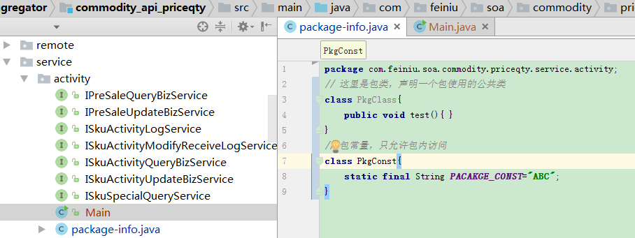

# java教程中的package-info类与个人的一些解释和看法，它是如何来实现为包进行编程的       

不知道学习java的同学在java教程中是否了解过一个类，叫做package-info类，它的出现也有它的意义，一般在java教程中都会有它的介绍，而对于它是否真正起到作用，其实很多java教程都把它作为一个不是非常必要的类，为什么呢？ 因为用到的地方不是很明显或者说不是特别多，一般的java教程都会有以下的介绍，但是笔者综合了一般的java教程加上自己的理解，写了这篇package-info类的服务包过程。

### Java 中有一个特殊的类：package-info 类，它是专门为本包服务的，为什么说它特殊呢？ 主要体现在3 个方面：

#### 它不能随便被创建 

在一般的IDE 中，Eclipse、package-info 等文件是不能随便被创建的，会报“Type name is notvalid”错误，类名无效。 在Java 变量定义规范中规定如下字符是允许的：字母、数字、下划线，以及那个不怎么常用的$ 符号，不过中划线可不在之列，那怎么创建这个文件呢？ 很简单，用记事本创建一个，然后拷贝进去再改一下就成了，更直接的办法就是从别的项目中拷贝过来。

#### 它服务的对象很特殊 

一个类是一类或一组事物的描述，比如Dog 这个类，就是描述“旺财”的，那package-info这个类是描述什么的呢？ 它总要有一个被描述或被陈述的对象吧，它是描述和记录本包信息的。

#### package-info 类不能有实现代码 

package-info 类再怎么特殊也是一个类， 也会被编译成package-info.class， 但是在package-info.java 文件里不能声明package-info 类。

### 在java教程中package-info 类还有几个特殊的地方，比如不可以继承，没有接口，没有类间关系（关联、组合、聚合等）等，不再赘述，Java 中既然允许存在这么一个特殊的类，那肯定有其特殊的作用了，我们来看看它的作用，主要表现在以下三个方面：

#### 声明友好类和包内访问常量 

这个比较简单，而且很实用，比如一个包中有很多内部访问的类或常量，就可以统一放到package-info 类中，这样很方便，而且便于集中管理，可以减少友好类到处游走的情况，代码如下： 

// 这里是包类，声明一个包使用的公共类 

class PkgClass{ 

public void test(){ } 

} 

// 包常量，只允许包内访问 

class PkgConst{ 

static final String PACAKGE_CONST=”ABC”; 

} 

图例：

 

注意以上代码是存放在package-info.java 中的，虽然它没有编写package-info 的实现，但是package-info.class 类文件还是会生成。 java教程中说到通过这样的定义，我们把一个包需要的类和常量都放置在本包下，在语义上和习惯上都能让程序员更适应。

#### 为在包上标注注解提供便利 

比如我们要写一个注解（Annotation），查看一个包下的所有对象，只要把注解标注到package-info 文件中即可， 而且在很多开源项目也采用了此方法， 比如Struts2 的@namespace、Hibernate 的@FilterDef 等。

#### 提供包的整体注释说明 

java教程中解释说，如果是分包开发，也就是说一个包实现了一个业务逻辑或功能点或模块或组件，则该包需要有一个很好的说明文档，说明这个包是做什么用的，版本变迁历史，与其他包的逻辑关系等，package-info 文件的作用在此就发挥出来了，这些都可以直接定义到此文件中，通过javadoc 生成文档时，会把这些说明作为包文档的首页，让读者更容易对该包有一个整体的认识。 当然在这点上它与package.htm 的作用是相同的，不过package-info 可以在代码中维护文档的完整性，并且可以实现代码与文档的同步更新。

解释了这么多，总结成一句话：在需要用到包的地方，就可以考虑一下package-info 这个特殊类，也许能起到事半功倍的作用。

​       其实，笔者对于这篇文章还是有一些描述的不是很贴切的，毕竟没有具体的代码来为每段话做一一描述和解释，而java教程中也并没有列举这个类具体的一些代码和解释，从而其实可以看出java教程中，对于这个类的推荐程度不是特别高，但是笔者还是认为，我们不要受java教程的影响，不要认为java教程中没有重点突出的类就不用重视，其实，笔者觉得，有用的东西都需要重视，都可以拿来主义哦。

转：http://www.ityuedu.com/article/6170132376/