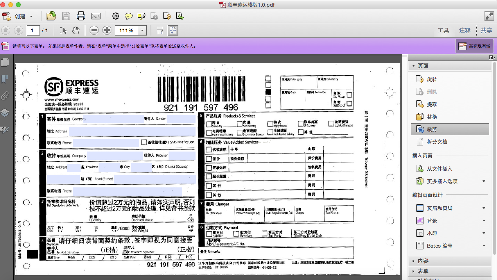
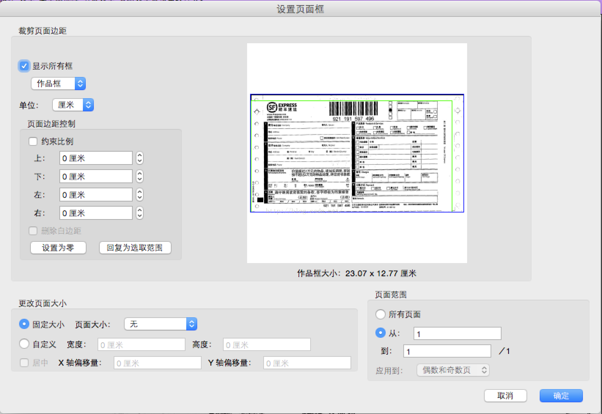
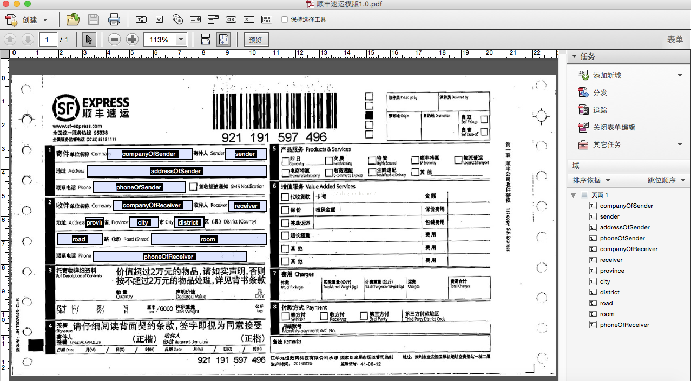

# java套打pdf做模版itext填数据

原创 2016年03月31日 16:53:45

企业应用的项目开发，一定会遇到打印，也一定有套打的需求，比如打印报销单据了，打印发票了什么的。

接上次用word2003和excel2003实现快递单套打的临时解决方案后，今天说说java程序实现套打。

模版选择的是pdf，这个也是国外用的多的，需要安装Adobe Acrobat。

首先，创建pdf文件，工具栏－》页面－》裁剪。



工具栏－》页面－》背景，设置顺丰速运的快递单扫描件为背景。

双击页面，弹出页面大小设置窗口，设置大小，以顺丰为例230mm＊127mm。



工具栏－》表单－》编辑，添加12个文本域。



删除背景图片，保存pdf为《顺丰速运模版2.0.pdf》

＝＝＝＝＝＝＝＝＝＝＝＝＝＝＝＝＝＝＝＝＝＝＝＝＝＝＝＝＝＝＝＝＝＝＝＝＝＝＝＝＝＝＝＝＝＝＝＝

JAVA程序实现，新建一个maven工程，pom.xml增加itext的依赖

```
<packaging>war</packaging>

<dependencies>
    <dependency>
        <groupId>javax.servlet</groupId>
        <artifactId>servlet-api</artifactId>
    </dependency>
    <dependency>
        <groupId>com.itextpdf</groupId>
        <artifactId>itextpdf</artifactId>
        <version>5.5.9</version>
    </dependency>
    <dependency>
        <groupId>com.itextpdf</groupId>
        <artifactId>itext-pdfa</artifactId>
        <version>5.5.9</version>
    </dependency>
    <dependency>
        <groupId>com.itextpdf</groupId>
        <artifactId>itext-xtra</artifactId>
        <version>5.5.9</version>
    </dependency>
    <dependency>
        <groupId>com.itextpdf.tool</groupId>
        <artifactId>xmlworker</artifactId>
        <version>5.5.9</version>
    </dependency>
    <dependency>
        <groupId>com.itextpdf</groupId>
        <artifactId>itext-asian</artifactId>
        <version>5.2.0</version>
    </dependency>
    <dependency>
        <groupId>org.springframework</groupId>
        <artifactId>spring-context</artifactId>
    </dependency>
    <dependency>
        <groupId>org.springframework</groupId>
        <artifactId>spring-web</artifactId>
    </dependency>
```

itext-asian是支持中文字体的。

```
    @Override
    protected void doPost(HttpServletRequest req, HttpServletResponse resp) throws ServletException, IOException {
        resp.reset();

        ByteArrayOutputStream ba = new ByteArrayOutputStream();
        try {
            String pdfTemplate = "/Users/me/Downloads/顺丰速运模版2.0.pdf";
            PdfReader reader = new PdfReader(pdfTemplate);

            PdfStamper stamper = new PdfStamper(reader, ba);

            Image img = Image.getInstance("/Users/me/Documents/顺丰速递快递单.jpg");
            img.setAbsolutePosition(0,0);
```


http://blog.csdn.net/polo_longsan/article/details/39254867