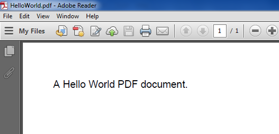
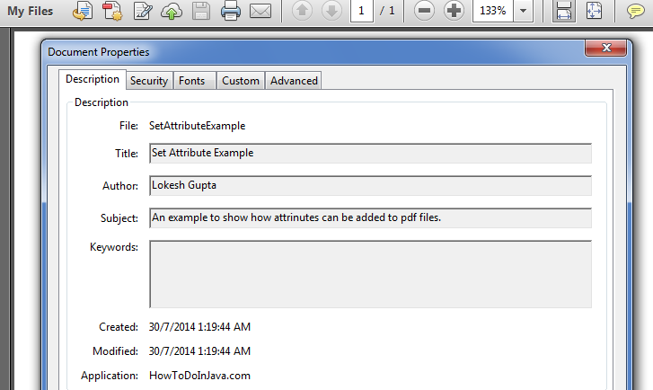
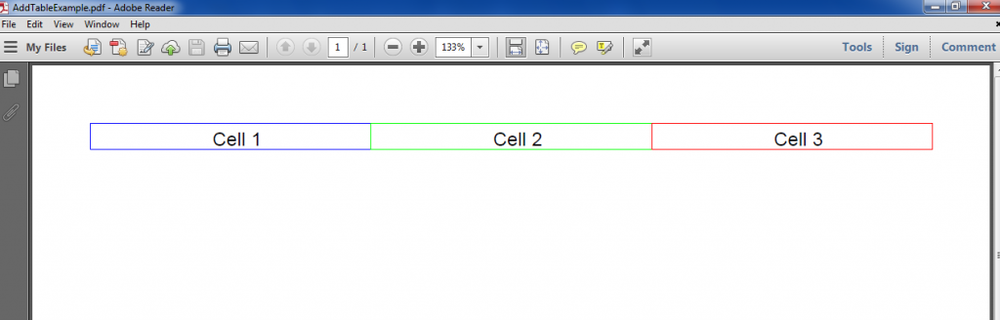
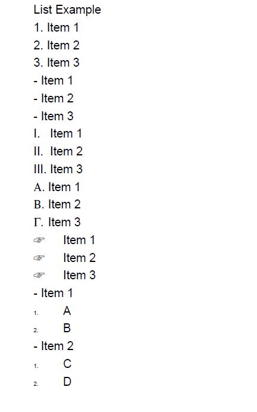
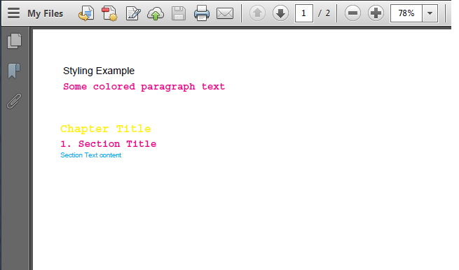
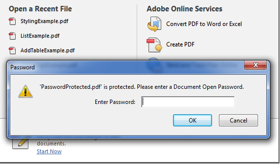
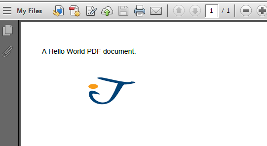

[TOC]


# 使用iText库创建PDF文件

## 阅读目录

- [阅读目录](#_label0)
- [前言](#_label1)
- [iText库概述](#_label2)
- [iText库常用类](#_label3)
- [iText Hello World示例](#_label4)
- [给PDF文件设置文件属性](#_label5)
- [PDF中添加图片](#_label6)
- [PDF中创建表格](#_label7)
- [PDF中创建列表](#_label8)
- [PDF中设置样式/格式化输出](#_label9)
- [给PDF文件设置密码](#_label10)
- [给PDF文件设置权限](#_label11)
- [读取/修改已有的PDF文件](#_label12)
- [往HTTP response输出流中写入PDF内容](#_label13)

## 阅读目录

- [前言](http://www.cnblogs.com/chenpi/p/5534595.html#_label0)
- [iText库概述](http://www.cnblogs.com/chenpi/p/5534595.html#_label1)
- [iText库常用类](http://www.cnblogs.com/chenpi/p/5534595.html#_label2)
- [iText Hello World示例](http://www.cnblogs.com/chenpi/p/5534595.html#_label3)
- [给PDF文件设置文件属性](http://www.cnblogs.com/chenpi/p/5534595.html#_label4)
- [PDF中添加图片](http://www.cnblogs.com/chenpi/p/5534595.html#_label5)
- [PDF中创建表格](http://www.cnblogs.com/chenpi/p/5534595.html#_label6)
- [PDF中创建列表](http://www.cnblogs.com/chenpi/p/5534595.html#_label7)
- [PDF中设置样式/格式化输出](http://www.cnblogs.com/chenpi/p/5534595.html#_label8)
- [给PDF文件设置密码](http://www.cnblogs.com/chenpi/p/5534595.html#_label9)
- [给PDF文件设置权限](http://www.cnblogs.com/chenpi/p/5534595.html#_label10)
- [读取/修改已有的PDF文件](http://www.cnblogs.com/chenpi/p/5534595.html#_label11)
- [往HTTP response输出流中写入PDF内容](http://www.cnblogs.com/chenpi/p/5534595.html#_label12)

## 前言

译文连接：<http://howtodoinjava.com/apache-commons/create-pdf-files-in-java-itext-tutorial/>

对于excel文件的读写操作，相信大家都比较熟悉，使用apache的POI库即可。本篇文章，我将基于iText库编写各式各样的代码示例去创建PDF文件。这些例子会按它们各自的功能分类，为了使大家能更加形象的看到代码所生成的PDF文件内容，每一个例子我都会附加上一张PDF文件截图。我已经尽可能的把我能找到的有用的例子放在这里，如果你觉得我错过了一些用例，随时在评论里留下你的建议，我会把这些例子添加进去。

## iText库概述

好的一面是，iText是开源的API，但是需要注意，虽然iText是开源，如果你出于商业目的使用它，仍然需要购买商业许可证。你可以从http://itextpdf.com上免费获取iText的Java类库，iText库非常强大，支持HTML、RTF、XML以及PDF文件的生产，你可以在文档中使用各种各样的字体，并且，还可以使用同样的代码生成上述不同类型的文件，这真的是一个很棒的特性，不是吗？

iText库包含一系列接口，可以生成不同字体的PDF文件，在PDF中创建表格，添加水印等等功能。当然，iText还有许许多多其它的功能，这将留给读者去探索。

如果你的项目是maven工程的话，在pom.xml文件中添加如下依赖，即可以给自己的应用程序添加iText库支持。

```
<dependency>
    <groupId>com.itextpdf</groupId>
    <artifactId>itextpdf</artifactId>
    <version>5.0.6</version>
</dependency>
```

当然，你也可以自己去下载最新的jar文件，然后添加到工程里，[下载地址](https://sourceforge.net/projects/itext/files/)。

## iText库常用类

让我们先列出几个接下来例子中要用到的重要的类，熟悉熟悉。

com.itextpdf.text.Document：这是iText库中最常用的类，它代表了一个pdf实例。如果你需要从零开始生成一个PDF文件，你需要使用这个Document类。首先创建（new）该实例，然后打开（open）它，并添加（add）内容，最后关闭（close）该实例，即可生成一个pdf文件。

com.itextpdf.text.Paragraph：表示一个缩进的文本段落，在段落中，你可以设置对齐方式，缩进，段落前后间隔等。

com.itextpdf.text.Chapter：表示PDF的一个章节，他通过一个Paragraph类型的标题和整形章数创建。

com.itextpdf.text.Font：这个类包含了所有规范好的字体，包括family of font，大小，样式和颜色，所有这些字体都被声明为静态常量。

com.itextpdf.text.List：表示一个列表；

com.itextpdf.text.pdf.PDFPTable：表示一个表格；

com.itextpdf.text.Anchor：表示一个锚，类似于HTML页面的链接。

com.itextpdf.text.pdf.PdfWriter：当这个PdfWriter被添加到PdfDocument后，所有添加到Document的内容将会写入到与文件或网络关联的输出流中。

com.itextpdf.text.pdf.PdfReader：用于读取PDF文件；

## iText Hello World示例

让我们先从简单的“Hello World”程序开始，在这个程序中，我将会创建一个PDF文件，里面的内容为一条简单的语句。


```
package cn.edu.hdu.chenpi.cpdemo.itext;

import java.io.FileNotFoundException;
import java.io.FileOutputStream;

import com.itextpdf.text.Document;
import com.itextpdf.text.DocumentException;
import com.itextpdf.text.Paragraph;
import com.itextpdf.text.pdf.PdfWriter;

public class JavaPdfHelloWorld {
    public static void main(String[] args) {
        Document document = new Document();
        try {
            PdfWriter writer = PdfWriter.getInstance(document, new FileOutputStream("HelloWorld.pdf"));
            document.open();
            document.add(new Paragraph("A Hello World PDF document."));
            document.close();
            writer.close();
        } catch (DocumentException e) {
            e.printStackTrace();
        } catch (FileNotFoundException e) {
            e.printStackTrace();
        }
    }
}
```




## 给PDF文件设置文件属性

这个例子将展示如何给PDF文件设置各种属性，如作者名字，创建日期，创建者，或者标题。


```
        Document document = new Document();
        try
        {
            PdfWriter writer = PdfWriter.getInstance(document, new FileOutputStream("SetAttributeExample.pdf"));
            document.open();
            document.add(new Paragraph("Some content here"));
         
            //Set attributes here
            document.addAuthor("Lokesh Gupta");
            document.addCreationDate();
            document.addCreator("HowToDoInJava.com");
            document.addTitle("Set Attribute Example");
            document.addSubject("An example to show how attributes can be added to pdf files.");
         
            document.close();
            writer.close();
        } catch (Exception e)
        {
            e.printStackTrace();
        }
```




## PDF中添加图片

下面例子展示如何往PDF文件中添加图片。例子中图片来源包含了两种方式：本地图片或URL。

并且，我添加了一些代码，用于设置图片在文档中的位置。


```
        Document document = new Document();
        try
        {
            PdfWriter writer = PdfWriter.getInstance(document, new FileOutputStream("AddImageExample.pdf"));
            document.open();
            document.add(new Paragraph("Image Example"));
         
            //Add Image
            Image image1 = Image.getInstance("C:\\temp.jpg");
            //Fixed Positioning
            image1.setAbsolutePosition(100f, 550f);
            //Scale to new height and new width of image
            image1.scaleAbsolute(200, 200);
            //Add to document
            document.add(image1);
         
            String imageUrl = "http://www.eclipse.org/xtend/images/java8_logo.png";
            Image image2 = Image.getInstance(new URL(imageUrl));
            document.add(image2);
         
            document.close();
            writer.close();
        } catch (Exception e)
        {
            e.printStackTrace();
        }
```


## PDF中创建表格

以下代码展示了如何在PDF文件中创建表格

```Java
Document document = new Document();
        try {
            PdfWriter writer = PdfWriter.getInstance(document,
                    new FileOutputStream("AddTableExample.pdf"));
            document.open();

            PdfPTable table = new PdfPTable(3); // 3 columns.
            table.setWidthPercentage(100); // Width 100%
            table.setSpacingBefore(10f); // Space before table
            table.setSpacingAfter(10f); // Space after table

            // Set Column widths
            float[] columnWidths = { 1f, 1f, 1f };
            table.setWidths(columnWidths);

            PdfPCell cell1 = new PdfPCell(new Paragraph("Cell 1"));
            cell1.setBorderColor(BaseColor.BLUE);
            cell1.setPaddingLeft(10);
            cell1.setHorizontalAlignment(Element.ALIGN_CENTER);
            cell1.setVerticalAlignment(Element.ALIGN_MIDDLE);

            PdfPCell cell2 = new PdfPCell(new Paragraph("Cell 2"));
            cell2.setBorderColor(BaseColor.GREEN);
            cell2.setPaddingLeft(10);
            cell2.setHorizontalAlignment(Element.ALIGN_CENTER);
            cell2.setVerticalAlignment(Element.ALIGN_MIDDLE);

            PdfPCell cell3 = new PdfPCell(new Paragraph("Cell 3"));
            cell3.setBorderColor(BaseColor.RED);
            cell3.setPaddingLeft(10);
            cell3.setHorizontalAlignment(Element.ALIGN_CENTER);
            cell3.setVerticalAlignment(Element.ALIGN_MIDDLE);

            // To avoid having the cell border and the content overlap, if you
            // are having thick cell borders
            // cell1.setUserBorderPadding(true);
            // cell2.setUserBorderPadding(true);
            // cell3.setUserBorderPadding(true);

            table.addCell(cell1);
            table.addCell(cell2);
            table.addCell(cell3);

            document.add(table);

            document.close();
            writer.close();
        } catch (Exception e) {
            e.printStackTrace();
        }
```




## PDF中创建列表

这个例子将会帮助你理解iText库是如何在PDF文件里创建列表的。

```Java
Document document = new Document();
        try
        {
            PdfWriter writer = PdfWriter.getInstance(document, new FileOutputStream("ListExample.pdf"));
            document.open();
            document.add(new Paragraph("List Example")); 
         
            //Add ordered list
            List orderedList = new List(List.ORDERED);
            orderedList.add(new ListItem("Item 1"));
            orderedList.add(new ListItem("Item 2"));
            orderedList.add(new ListItem("Item 3"));
            document.add(orderedList);
         
            //Add un-ordered list
            List unorderedList = new List(List.UNORDERED);
            unorderedList.add(new ListItem("Item 1"));
            unorderedList.add(new ListItem("Item 2"));
            unorderedList.add(new ListItem("Item 3"));
            document.add(unorderedList);
         
            //Add roman list
            RomanList romanList = new RomanList();
            romanList.add(new ListItem("Item 1"));
            romanList.add(new ListItem("Item 2"));
            romanList.add(new ListItem("Item 3"));
            document.add(romanList);
         
            //Add Greek list
            GreekList greekList = new GreekList();
            greekList.add(new ListItem("Item 1"));
            greekList.add(new ListItem("Item 2"));
            greekList.add(new ListItem("Item 3"));
            document.add(greekList);
         
            //ZapfDingbatsList List Example
            ZapfDingbatsList zapfDingbatsList = new ZapfDingbatsList(43, 30);
            zapfDingbatsList.add(new ListItem("Item 1"));
            zapfDingbatsList.add(new ListItem("Item 2"));
            zapfDingbatsList.add(new ListItem("Item 3"));
            document.add(zapfDingbatsList);
         
            //List and Sublist Examples
            List nestedList = new List(List.UNORDERED);
            nestedList.add(new ListItem("Item 1"));
         
            List sublist = new List(true, false, 30);
            sublist.setListSymbol(new Chunk("", FontFactory.getFont(FontFactory.HELVETICA, 6)));
            sublist.add("A");
            sublist.add("B");
            nestedList.add(sublist);
         
            nestedList.add(new ListItem("Item 2"));
         
            sublist = new List(true, false, 30);
            sublist.setListSymbol(new Chunk("", FontFactory.getFont(FontFactory.HELVETICA, 6)));
            sublist.add("C");
            sublist.add("D");
            nestedList.add(sublist);
         
            document.add(nestedList);
         
            document.close();
            writer.close();
        } catch (Exception e)
        {
            e.printStackTrace();
        }
```



## PDF中设置样式/格式化输出

让我们来看一些给PDF文件内容设置样式的例子，例子中包含了字体、章、节的使用。

```Java
Font blueFont = FontFactory.getFont(FontFactory.HELVETICA, 8, Font.NORMAL, new CMYKColor(255, 0, 0, 0));
        Font redFont = FontFactory.getFont(FontFactory.COURIER, 12, Font.BOLD, new CMYKColor(0, 255, 0, 0));
        Font yellowFont = FontFactory.getFont(FontFactory.COURIER, 14, Font.BOLD, new CMYKColor(0, 0, 255, 0));
        Document document = new Document();
        try
        {
            PdfWriter writer = PdfWriter.getInstance(document, new FileOutputStream("StylingExample.pdf"));
            document.open();
            //document.add(new Paragraph("Styling Example"));
         
            //Paragraph with color and font styles
            Paragraph paragraphOne = new Paragraph("Some colored paragraph text", redFont);
            document.add(paragraphOne);
         
            //Create chapter and sections
            Paragraph chapterTitle = new Paragraph("Chapter Title", yellowFont);
            Chapter chapter1 = new Chapter(chapterTitle, 1);
            chapter1.setNumberDepth(0);
         
            Paragraph sectionTitle = new Paragraph("Section Title", redFont);
            Section section1 = chapter1.addSection(sectionTitle);
         
            Paragraph sectionContent = new Paragraph("Section Text content", blueFont);
            section1.add(sectionContent);
         
            document.add(chapter1);
         
            document.close();
            writer.close();
        } catch (Exception e)
        {
            e.printStackTrace();
        }
```



## 给PDF文件设置密码

接下来，让我们看下如何给pdf文件生产保护密码，如下，使用writer.setEncryption()方法即可给pdf文件设置密码。


```
private static String USER_PASSWORD = "password";
    private static String OWNER_PASSWORD = "lokesh";
     
    public static void main(String[] args) {
        try
        {
            OutputStream file = new FileOutputStream(new File("PasswordProtected.pdf"));
            Document document = new Document();
            PdfWriter writer = PdfWriter.getInstance(document, file);
     
            writer.setEncryption(USER_PASSWORD.getBytes(),
                    OWNER_PASSWORD.getBytes(), PdfWriter.ALLOW_PRINTING,
                    PdfWriter.ENCRYPTION_AES_128);
     
            document.open();
            document.add(new Paragraph("Password Protected pdf example !!"));
            document.close();
            file.close();
     
        } catch (Exception e) 
        {
            e.printStackTrace();
        }
    }
```




## 给PDF文件设置权限

在这个例子中，我将设置一些权限用于限制其它用户访问PDF文件，如下是一些权限设置值：

```
 PdfWriter.ALLOW_PRINTING
 PdfWriter.ALLOW_ASSEMBLY
 PdfWriter.ALLOW_COPY
 PdfWriter.ALLOW_DEGRADED_PRINTING
 PdfWriter.ALLOW_FILL_IN
 PdfWriter.ALLOW_MODIFY_ANNOTATIONS
 PdfWriter.ALLOW_MODIFY_CONTENTS
 PdfWriter.ALLOW_SCREENREADERS
```

你可以通过对不同的值执行或操作来实现多权限设置，举个例子：PdfWriter.ALLOW_PRINTING | PdfWriter.ALLOW_COPY。


```
    public static void main(String[] args) {
        try {
            OutputStream file = new FileOutputStream(new File(
                    "LimitedAccess.pdf"));
            Document document = new Document();
            PdfWriter writer = PdfWriter.getInstance(document, file);
     
            writer.setEncryption("".getBytes(), "".getBytes(),
                    PdfWriter.ALLOW_PRINTING , //Only printing allowed; Try to copy text !!
                    PdfWriter.ENCRYPTION_AES_128);
     
            document.open();
            document.add(new Paragraph("Limited Access File !!"));
            document.close();
            file.close();
     
        } catch (Exception e) {
            e.printStackTrace();
        }
    }
```


## 读取/修改已有的PDF文件

本例子将展示如何使用iText库实现PDF文件的读取和修改。在这个例子中，我将读取一个PDF文件，并往每一页添加一些内容。


```
public static void main(String[] args) {
  try
  {
    //Read file using PdfReader
    PdfReader pdfReader = new PdfReader("HelloWorld.pdf");
 
    //Modify file using PdfReader
    PdfStamper pdfStamper = new PdfStamper(pdfReader, new FileOutputStream("HelloWorld-modified.pdf"));
 
    Image image = Image.getInstance("temp.jpg");
    image.scaleAbsolute(100, 50);
    image.setAbsolutePosition(100f, 700f);
 
    for(int i=1; i<= pdfReader.getNumberOfPages(); i++)
    {
        PdfContentByte content = pdfStamper.getUnderContent(i);
        content.addImage(image);
    }
 
    pdfStamper.close();
 
  } catch (IOException e) {
    e.printStackTrace();
  } catch (DocumentException e) {
    e.printStackTrace();
  }
}
```




## 往HTTP response输出流中写入PDF内容

这是本篇文章的最后一个例子，我将会往HttpServletResponse的输出流中写入一些PDF内容。在CS环境中，当你需要将PDF文件转成流的形式的时候，这非常有用。


```
Document document = new Document();
try{
    response.setContentType("application/pdf");
    PdfWriter.getInstance(document, response.getOutputStream());
    document.open();
    document.add(new Paragraph("howtodoinjava.com"));
    document.add(new Paragraph(new Date().toString()));
    //Add more content here
}catch(Exception e){
    e.printStackTrace();
}
    document.close();
}
```


 

以上就是关于**iText **库的所有例子了，如果有什么地方不清楚，或你想增加更多的例子，欢迎留下你的评论。

学习愉快~

译文连接：<http://howtodoinjava.com/apache-commons/create-pdf-files-in-java-itext-tutorial/>

@Author      [风一样的码农](http://www.cnblogs.com/chenpi/)
@HomePageUrl <http://www.cnblogs.com/chenpi/> 
@Copyright      [转载请注明出处，谢谢~](http://www.cnblogs.com/chenpi/) 


http://www.cnblogs.com/chenpi/p/5534595.html#_label8