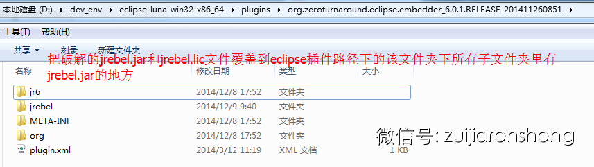

 最新详情请关注：微信公众号 

zuijiarensheng


**一，Java热部署神器JRebel_6.2.5-agent-crack分享链接**

****

JRebel6.2.5-agent-crack下载地址分享(适合jdk7, jdk8的Java环境)

==============================

(注意下载链接的字符区分大小写，而且里面有个数字1)

链接: http://pan.baidu.com/s/1fXsHw 密码: 2ncj 

**二，JRebel最新破解版的使用方法**

**1. Eclipse IDE的JRebel插件破解（Intellij IDEA类同）方法如下：**

**Intellij IDEA的jrebel插件存放路径可以参考：****http://intellij-support.jetbrains.com/entries/23358108**

****

以windows下JRebel-6.0.1-agent的eclipse IDE插件为例，
如eclipse在d:\eclipse, 则将破解的lib文件夹下的jrebel.jar和jrebel.lic这2个文件覆盖拷贝到d:\eclipse\plugins\org.zeroturnaround.eclipse.embedder_6.0.1.RELEASE-201411260851文件夹下的所有的有jrebel.jar的子文件夹里，然后重启eclipse即可破解。




.jpeg)


.jpeg)


**2. 单独使用JRebel.jar破解版(如在64位下WINDOWS下的Tomcat中使用热部署)的方法如下：**

在Java的VM arguments 输入如下参数：

-noverify

-agentpath:D:/dev_env/jrebel/jrebel_running/lib/jrebel64.dll

\#Linux用这个：-agentpath:/dev_env/jrebel/jrebel_running/lib/libjrebel64.so

\#Mac OS用这个：-agentpath:/dev_env/jrebel/jrebel_running/lib/libjrebel64.dylib

-Drebel.dirs=f:/myproject/test-jrebel/webapp/WEB-INF/classes

-Drebel.disable_update=true

-DJAVA_OPTS=-Xms256m -Xmx256m -XX:MaxNewSize=512m

上述参数的相关说明：

-agentpath: 这个是你使用的JRebel Agent版本的lib包的路径(路径后缀不要写成jrebel.jar)，注意其中的斜线方向。

-Drebel.dirs ：这个是你要监控的项目的 class 文件路径

-Drebel.disable_update: 设为true,就不会联网检查更新

-DJAVA_OPTS: 这个选项不是必须，当内存溢出的时候或其它特殊情况下才需要设置它的参数大小。

**3. 还可以把-agentpath和-Drebel.properties等VM arguments写到Tomcat的启动脚本里来启动Tomcat**

**a. 64位的Windows环境下在tomcat启动脚本使用JRebel, 脚本可命名为：startup_jrebel_jvm.cmd** 

```
@echo off

rem ---------------------------放入tomcat路径下的bin/catalina.bat同一级目录

rem ---------------------------jrebel remoting------------------------------------------------

set JAVA_OPTS=%JAVA_OPTS% -noverify -agentpath:D:/jrebel/lib/jrebel64.dll -Drebel.properties=D:/jrebel/jrebel_config/jrebel.properties -Drebel.disable_update=truerem ---------------------------JVM------------------------------------------------

set JAVA_OPTS=%JAVA_OPTS% -Xms512m -Xmx512m

set JPDA_ADDRESS=8881

set TITLE=WebProject

call "%~dp0catalina.bat" %* jpda start
```

**b. Centos(linux)环境下在tomcat启动脚本使用JRebel, 脚本可命名为：catalina-jrebel-startup.sh** 

```
#!/bin/bash 

export CATALINA_OPTS="$CATALINA_OPTS -noverify -agentpath:/jrebel/lib/jrebel64.dll -Drebel.properties=/jrebel/jrebel_config/jrebel.properties -Drebel.disable_update=true" 

export CATALINA_OPTS="$CATALINA_OPTS -server -Xms512m -Xmx512m -Xmn128m -XX:SurvivorRatio=8 -XX:ParallelGCThreads=8 -Xss512k -XX:-DisableExplicitGC -XX:+UseCompressedOops -XX:+UseConcMarkSweepGC -XX:+CMSParallelRemarkEnabled" 

export JPDA_ADDRESS=8881 

`dirname $0`/catalina.sh jpda start 
```

更多的JRebel使用方法和相关配置可以查阅JRebel官方文档：http://zeroturnaround.com/software/jrebel/learn/

来源： <<http://mp.weixin.qq.com/s?__biz=MzA3ODUzNjExOA==&mid=202165011&idx=1&sn=000ded9dcdcde00cd5d42632d3b7d43c&scene=20&key=b410d3164f5f798ea832dc9fd1d1924e27692a597566edb454cbc3dd9159da14f6de4c4d1144bff2a5611ad35548ee8b&ascene=1&uin=MTMyMDM2MTc1&devicetype=Windows+7&version=61050016&pass_ticket=NaVfGveuvd8i7SQvTy1T%2FDksJ9kLnLQHGx74AVrJgXw%3D>>

 