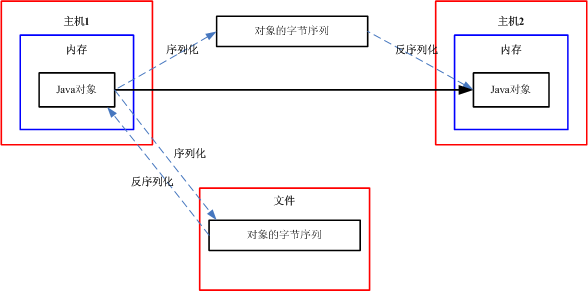

# RMI、Hessian、Burlap、Httpinvoker、WebService的比较

## 一、综述

本文比较了RMI、Hessian、Burlap、Httpinvoker、WebService5这种通讯协议的在不同的数据结构和不同数据量时的传输性能。
RMI是[Java](http://lib.csdn.net/base/17)语言本身提供的远程通讯协议，稳定高效，是EJB的基础。但它只能用于JAVA程序之间的通讯。
Hessian和Burlap是caucho公司提供的开源协议，基于HTTP传输，服务端不用开防火墙端口。协议的规范公开，可以用于任意语言。
Httpinvoker是SpringFramework提供的远程通讯协议，只能用于JAVA程序间的通讯，且服务端和客户端必须使用SpringFramework。
Web service是连接异构系统或异构语言的首选协议，它使用SOAP形式通讯，可以用于任何语言，目前的许多开发工具对其的支持也很好。
测试结果显示，几种协议的通讯效率依次为：
**RMI > Httpinvoker >= Hessian >> Burlap>> web service**
RMI不愧是JAVA的首选远程调用协议，非常高效稳定，特别是在[大数据](http://lib.csdn.net/base/20)量的情况下，与其他通讯协议的差距尤为明显。
HttpInvoker使用java的序列化技术传输对象，与RMI在本质上是一致的。从效率上看，两者也相差无几，HttpInvoker与RMI的传输时间基本持平。
Hessian在传输少量对象时，比RMI还要快速高效，但传输数据结构复杂的对象或大量数据对象时，较RMI要慢20%左右。
Burlap仅在传输1条数据时速度尚可，通常情况下，它的毫时是RMI的3倍。
Web Service的效率低下是众所周知的，平均来看，Web Service的通讯毫时是RMI的10倍。

## **二、结果分析**

**1、直接调用**

直接调用的所有毫时都接近0，这说明程序处理几乎没有花费时间，记录的全部时间都是远程调用耗费的。
**2、RMI调用**

与设想的一样，RMI理所当然是最快的，在几乎所有的情况下，它的毫时都是最少的。特别是在数据结构复杂，数据量大的情况下，与其他协议的差距尤为明显。
为 了充分发挥RMI的性能，另外做了测试类，不使用[spring](http://lib.csdn.net/base/17)，用原始的RMI形式（继承UnicastRemoteObject对象）提供服务并远程调用，与Spring对POJO包装成的RMI进行效率比较。结果显示：两者基本持平，Spring提供的服务还稍快些。
初步认为，这是因为Spring的代理和缓存机制比较强大，节省了对象重新获取的时间。
**3、Hessian调用**

caucho 公司的resin服务器号称是最快的服务器，在java领域有一定的知名度。Hessian做为resin的组成部分，其设计也非常精简高效，实际运行情况也证明了这一点。平均来看，Hessian较RMI要慢20%左右，但这只是在数据量特别大，数据结构很复杂的情况下才能体现出来，中等或少量数据时，Hessian并不比RMI慢。
Hessian的好处是精简高效，可以跨语言使用，而且协议规范公开，我们可以针对任意语言开发对其协议的实现。目前已有实现的语言有：java, c++, .net, [Python](http://lib.csdn.net/base/11), ruby。还没有delphi的实现。
另 外，Hessian与WEB服务器结合非常好，借助WEB服务器的成熟功能，在处理大量用户并发访问时会有很大优势，在资源分配，线程排队，异常处理等方 面都可以由成熟的WEB服务器保证。而RMI本身并不提供多线程的服务器。而且，RMI需要开防火墙端口，Hessian不用。
**4、Burlap调用**

Burlap与Hessian都是caucho公司的开源产品，只不过Hessian采用二进制的方式，而Burlap采用xml的格式。
测试结果显示，Burlap在数据结构不复杂，数据量中等的情况下，效率还是可以接受的，但如果数据量大，效率会急剧下降。平均计算，Burlap的调用毫时是RMI的3倍。
我认为，其效率低有两方面的原因，一个是XML数据描述内容太多，同样的数据结构，其传输量要大很多；另一方面，众所周知，对xml的解析是比较费资源的，特别对于大数据量情况下更是如此。
**5、HttpInvoker调用**

HttpInvoker是SpringFramework提供的JAVA远程调用方法，使用java的序列化机制处理对象的传输。从测试结果看，其效率还是可以的，与RMI基本持平。
不过，它只能用于JAVA语言之间的通讯，而且，要求客户端和服务端都使用SPRING框架。
另外，HttpInvoker 并没有经过实践的检验，目前还没有找到应用该协议的项目。
**6、web service调用**

本次测试选用了apache的AXIS组件作为WEB SERVICE的实现，AXIS在WEBSERVICE领域相对成熟老牌。
为了仅测试数据传输和编码、解码的时间，客户端和服务端都使用了缓存，对象只需实例化一次。但是，测试结果显示，webservice的效率还是要比其他通讯协议慢10倍。
如果考虑到多个引用指向同一对象的传输情况，web service要落后更多。因为RMI，Hessian等协议都可以传递引用，而web service有多少个引用，就要复制多少份对象实体。
Web service传输的冗余信息过多是其速度慢的原因之一，监控发现，同样的访问请求，描述相同的数据，webservice返回的数据量是hessian协议的6.5倍。另外，WEB SERVICE的处理也很毫时，目前的xml解析器效率普遍不高，处理xml <-> bean很毫资源。从测试结果看，异地调用比本地调用要快，也从侧面说明了其毫时主要用在编码和解码xml文件上。这比冗余信息更为严重，冗余信息占用的 只是网络带宽，而每次调用的资源耗费直接影响到服务器的负载能力。（MS的工程师曾说过，用WEB SERVICE不能负载100个以上的并发用户。）
测试过程中还发现，web service编码不甚方便，对非基本类型需要逐个注册序列化和反序列化类，很麻烦，生成stub更累，不如spring + RMI/hessian处理那么流畅简洁。而且，web service不支持集合类型，只能用数组，不方便。

## **三、Hession机制**

来源： <http://blog.csdn.net/anerou/article/details/6715584>