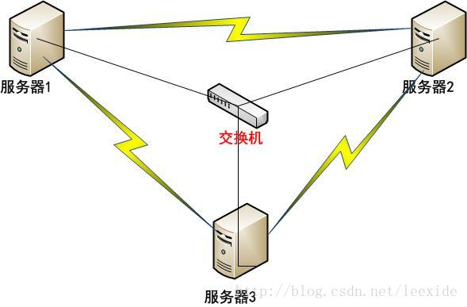

# Linux/UNIX下使用ssh-keygen设置SSH无密码登录


# 一、SSH简介

​    SSH是一个专为远程登录会话和其他网络服务提供安全性的协议。默认状态下SSH链接是需要密码认证的，可以通过添加系统认证（即公钥-私钥）的修改，修改后系统间切换可以避免密码输入和SSH认证。

# 二、公钥认证的基本思想：

​    对信息的加密和解密采用不同的key，这对key分别称作private key和public key，其中，public key存放在欲登录的服务器上，而private key为特定的客户机所持有。

​    当客户机向服务器发出建立安全连接的请求时，首先发送自己的public key，如果这个public key是被服务器所允许的，服务器就发送一个经过public key加密的随机数据给客户机，这个数据只能通过private key解密，客户机将解密后的信息发还给服务器，服务器验证正确后即确认客户机是可信任的，从而建立起一条安全的信息通道。

​    通过这种方式，客户机不需要向外发送自己的身份标志“private key”即可达到校验的目的，并且private key是不能通过public key反向推断出来的。这避免了网络窃听可能造成的密码泄露。客户机需要小心的保存自己的private key，以免被其他人窃取，一旦这样的事情发生，就需要各服务器更换受信的public key列表。

# 三、实验网络拓扑图和实验目的

## 1、网络拓扑图

如下所示：




## 2、实现目的

服务器1，服务器2，服务器3能实现彼此无密码登录。

## 3、补充说明

Linux下修改主机名的完整步骤如下：
第一步：

```
#hostname Server1  
```

第二步：

```
修改/etc/sysconfig/network中的hostname  
```

第三步：

```
修改/etc/hosts文件  
```


# 四、无密码登录实现方式

## 1、用ssh-keygen创建公钥

（1）在服务器1上执行下面的命令：

```
[root@Server1 ~]# ssh-keygen -t rsa  
Generating public/private rsa key pair.  
Enter file in which to save the key(/root/.ssh/id_rsa):  
Created directory '/root/.ssh'.  
Enter passphrase (empty for no passphrase):  
Enter same passphrase again:  
Your identification has been saved in/root/.ssh/id_rsa.  
Your public key has been saved in/root/.ssh/id_rsa.pub.  
The key fingerprint is:  
7b:aa:08:a0:99:fc:d9:cc:d8:2e:4b:1a:c0:6b:da:e4root@Server1  
The key's randomart image is:  
+--[ RSA 2048]----+  
| |  
| |  
| |  
|. |  
|o. S |  
|++. . |  
|+=o. . . |  
|o+=oB. o |  
|..E==*... |  
+-----------------+  
```

​    输入后，会提示创建.ssh/id_rsa、id_rsa.pub的文件，其中第一个为密钥，第二个为公钥。过程中会要求输入密码，为了ssh访问过程无须密码，可以直接回车 。

（2）补充说明：
ssh-keygen:生成秘钥
其中：

  -t指定算法
  -f 指定生成秘钥路径
  -N 指定密码

## 2、查看钥匙

```
[root@Server1 ~]# ls -l .ssh  
总用量 8  
-rw-------. 1 root root 1675 12月 10 22:20 id_rsa  
-rw-r--r--. 1 root root 394 12月 10 22:20 id_rsa.pub 
```

  可以发现 ssh目录下的两枚钥匙。

## 3.将公钥复制到被管理机器Server2和Server3下的.ssh目录下（先确保存在这个目录）

```
[root@server1 .ssh]# scp id_rsa.pubroot@192.168.1.3:~/.ssh/  
The authenticity of host '192.168.1.3(192.168.1.3)' can't be established.  
RSA key fingerprint is93:eb:f9:47:b1:f6:3f:b4:2e:21:c3:d5:ab:1d:ae:65.  
Are you sure you want to continueconnecting (yes/no)? yes  
Warning: Permanently added '192.168.1.3'(RSA) to the list of known hosts.  
root@192.168.1.3's password:  
id_rsa.pub   
[root@server1 .ssh]# scp id_rsa.pubroot@192.168.1.4:~/.ssh/authorized_keys  
The authenticity of host '192.168.1.4(192.168.1.4)' can't be established.  
RSA key fingerprint is93:eb:f9:47:b1:f6:3f:b4:2e:21:c3:d5:ab:1d:ae:65.  
Are you sure you want to continueconnecting (yes/no)? yes  
Warning: Permanently added '192.168.1.4'(RSA) to the list of known hosts.  
root@192.168.1.4's password:  
id_rsa.pub  
```

到Server2和Server3目录下执行下面的命令

```
#cat id_dsa.pub >> ~/.ssh/authorized_keys  
```


## 4、设置文件和目录权限：

设置authorized_keys权限

```
$ chmod 600 authorized_keys   
```

设置.ssh目录权限

```
$ chmod 700 -R .ssh  
```


## 5、验证使用SSH IP地址的方式无密码访问

```
[root@server1 .ssh]# ssh 192.168.1.3  
Last login: Tue Dec 10 22:34:02 2013  
[root@Server2 ~]#  
[root@Server2 ~]#  
[root@Server2 ~]#  
```

## 6、验证使用SSH 主机名的方式无密码访问

我们在Server1上将Server2和Server3的IP地址解析为主机名

```
[root@server1 .ssh]# cat /etc/hosts  
192.168.1.2 Server1  
192.168.1.3 Server2  
192.168.1.4 Server3  
```

我们试试下面这种ssh登录方式：

```
[root@server1 .ssh]# ssh Server3  
The authenticity of host 'server3(192.168.1.4)' can't be established.  
RSA key fingerprint is93:eb:f9:47:b1:f6:3f:b4:2e:21:c3:d5:ab:1d:ae:65.  
Are you sure you want to continueconnecting (yes/no)? yes  
Warning: Permanently added 'server3' (RSA)to the list of known hosts.  
Last login: Tue Dec 10 22:34:08 2013  
```


# 五、注意：

**1、文件和目录的权限千万别设置成chmod 777.这个权限太大了，不安全，数字签名也不支持。**
2、生成的rsa/dsa签名的公钥是给对方机器使用的。这个公钥内容还要拷贝到authorized_keys
3、linux之间的访问直接 ssh 机器ip
4、某个机器生成自己的RSA或者DSA的数字签名，将公钥给目标机器，然后目标机器接收后设定相关权限（公钥和authorized_keys权限），这个目标机就能被生成数字签名的机器无密码访问了


# 六、具体实例

```
  $ ssh-keygen -t dsa -P '' -f ~/.ssh/id_dsa
  $ cat ~/.ssh/id_dsa.pub >> ~/.ssh/authorized_keys
```


http://blog.csdn.net/leexide/article/details/17252369