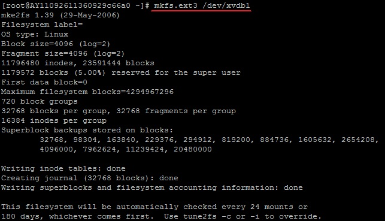

Linux 系统挂载数据盘

分类: linux
日期: 2015-06-18

原文地址: 

http://blog.chinaunix.net/uid-29632145-id-5087432.html

------

****[Linux 系统挂载数据盘]() *2015-06-18 11:41:16*

分类： LINUX

转载：http://help.aliyun.com/knowledge_detail.htm?spm=5176.788314852.3.1.Enli5O&knowledgeId=5974154&categoryId=
适用系统：Linux（Redhat , CentOS，Debian，Ubuntu）

\*  Linux的云服务器数据盘未做分区和格式化，可以根据以下步骤进行分区以及格式化操作。

下面的操作将会把数据盘划分为一个分区来使用。

 

**1、查看数据盘**

在没有分区和格式化数据盘之前，使用 “df –h”命令，是无法看到数据盘的，可以使用“fdisk -l”命令查看。如下图：

[1].jpg)

友情提示：**若您执行fdisk -l命令，发现没有 /dev/xvdb 表明您的云服务无数据盘，那么您无需进行挂载，此时该教程对您不适用**

**2、 对数据盘进行分区**

执行“fdisk -S 56 /dev/xvdb”命令，对数据盘进行分区；

根据提示，依次输入“n”，“p”“1”，两次回车，“wq”，分区就开始了，很快就会完成。

**3、 查看新的分区**

使用“fdisk -l”命令可以看到，新的分区xvdb1已经建立完成了。

[1].jpg)

** 4、格式化新分区**

以ext3为例：使用“mkfs.ext3 /dev/xvdb1”命令对新分区进行格式化，格式化的时间根据硬盘大小有所不同。

(也可自主决定选用其它文件格式，如ext4等)

 

** 5、添加分区信息**

使用“echo '/dev/xvdb1  /mnt ext3    defaults    0  0' >> /etc/fstab”（不含引号）命令写入新分区信息。
然后使用“cat /etc/fstab”命令查看，出现以下信息就表示写入成功。

注：ubuntu12.04不支持barrier，所以正确写法是：echo '/dev/xvdb1  /mnt ext3    barrier=0  0  0' >> /etc/fstab

\*  如果需要把数据盘单独挂载到某个文件夹，比如单独用来存放网页，可以修改以上命令中的/mnt部分

 

**6、挂载新分区**

使用“mount -a”命令挂载新分区，然后用“df -h”命令查看，出现以下信息就说明挂载成功，可以开始使用新的分区了。

\>>[Linux FTP服务配置](http://help.aliyun.com/manual?spm=0.0.0.0.PEbfvq&helpId=273)

\>>[linux一键安装web环境全攻略](http://help.aliyun.com/manual?spm=0.0.0.0.PEbfvq&helpId=129)

\>>[硬盘分区和格式化for Windows 2008](http://help.aliyun.com/manual?spm=0.0.0.0.VhiMLR&helpId=69)

# Linux挂载文件后能修改文件夹名吗

`必须重新挂载修改//data目录是要修改的文件名# mkdir /data  //把原来挂载的删除掉# umount /home//重新挂载 # mount /dev/mapper/VolGroup-lv_home /data`