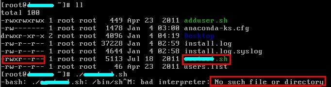

Linux执行.sh文件，提示No such file or directory的问题

问题描述 

解决方法 

分析原因，可能因为我平台迁移碰到权限问题我们来进行权限转换 

1）在Windows下转换： 

利用一些编辑器如UltraEdit或EditPlus等工具先将脚本编码转换，再放到Linux中执行。转换方式如下（UltraEdit）：File-->Conversions-->DOS->UNIX即可。 

2)方法 

用vim打开该sh文件，输入： 

[plain] 

:set ff 

回车，显示fileformat=dos，重新设置下(www.111cn.net)文件格式： 

[plain] 

:set ff=unix 

保存退出: 

[plain] 

:wq 

再执行，竟然可以了 

3）在linux中的权限转换 

也可在Linux中转换： 

首先要确保文件有可执行权限 

\#chmod u+x filename 

然后修改文件格式 

\#vi filename 

三种方法都可以方便快速的解决关于Linux执行.sh文件，提示No such file or directory这个问题了。 

在window平台下，写好shell脚本文件，迁移到linux平台，赋过可执行权限，执行该sh文件，

却提示No such file or directory。ls 了下，确实有该文件，怎么会事呢,

难道是文件格式兼容性问题？用vim打开该sh文件，输入：

[plain]

:set ff  

回车，显示fileformat=dos，重新设置下文件格式：

[plain]

:set ff=unix  

保存退出:

[plain]

:wq  

​    再执行，竟然可以了。这个事情又给我提了次醒，程序尽量在linux下编写，迁移时，也许会少很多问题。

来源： <<http://www.jb51.net/LINUXjishu/56395.html>>

 