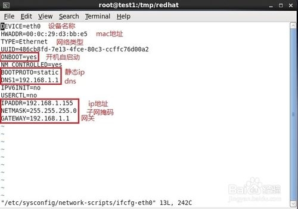
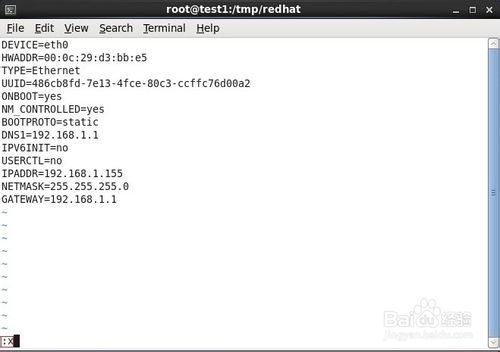
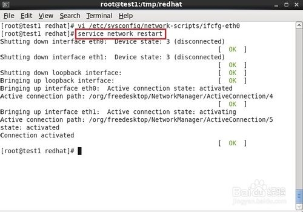
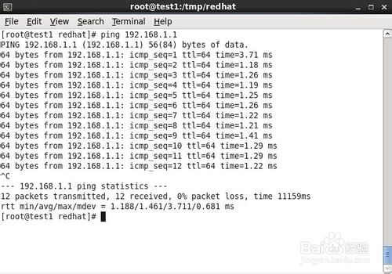
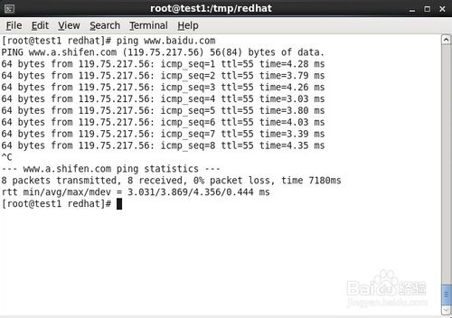

## 工具/原料

- redhat6.4 x64

## 方法/步骤

1. ​

   在终端中输入：vi /etc/sysconfig/network-scripts/ifcfg-eth0

   

2. ​

   开始编辑，填写ip地址、子网掩码、网关、DNS等。其中“红框内的信息”是必须得有的。

   

3. ​

   编辑完后，保存退出。

   

4. ​

   重启网络服务。service network restart或/etc/init.d/network restart

   

5. ​

   ping网关，ping外网进行测试。都能ping通表示网络正常。

   

   

6. ​

   摘要：

   ---修改ip地址---

   即时生效:

   \# ifconfig eth0 192.168.1.155 netmask 255.255.255.0

   重启生效:

   修改/etc/sysconfig/network-scripts/ifcfg-eth0

   ​

   ---修改default gateway---

   即时生效:

   \# route add default gw 192.168.1.1

   重启生效:

   修改/etc/sysconfig/network-scripts/ifcfg-eth0

   ​

   ---修改dns---

   修改/etc/resolv.conf

   修改后即时生效，重启同样有效

   ​

   ---修改host name---

   即时生效:

   \# hostname test1

   重启生效:

   修改/etc/sysconfig/network

   END

来源： <<http://jingyan.baidu.com/article/455a99508be7cda167277865.html>>

 