今天，我来为大家解读一幅来自 TurnOff.us 的漫画 “[InSide The Linux Kernel](http://turnoff.us/geek/inside-the-linux-kernel/)” 。 [TurnOff.us](http://turnoff.us/) 是一个极客漫画网站，作者Daniel Stori 画了一些非常有趣的关于编程语言、Web、云计算、Linux 相关的漫画。今天解读的便是其中的一篇。

在开始，我们先来看看这幅漫画的全貌！

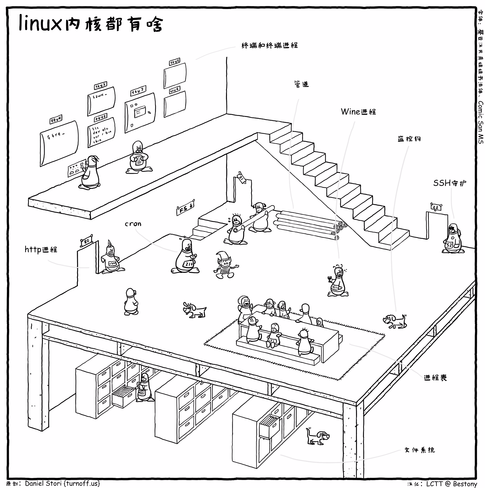

这幅漫画是以一个房子的侧方刨面图来绘画的。使用这样的一个房子来代表 Linux 内核。

### 地基

作为一个房子，最重要的莫过于其地基，在这个图片里，我们也从最下面的地基开始看起：

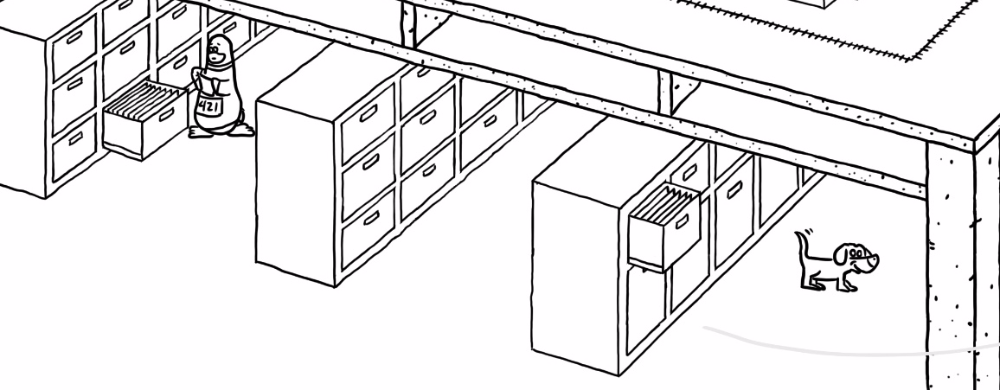

地基（底层）由一排排的文件柜组成，井然有序，文件柜里放置着“文件”——电脑中的文件。左上角，有一只胸前挂着 421 号牌的小企鹅，它表示着 PID（进程 IDProcess ID） 为 421 的进程，它正在查看文件柜中的文件，这代表系统中正有一个进程在访问文件系统。在右下角有一只小狗，它是看门狗watchdog ，这代表对文件系统的监控。

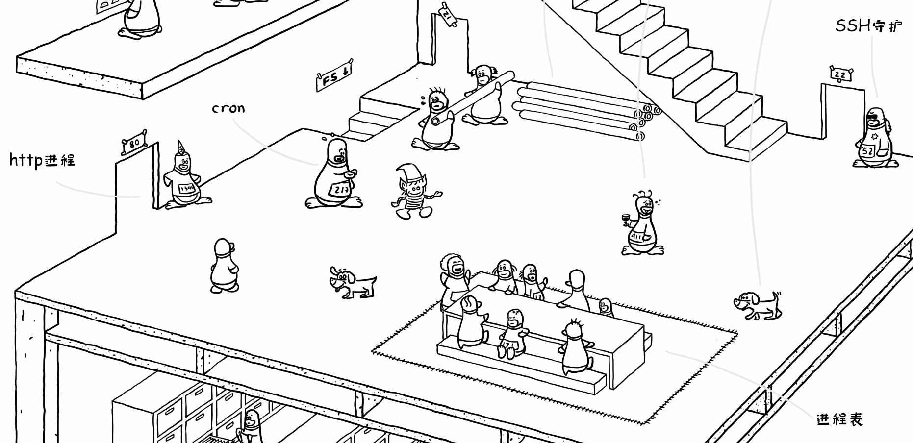

### 一层（地面层）

看完了地基，接下来我们来看地基上面的一层，都有哪些东西。

在这一层，最引人瞩目的莫过于中间的一块垫子，众多小企鹅在围着着桌子坐着。这个垫子的区域代表进程表。

左上角有一个小企鹅，站着，仿佛在说些什么这显然是一位家长式的人物，不过看起来周围坐的那些小企鹅不是很听话——你看有好多走神、自顾自聊天的——“喂喂，说你呢，哇塞娃（171），转过身来”。它代表着 Linux 内核中的初始化（init）进程，也就是我们常说的 PID 为 1 的进程。桌子上坐的小企鹅都在等待状态wait中，等待工作任务。

瞧瞧，垫子（进程表）两旁有两只小狗，它会监控小企鹅的状态（监控进程），当小企鹅们不听话时，它就会汪汪地叫喊起来。

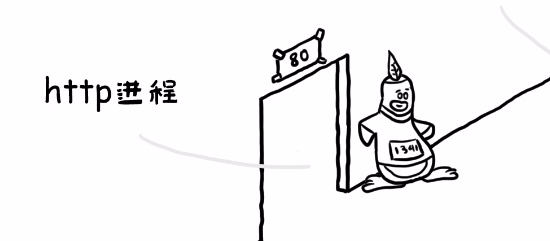

在这层的左侧，有一只号牌为 1341 的小企鹅，守在门口，门上写着 80，说明这个 PID 为 1341 的小企鹅负责接待 80 端口，也就是我们常说的 HTTP （网站）的端口。小企鹅头上有一片羽毛，这片羽毛大有来历，它是著名的 HTTP 服务器 Apache 的 Logo。喏，就是这只：

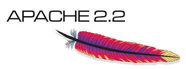

向右看，我们可以看到这里仍有一扇门，门上写着 21，但是，看起来这扇门似乎年久失修，上面的门牌号都歪了，门口也没人守着。看起来这个 21 端口的 FTP 协议有点老旧了，目前用的人也比以前少了，以至于这里都没人接待了。

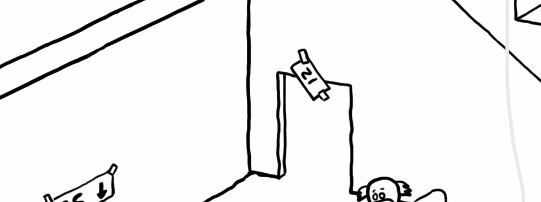

而在最右侧的一个门牌号 22 的们的待遇就大为不同，居然有一只带着墨镜的小企鹅在守着，看起来好酷啊，它是黑衣人叔叔吗？为什么要这么酷的一个企鹅呢，因为 22 端口是 SSH 端口，是一个非常重要的远程连接端口，通常通过这个端口进行远程管理，所以对这个端口进来的人要仔细审查。

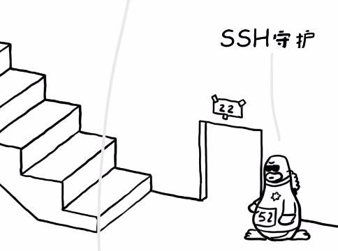

它的身上写着 52，说明它是第 52 个小企鹅。

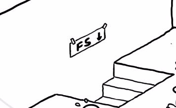

在图片的左上角，有一个向下台阶。这个台阶是底层（地基）的文件系统中的，进程们可以通过这个台阶，到文件系统中去读取文件，进行操作。

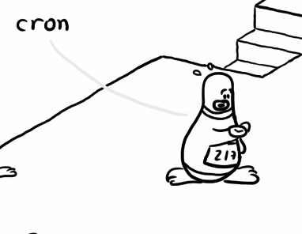

在这一层中，有一个身上写着 217 的小企鹅，他正满头大汗地看着自己的手表。这只小企鹅就是定时任务（Crontab），他会时刻关注时间，查看是否要去做某个工作。

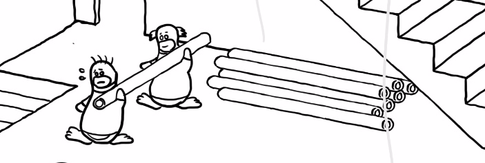

在图片的中部，有两个小企鹅扛着管道（PipeLine）在行走，一只小企鹅可以把自己手上的东西通过这个管道，传递给后面的小企鹅。不过怎么看起来前面这种（男？）企鹅累得满头大汗，而后面那只（女？）企鹅似乎游刃有余——喂喂，前面那个，裤子快掉了~

在这一层还有另外的一个小企鹅，它手上拿着一杯红酒，身上写着 411，看起来有点不胜酒力。它就是红酒（Wine）小企鹅,它可以干（执行）一些来自 Windows 的任务。

### 跃层

在一层之上，还有一个跃层，这里有很多不同的屏幕，每个屏幕上写着 TTY（这就是对外的终端）。比如说最左边 tty4 上输入了“fre”——这是想输入“freshmeat...”么 ：d ；它旁边的 tty2 和 tty3 就正常多了，看起来是比较正常的命令；tty7 显示的图形界面嗳，对，图形界面（X Window）一般就在 7 号终端；tty5 和 tty6 是空的，这表示这两个终端没人用。等等，tty1 呢？

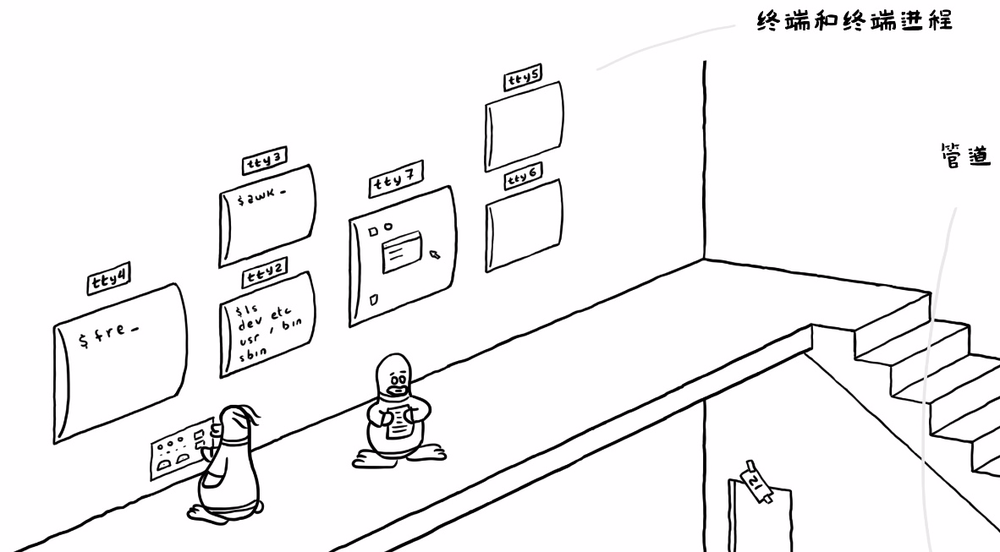

tty（终端）是对外沟通的渠道之一，但是，不是每一个进程都需要 tty，某些进程可以直接通过其他途径（比如端口）来和外部进行通信，对外提供服务的，所以，这一层不是完整的一层，只是个跃层。

好了，我们有落下什么吗？

这小丑是谁啊？

啊哈，我也不知道，或许是病毒？你说呢？

编译自：<http://turnoff.us/geek/inside-the-linux-kernel/>作者： Daniel Stori
原创：[LCTT](https://linux.cn/lctt/) <https://linux.cn/article-8290-1.html>译者： [bestony](https://linux.cn/lctt/bestony)
本文地址：<https://linux.cn/article-8290-1.html>

来源： <https://linux.cn/article-8290-1.html>