# [Jmeter性能测试 入门](http://www.cnblogs.com/TankXiao/p/4045439.html)

Jmeter是一款优秀的开源测试工具， 是每个资深测试工程师，必须掌握的测试工具，熟练使用Jmeter能大大提高工作效率。

熟练使用Jmeter后， 能用Jmeter搞定的事情，你就不会使用LoadRunner了。

【小坦克Jmeter教程】，将会覆盖Jmeter的各个功能，并且会通过丰富的实例，让读者快速掌握Jmeter的各种用法 。

本文将通过一个实际的测试例子， 来讲解Jmeter的基本用法。本文的最后提供了本篇文章的脚本。 不喜欢看文章的同学直接看脚本也能看懂

阅读目录 

1. [Jmeter介绍](http://www.cnblogs.com/TankXiao/p/4045439.html#introduce)
2. [如何学好Jmeter](http://www.cnblogs.com/TankXiao/p/4045439.html#howtoLearn)
3. [Jmeter下载和运行](http://www.cnblogs.com/TankXiao/p/4045439.html#download)
4. [实际测试的例子](http://www.cnblogs.com/TankXiao/p/4045439.html#sampler)
5. [第一步: 新建Thread Group](http://www.cnblogs.com/TankXiao/p/4045439.html#threadGroup)
6. [第二步: 新建HTTP Request](http://www.cnblogs.com/TankXiao/p/4045439.html#httprequest)
7. [第三步: 新建HTTP Header Manager](http://www.cnblogs.com/TankXiao/p/4045439.html#headmanager)
8. [第四步: 新建 View Results Tree](http://www.cnblogs.com/TankXiao/p/4045439.html#viewResultsTree)
9. [第五步: 运行测试，查看结果](http://www.cnblogs.com/TankXiao/p/4045439.html#run)
10. [第六步: 添加Assertion和Assertion Results](http://www.cnblogs.com/TankXiao/p/4045439.html#assertion)
11. [第七步: 使用用户自定义变量](http://www.cnblogs.com/TankXiao/p/4045439.html#argu)
12. [第八步: 关联](http://www.cnblogs.com/TankXiao/p/4045439.html#guanlian)
13. [源代码下载](http://www.cnblogs.com/TankXiao/p/4045439.html#source)

 

# Jmeter 介绍

Jmeter  是一款使用Java开发的，开源免费的，测试工具， 主要用来做功能测试和性能测试（压力测试/负载测试）. 

而且用Jmeter 来测试 Restful API, 非常好用。

 

 

# 如何学好Jmeter

如果你用Jmeter去对Web进行功能测试，或者性能测试。 你必须熟练HTTP协议，才能学好Jmeter。 否则你很难理解Jmeter中得概念。

不熟悉HTTP协议的话， 可以参考我的 [【小坦克：HTTP 协议教程】](http://www.cnblogs.com/TankXiao/archive/2012/02/13/2342672.html)

 

# Jmeter  下载和运行

官方网站：<http://jmeter.apache.org/>

解压后， 运行  “bin/jmeter.bat”   

Jmeter 是支持中文的， 启动Jmeter 后， 点击 Options -> Choose Language  来选择语言

 

# 实际测试的例子

目标： 获取城市的天气数据：

 

第一步： 发送request 获取城市的城市代号
http://toy1.weather.com.cn/search?cityname=上海 

从这个请求的response 中获取到上海的城市代码. 比如:

上海的地区代码是101020100

上海动物园的地区代码是:  10102010016A

 

第二步：  发送request 到： http://www.weather.com.cn/weather2d/101020100.shtml   可以得到该城市的天气数据

 

# 第一步： 新建一个Thread Group

必须新建一个Thread Group,  jmeter的所有任务都必须由线程处理，所有任务都必须在线程组下面创建。

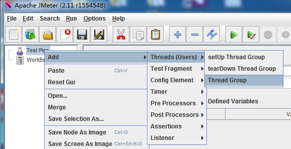

 

# 第二步：新建一个 HTTP Request

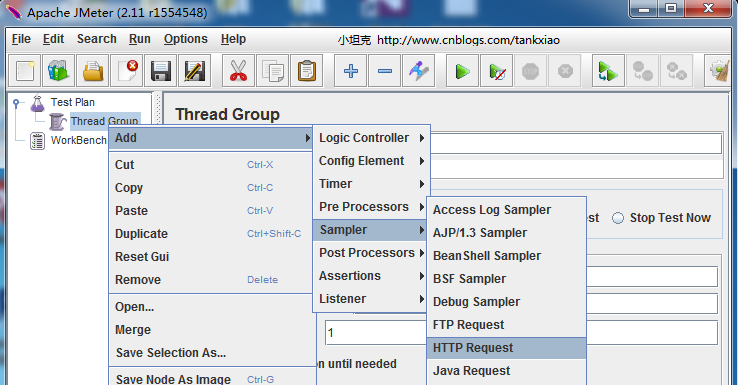

 

比如我要发送一个Get 方法的http 请求: http://toy1.weather.com.cn/search?cityname=上海 

可以按照下图这么填

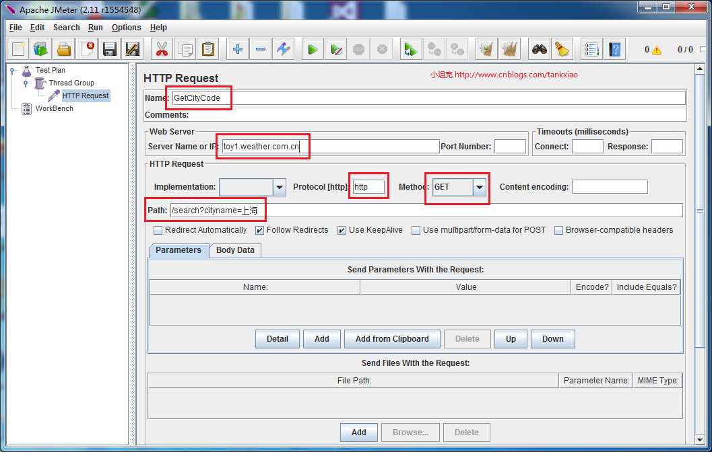

 

# 第三步 添加HTTP Head Manager

选中上一步新建的HTTP request. 右键，新建一个Http Header manager. 添加一个header

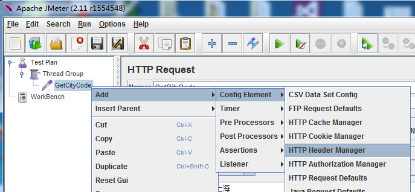

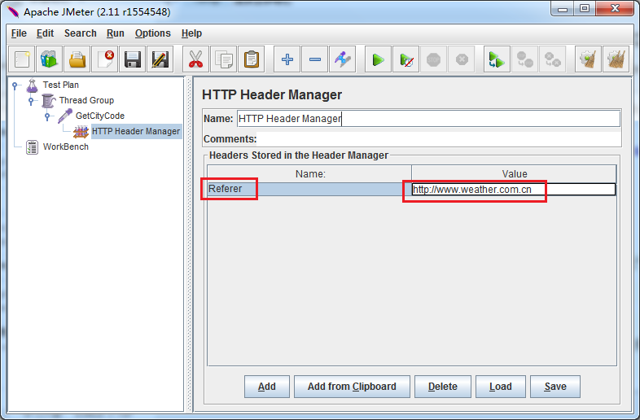

 

# 第四步: 添加View Results Tree

View Results Tree 是用来看运行的结果的

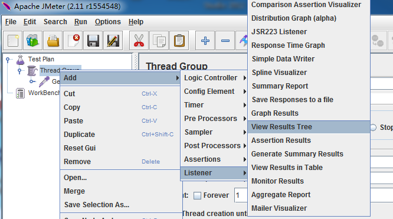

 

# 第五步：运行测试,查看结果

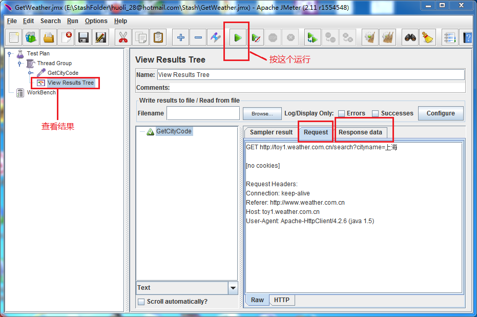

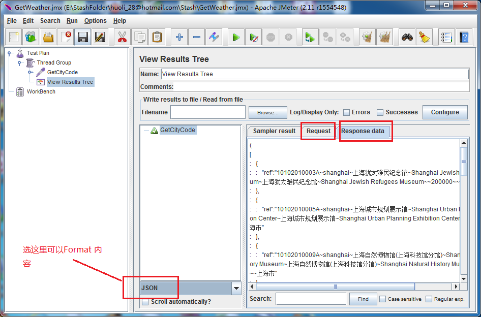

到这里。 我们已经成功运行起来了。

 

# 第六步:添加Assertion和Assert Results

 选择HTTP Request, 右键 Add-> Assertions -> Response Assertion.  添加 Patterns To Test

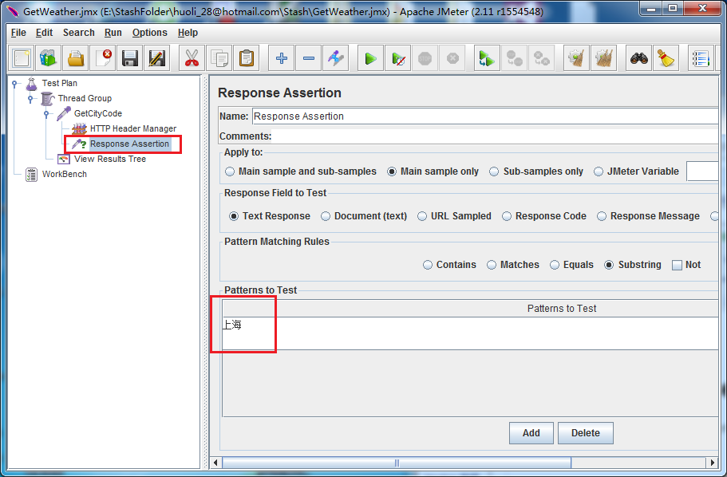

 

然后添加一个Assetion Results 用来查看Assertion执行的结果. 

选中Thread Group 右键  Add -> Listener -> Assertion Results. 

运行后， 如果HTTP Response中没有包含期待的字符串。 那么test 就会Fail. 

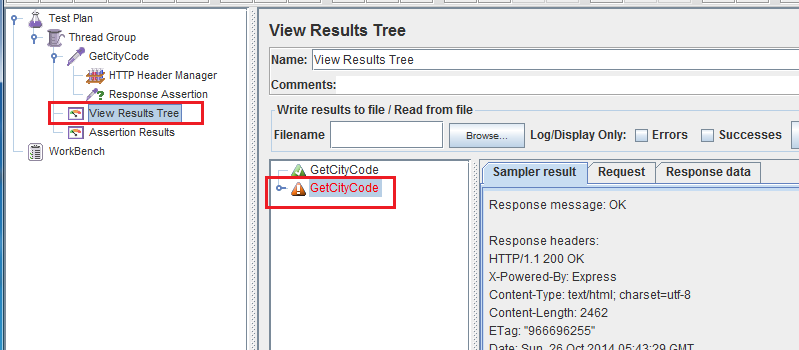

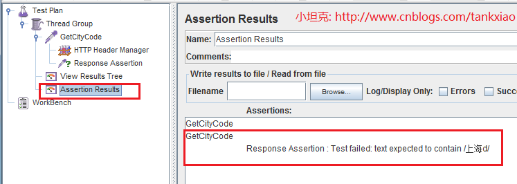

 

# 第7步: 使用用户自定义变量

我们还可以在Jmeter中定义变量。 比如我定义一个变量叫 city.    使用它的时候用  ${city}

添加一个 User Defined Variables.  选中Thread Group: 右键 Add -> Config Element -> User Defined Variables.

我们添加一个变量: city

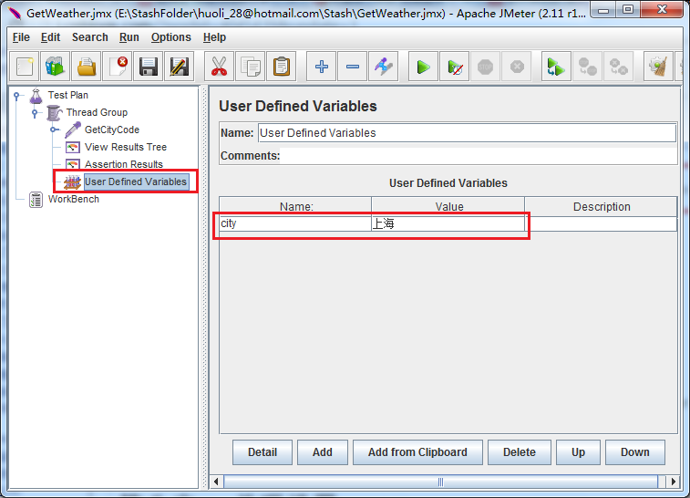

 

然后在Http Request中使用这个变量

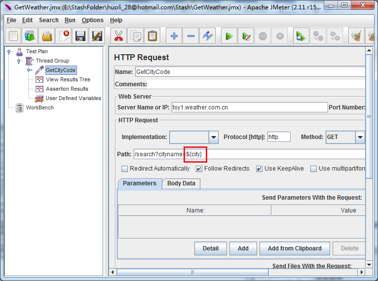

 

# 第八步：关联

所谓关联， 就是第二个Requst, 使用第一个Request中的数据

我们需要在第一个Http Requst 中新建一个正则表达式，把Response的值提取到变量中，提供给别的Http Request 使用

选择第一个Http Request, 右键 Add -> Post Processors -> Regular Expresstion Extractor

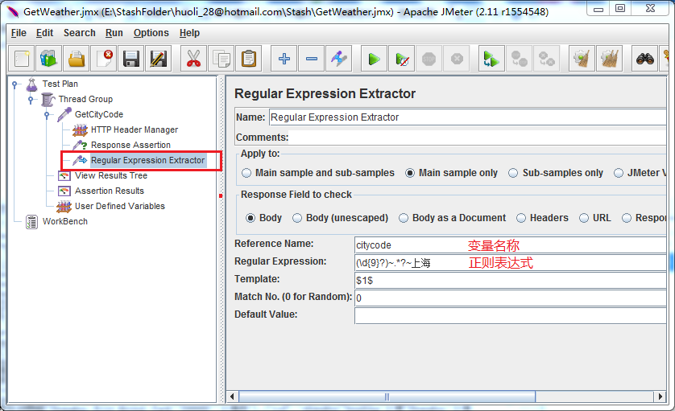

 

现在新建第二个Http Request,     发送到： http://www.weather.com.cn/weather2d/${citycode}.html 

${citycode} 中的数据， 是从Regular Expression Extractor 中取来的

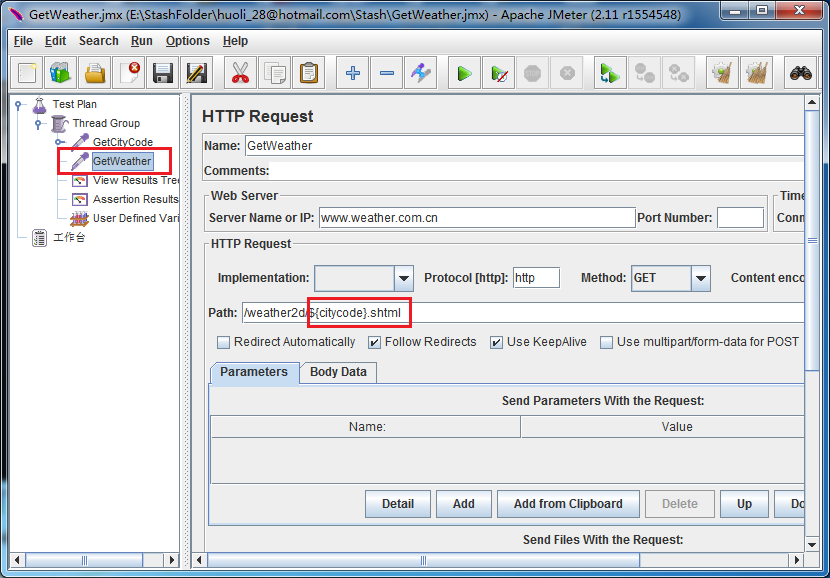

 

到这， 脚本就全部写好了， 运行下，看下最终结果

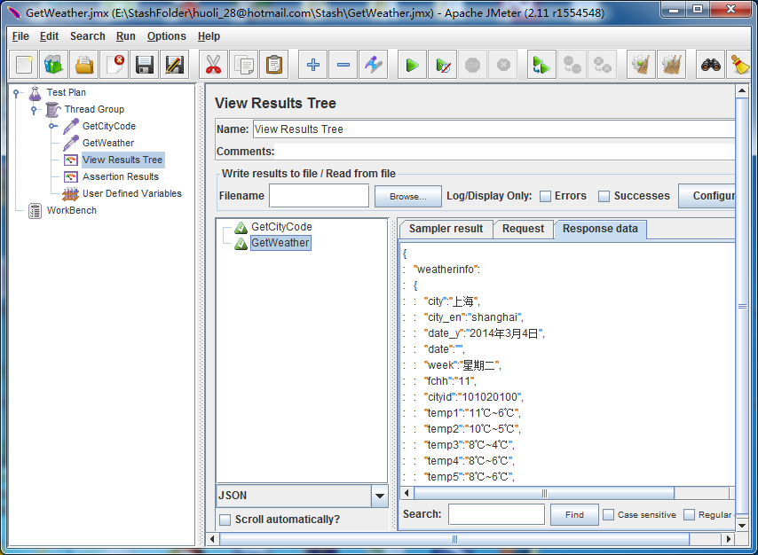 

 

# 源代码下载

点击这里[[小坦克\]](http://files.cnblogs.com/TankXiao/GetWeather.rar)下载源代码

附： Jmeter教程 (连载中, 敬请期待）

[Jmeter教程 入门教程](http://www.cnblogs.com/TankXiao/p/4045439.html)

[Jmeter教程 录制脚本](http://www.cnblogs.com/TankXiao/p/4064289.html)

[Jmeter教程 简单的压力测试](http://www.cnblogs.com/TankXiao/p/4059378.html)

附： Jmeter教程 (连载中, 敬请期待）

[Jmeter教程 入门教程](http://www.cnblogs.com/TankXiao/p/4045439.html)

[Jmeter教程 录制脚本](http://www.cnblogs.com/TankXiao/p/4064289.html)

[Jmeter教程 简单的压力测试](http://www.cnblogs.com/TankXiao/p/4059378.html)

 

分类: [1-3 JMeter 教程](http://www.cnblogs.com/TankXiao/category/507356.html)

http://www.cnblogs.com/TankXiao/p/4045439.html