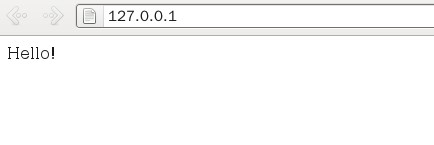

# Linux下配置安装PHP环境

参考别人的做法,遇到问题上网查,下面就是安装步骤.

## 一、安装Apache2.2.22

1、到官网下载  http://httpd.apache.org/download.cgi    
2、解压
​    tar  -zxvf httpd-2.2.22.tar.gz
3、建立目标文件夹（注意以下所有操作都时在root用户下执行的）
​    mkdir /usr/local/apache2
​    也就是说等下安装的apache2要安装到这个文件夹里面
4、配置
​    回到原来解压之后产生的文件夹
​    ./configure --prefix=/usr/local/apache2 --enable-module=shared
​    要加上后面的参数，否则无法使用php，-enable-module=shared表示Apache可以动态的加载模块

这一步，出现了很多问题：

第一个错误为：

```
checking for APR... no
configure: error: APR not found.  Please read the documentation.
解决方法： 
```

> download the latest versions of both APR and APR-Util from [Apache APR](http://apr.apache.org/), unpack them into ./srclib/apr and ./srclib/apr-util (be sure the domain names do not have version numbers; for example, the APR distribution must be under ./srclib/apr/)

then do

```
./configure --with-included-apr 原文章地址：http://stackoverflow.com/questions/9436860/apache-httpd-setup-and-installatio 另外一种解决方法为：
分别安装APR和APR-util，安装方法为：首先下载这两个文件，然后解压，进入解压后目录，然后把APR和APR-util分别安装到/usr/local/文件夹的apr和apr-util文件夹下。APR的具体安装方法为：
[root@localhost 52lamp]# tar -zxvf apr-1.4.2.tar.gz //unzip -o apr-1.4.2.zip
[root@localhost 52lamp]# cd apr-1.4.2
[root@localhost apr-1.4.2]# ./configure --prefix=/usr/local/apr
[root@localhost apr-1.4.2]# make
[root@localhost apr-1.4.2]# make install
安装Apr-util 在./confiure --prefix=/usr/local/apr-util --with-apr=/usr/local/apr
其他步骤类似。 第二个错误为：no acceptable C compiler found in $Path
直接运行 yum install gcc，安装Gcc即可
第三个问题为：pcre-config for libpcre not found
解决方法就是 下载prce安装包，和APR类似，安装到/usr/local/pcre文件夹下面即可。PS:fedora下安装c++编译器g++的命令为：yum install gcc-c++ 。
5、编译
    make    
6、安装
    make install  
7、启动，重启和停止 ，先切换到安装完成后的目录/usr/local/apache2/bin
    ./apachectl -k start
    ./apachectl -k restart
    ./apachectl -k stop  
8、配置文件(满足最基本的配置)
     编辑 /usr/local/apache2/conf/httpd.conf 文件     
     找到：
    AddType  application/x-compress .Z
    AddType application/x-gzip .gz .tgz
    在后面添加：
    AddType application/x-httpd-php .php（使Apcche支持PHP）
    AddType application/x-httpd-php-source .php5   
    找到：
    
    DirectoryIndex index.html
    
    添加：
    
    DirectoryIndex index.html index.php
        
    找到：
    ＃ServerName www.example.com:80
    修改为：
    ServerName 127.0.0.1:80或者ServerName localhost:80
    记得要去掉前面的“＃”    
9、测试
    在浏览器里输入http://127.0.0.1
    如果出现It Works!说明成功。这是我的测试结果:O(∩_∩)O哈哈~
```


10、修改默认的Web站点目录

​     默认的目录为  "/usr/local/apache2/htdocs"，修改apache的配置文件httpd.conf，比如在新建一个 /home/gyw/WebSite的目录作为apache的站点目录

​    找到DocumentRoot这一行修改为：DocumentRoot "/home/gyw/WebSite"

   找到 这一行修改为： 

测试:修改到文件夹出现错误:

“You don't have permission to access /index.html on this server.”

解决方法:

更改文件权限；chmod 755 index.html

打开apache配置文件httpd.conf，找到这么一段：
​     Options FollowSymLinks
​     AllowOverride None
​     Order deny,allow
​     deny from all
​     Satisfy all

测试结果如下：



```
 
```

##   二、安装PHP 

1、 下载
​    http://www.php.net/downloads.php
2、解压
​    tar -zxvf php-5.3.16.tar.gz
3、建立目标文件夹
​    mkdir /usr/local/php
​    也就是说等下安装的php要安装到这个文件夹里面
4、配置
​    回到原来解压后的文件夹
​    ./configure --prefix=/usr/local/php  --with-apxs2=/usr/local/apache2/bin/apxs

​    注意这里有一个-with-apxs2=/usr/local/apache2/bin/apxs选项，其中apxs是在安装Apache时产生的，apxs是一个为Apache HTTP服务器编译和安装扩展模块的工具，使之可以用由[mod_so](http://lamp.linux.gov.cn/Apache/ApacheMenu/mod/mod_so.html)提供的[LoadModule](http://lamp.linux.gov.cn/Apache/ApacheMenu/mod/mod_so.html#loadmodule)指令在运行时加载到Apache服务器中。我的理解是通过这个工具把PHP模块动态加载到Apache中

出现错误:configure: error: xml2-config not found. Please check your libxml2 installation.

运行yum install libxml2，然后再运行yum install libxml2-devel安装完毕后，重新运行上面的./configure命令。

5、编译
​    make   
6、测试编译
​    make test   
7、安装
​    make install

8、配置文件

​    cp /usr/local/php/php.ini-development  /usr/local/php/lib/php.ini
​    把原来位于源代码里面的php.ini-development拷贝到/usr/local/php/lib/php.ini下，并且重命名为php.ini

9.重启apache
10、测试
​    在apache的htdocs下建立一个php文件test.php，里面的内容如下：
​        phpinfo();
​    ?>
​    然后在浏览器里输入http://127.0.0.1/test.php
​    如果出现php的相关配置，成功，如果什么都没有输入，说明失败，重新以上步骤或者查找原因

如果决定在安装后改变配置选项，只需重复最后的三步configure, make, 以及 make install，然后需要重新启动 Apache 使新模块生效。Apache不需要重新编译。

测试结果如下图:


```
 三、安装MySql
```

1、下载
​    到官网下载mysql-5.1.65.tar.gz（注意是源码包）
2、解压
​    tar -zxvf mysql-5.1.65.tar.gz
3、建立目标文件夹
​    mkdir /usr/local/mysql
​    也就是说等下安装的mysql要安装到这个文件夹里面
4、配置
​    ./configure --prefix=/usr/local/mysql/ 

**在./configure****时出现错误：error: No curses/termcap library found**

下载安装相应软件包

yum list|grep ncurses

yum -y install ncurses-devel

yum install ncurses-devel

5、编译
​    make
6、安装
​    make install

7、启动
​    MySQL服务并不会自动启动，还需要先初始化MySQL数据库，操作如下：
​    cd /usr/local/mysql/bin
​    sudo ./mysql_install_db --user=root
​    注意，这里最后的root是指可以操作数据库的用户，可以是当前用户，也可以新建用户，与linux上的root用户是两回事，可以自己取一个名字
​    ./mysqld_safe --user=root & 这条命令负责启动mysql服务的守护进程，此外最后的&时必须的，因为希望守护进程在后台运行
​    这里的root就是刚才的那个
8、为根用户创建密码
​        ./mysqladmin -u root password ‘123456’
​        如果root已经设置过密码，采用如下方法
​        ./mysqladmin -u root password oldpass ‘123456’         
9、测试
​    mysql -u root -p
​    会提示输入密码，就用刚才设置的密码
​    123456
​    如果出现mysql>，说明连接成功了,下面通过命令 创建一个数据库、建一个表，增加一条记录，为后面的测试准备

   mysql> create database gywtest;
   mysql> use gywtest;

   mysql> create table student(id int(4) not null primary key auto_increment,stuname char(20));

   mysql> insert into student(stuname) values('Tom');

   注意每条命令后面有个分号，如果上面的都成功，后面就可以用这个测试。

 四、将PHP与MySql结合起来

 1、重新配置PHP，改变配置选项，只需重复PHP安装时的最后的三步configure, make, 以及 make install，然后需要重新启动 Apache 使新模块生效，Apache不需要重新编译。

 2、配置

./configure --prefix=/usr/local/php  --with-apxs2=/usr/local/apache2/bin/apxs --with-mysqli=/usr/local/mysql/bin/mysql_config  注意mysql_config 的路径
3、编译 make

4、安装 make installe

5、测试 写一个页面test.php,放在apache的web目录下，测试上面用命令创建的数据库

​       $mysqli=new mysqli();
  $mysqli->connect('localhost','root','123456','gywtest');
   // 创建查询
   $sqlstr='select * from student';
  //发送查询给MySql
   $result=$mysqli->query($sqlstr);
​    while($row=$result->fetch_object())
​    { 
​      $name=$row->stuname;
​       echo $name;
​    }
?>

Fatal error: Class 'mysqli' not found in /home/lufangtao/Project/DB.php on line 3

解决方法：

/usr/local/php/bin/phpize 这里回车运行

出错：

Cannot find config.m4. 
Make sure that you run './phpize' in the top level source directory of the module

解决方法：

PHP源码包文件夹下的EXT文件夹就是放置着目前版本的可用扩展，CD进去看看都有哪些你需要的？应该看到mysqli文件夹了吧~~~

在当前目录下执行phpize

[root@localhost mysqli]#/usr/local/php/bin/phpize

Configuring for:

PHP Api Version:                     20090626

Zend Modeule Api No:             20090626

Zend Extension Api No:           220090626

Cannot find autoconf. Please check your autoconf installation and the
$PHP_AUTOCONF environment variable. Then, rerun this script.

解决方法：

yum install autoconf再次运行上面的命令即可。

[root@localhost mysqli]#./configure –prefix=/opt/mysqli –with-php-config=/opt/php/bin/php-config –with-mysqli=/opt/mysql/bin/mysql_config

[root@localhost mysqli]#make

[root@localhost mysqli]#make install

安装完成后会有提示扩展所在目录路径，如：

/opt/php/lib/php/extensions/no-debug-zts-20090626php

所需的mysqli.so便会在此目录下，接下来修改/opt/php/etc/下的php.ini文件，加入mysqli扩展，即加入如下一行：

extension=/opt/php/lib/php/extensions/no-debug-zts-20090626/mysqli.so

这里还是回出现错误：

参考博客<http://www.cnblogs.com/wangtao_20/archive/2011/03/07/1973621.html>

解决不用扩展连接MySQL的方法。

最终还是没有解决MySQLi连接的问题，但是可以使用MySQL数据库了，下面是测试程序


```
\n";

 while ($line = mysql_fetch_array($result, MYSQL_ASSOC)) {        
print "\t\n";      
  foreach ($line as $col_value) {    
        print "\t\t$col_value\n";       
 }       
 print "\t\n";    }   
 print "\n";


    /* 释放资源 */


mysql_free_result($result);
mysql_close();

?>
~       
```


 


 http://blog.chinaunix.net/uid-29632145-id-4888059.html