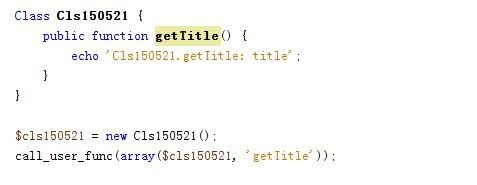
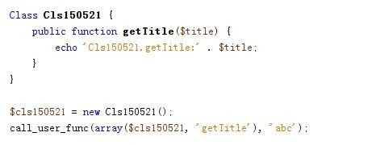

php中可使用call_user_func进行方法的动态调用，可以动态调用普通函数、类方法以及带参数的类方法。

## 工具/原料

- php

## 方法/步骤

1. ​

   1，定义一个普通函数getCurrentDate，用于获取今天日期。

   call_user_func带上的参数为要被调用的函数名。

   

2. ​

   程序会自动执行getCurrentDate函数并获得期望的结果。

   

3. ​

   2，定义一个类Cls150521及类方法getTitle，call_user_func的输入参数变为一个数组，数组第一个元素为对象名、第二个元素为类方法名。

   

4. ​

   程序会自动调用对象$cls150521的方法getTitle()，并获得期望结果。

   

5. ​

   3,也可调用带参数的方法，此时将getTitle方法改为getTitle($title)。

   调用时，加上第二个参数，就是需要传给方法的参数。

   

6. ​

   传入的参数为abc，可获得期望的结果：

   Cls150521.getTitle:abc

   

   END

   ​

   来源： <<http://jingyan.baidu.com/article/6c67b1d697a0b32786bb1e77.html>>

    