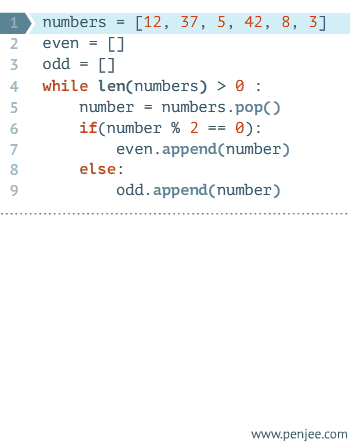

# Python控制流

## 简介

在到目前为止我们所见到的程序中，总是有一系列的语句，Python 忠实地按照它们的顺序执行它们。如果你想要改变语句流的执行顺序，该怎么办呢？例如，你想要让程序做一些决定，根据不同的情况做不同的事情，例如根据时间打印“早上好”或者“晚上好”。

你可能已经猜到了，这是通过控制流语句实现的。在 Python 中有三种控制流语句—— if、for 和 while。

## if 语句

if 语句用来检验一个条件， 如果 条件为真，我们运行一块语句（称为 if-块 ）， 否则 我们处理另外一块语句（称为 else-块 ）。 else 从句是可选的。

### 使用 if 语句

**例 6.1 使用 if 语句**

```python
#!/usr/bin/env python
# encoding=utf-8


#### if-else ####
print '#### if-else ####'
a = input("a: ")  # 12 or 10+2
b = input("b: ")
if (a > b):
    print "max: ", a
else:
    print "max: ", b
#### if-elif-else ####
print '#### if-elif-else ####'
score = raw_input("score: ")  # string
score = int(score)
if (score >= 90) and (score <= 100):
    print "A"
elif (score >= 80 and score < 90):
    print "B"
elif (score >= 60 and score < 80):
    print "C"
else:
    print "D"

```


**输出**

```
#### if-else ####
a: 23
b: 2
max:  23
#### if-elif-else ####
score: 23
D

```


> **给C/C++程序员的注释**
> 在 Python 中没有 switch 语句。你可以使用 if..elif..else 语句来完成同样的工作（在某些场合，使用[字典](http://woodpecker.org.cn/abyteofpython_cn/chinese/ch09s04.html)会更加快捷。）

## while 语句

### 基本形式

Python 编程中 while 语句用于循环执行程序，即在某条件下，循环执行某段程序，以处理需要重复处理的相同任务。其基本形式为：

```
while 判断条件：
    执行语句……
```

执行语句可以是单个语句或语句块。判断条件可以是任何表达式，任何非零、或非空（null）的值均为true。

当判断条件假false时，循环结束。

执行流程图如下：


#### Gif 演示 Python while 语句执行过程



#### 实例

```
#!/usr/bin/python
 
count = 0
while (count < 9):
   print 'The count is:', count
   count = count + 1
 
print "Good bye!"
```

以上代码执行输出结果:

```
The count is: 0
The count is: 1
The count is: 2
The count is: 3
The count is: 4
The count is: 5
The count is: 6
The count is: 7
The count is: 8
Good bye!
```

while 语句时还有另外两个重要的命令 continue，break 来跳过循环，continue 用于跳过该次循环，break 则是用于退出循环，此外"判断条件"还可以是个常值，表示循环必定成立，具体用法如下：

\# continue 和 break 用法 i = 1while i < 10:       i += 1    if i%2 > 0:     # 非双数时跳过输出        continue    print i         # 输出双数2、4、6、8、10 i = 1while 1:            # 循环条件为1必定成立    print i         # 输出1~10    i += 1    if i > 10:     # 当i大于10时跳出循环        break

------

### 无限循环

如果条件判断语句永远为 true，循环将会无限的执行下去，如下实例：

**实例**

```
#!/usr/bin/python
# -*- coding: UTF-8 -*-
 
var = 1
while var == 1 :  # 该条件永远为true，循环将无限执行下去
   num = raw_input("Enter a number  :")
   print "You entered: ", num
 
print "Good bye!"
```

以上实例输出结果：

```
Enter a number  :20
You entered:  20
Enter a number  :29
You entered:  29
Enter a number  :3
You entered:  3
Enter a number between :Traceback (most recent call last):
  File "test.py", line 5, in <module>
    num = raw_input("Enter a number :")
KeyboardInterrupt
```

**注意：**以上的无限循环你可以使用 CTRL+C 来中断循环。

------

### 循环使用 else 语句

在 python 中，while … else 在循环条件为 false 时执行 else 语句块：

**实例**

```
#!/usr/bin/python
 
count = 0
while count < 5:
   print count, " is  less than 5"
   count = count + 1
else:
   print count, " is not less than 5"
```

以上实例输出结果为：

```
0 is less than 5
1 is less than 5
2 is less than 5
3 is less than 5
4 is less than 5
5 is not less than 5
```

------

### 简单语句组

类似 if 语句的语法，如果你的 while 循环体中只有一条语句，你可以将该语句与while写在同一行中， 如下所示：

实例

```
#!/usr/bin/python
 
flag = 1
 
while (flag): print 'Given flag is really true!'
 
print "Good bye!"
```

**注意：**以上的无限循环你可以使用 CTRL+C 来中断循环。

> **给 C/C++程序员的注释**
> 记住，你可以在 while 循环中使用一个 else 从句。

## for 循环

for..in 是另外一个循环语句，它在一序列的对象上 递归 即逐一使用队列中的每个项目。我们会在后面的章节中更加详细地学习[序列](http://woodpecker.org.cn/abyteofpython_cn/chinese/ch09s05.html)。

### 使用 for 语句

**例 6.3 使用 for 语句**

```
    #!/usr/bin/python
    # Filename: for.py

    for i in range(1, 5):
        print i
    else:
        print 'The for loop is over'

```

**输出**

```
    $ python for.py
    1
    2
    3
    4
    The for loop is over

```

**它如何工作**

在这个程序中，我们打印了一个 序列 的数。我们使用内建的 range 函数生成这个数的序列。

我们所做的只是提供两个数，range 返回一个序列的数。这个序列从第一个数开始到第二个数为止。例如，range(1,5)给出序列[1, 2, 3, 4]。默认地，range 的步长为 1。如果我们为range 提供第三个数，那么它将成为步长。例如，range(1,5,2)给出[1,3]。记住，range 向上 延伸到第二个数，即它**不**包含第二个数。

for 循环在这个范围内递归—— for i in range(1,5)等价于 for i in [1, 2, 3, 4]，这就如同把序列中的每个数（或对象）赋值给 i，一次一个，然后以每个 i 的值执行这个程序块。在这个例子中，我们只是打印 i 的值。

记住，else 部分是可选的。如果包含 else，它总是在 for 循环结束后执行一次，除非遇到 [break](http://woodpecker.org.cn/abyteofpython_cn/chinese/ch06s05.html) 语句。

记住，for..in 循环对于任何序列都适用。这里我们使用的是一个由内建 range 函数生成的数的列表，但是广义说来我们可以使用任何种类的由任何对象组成的序列！我们会在后面的章节中详细探索这个观点。

> **给 C/C++/Java/C#程序员的注释**
> Python 的 for 循环从根本上不同于 C/C++的 for 循环。C#程序员会注意到 Python 的 for 循环与 C#中的 foreach 循环十分类似。Java 程序员会注意到它与 Java 1.5 中的 for (int i : IntArray)相似。 在 C/C++中，如果你想要写 for (int i = 0; i < 5; i++)，那么用 Python，你写成 for i in range(0,5)。你会注意到，Python 的 for 循环更加简单、明白、不易出错。

## break 语句

break 语句是用来 终止 循环语句的，即哪怕循环条件没有称为 False 或序列还没有被完全递归，也停止执行循环语句。

一个重要的注释是，如果你从 for 或 while 循环中 终止 ，任何对应的循环 else 块将**不**执行。

### 使用 break 语句

**例 6.4 使用 break 语句**

```python
#!/usr/bin/env python
# encoding=utf-8

while True:
    s = raw_input('Enter something : ')
    if s == 'quit':
        break
    print 'Length of the string is', len(s)
print 'Done'
```


**输出**

```
    $ python break.py
    Enter something : Programming is fun
    Length of the string is 18
    Enter something : When the work is done
    Length of the string is 21
    Enter something : if you wanna make your work also fun:
    Length of the string is 37
    Enter something :   use Python!
    Length of the string is 12
    Enter something : quit
    Done

```

**它如何工作**

在这个程序中，我们反复地取得用户地输入，然后打印每次输入地长度。我们提供了一个特别的条件来停止程序，即检验用户的输入是否是'quit'。通过 终止 循环到达程序结尾来停止程序。

输入字符串的长度通过内建的 len 函数取得。

记住，break 语句也可以在 for 循环中使用。

### G2 的 Python 诗

我在这里输入的是我所写的一段小诗，称为 **G2 的 Python 诗**：

```
    Programming is fun
    When the work is done
    if you wanna make your work also fun:
      use Python!

```

## continue 语句

continue 语句被用来告诉 Python 跳过当前循环块中的剩余语句，然后 *继续* 进行下一轮循环。

### 使用 continue 语句

**例 6.5 使用 continue 语句**

```
#!/usr/bin/env python
# encoding=utf-8

while True:
    s = raw_input('Enter something : ')
    if s == 'quit':
        break
    if len(s) < 3:
        continue
    print 'Input is of sufficient length'
# Do other kinds of processing here...
```

**输出**

```
    $ python continue.py
    Enter something : a
    Enter something : 12
    Enter something : abc
    Input is of sufficient length
    Enter something : quit

```

**它如何工作**

在这个程序中，我们从用户处取得输入，但是我们仅仅当它们有至少 3 个字符长的时候才处理它们。所以，我们使用内建的 len 函数来取得长度。如果长度小于 3，我们将使用 continue 语句忽略块中的剩余的语句。否则，这个循环中的剩余语句将被执行，我们可以在这里做我们希望的任何处理。

注意，continue 语句对于 for 循环也有效。

## 概括

我们已经学习了如何使用三种控制流语句—— if、while 和 for 以及与它们相关的 break 和 continue 语句。它们是 Python 中最常用的部分，熟悉这些控制流是应当掌握的基本技能。

接下来，我们将学习如何创建和使用函数。


http://wiki.jikexueyuan.com/project/simple-python-course/control-flow.html