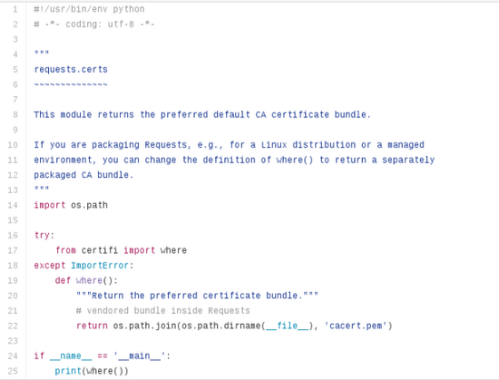

# Python里的一些注释规范

写代码注释是一件很重要的事情，如果你写的一段函数给别人调用那么往往都需要配上一些基本的注释。写好代码可以让别人容易阅读你的代码。试想一 下：如果你在github上面找到一段你想要的代码，这段代码有200行，可能这些代码我们要进行改造，那么这时候如果代码中都没有恰当的注释，我们可能 要用比较久的时间去通读一下他的代码。

相反，如果这些代码有一些恰当的注释，我们可能会更加好理解一点。学会注释是编码过程中不可或缺的一部分。那么什么样的注释才是规范的注释，才能让其他看你代码的人能快速的了解你得代码结构呢。我们今天就说一说 有关于Python的一些注释规范。

## 三种注释

在说规范之前我们有必要先看以下Python的注释有哪些?

单行注释

多行注释

特殊注释


## 示例介绍

按照每一个注释进行简单的介绍(我们截选request库的一段文件)：



关于 #!/usr/bin/env python

1、必须是文件的第一行

2、必须以#!开头

3、#!/usr/bin/env python告诉LINUX/UNIX去找到python的翻译器。

关于： # -*- coding: utf-8 -*-

1、基本上在文件的第二行，在#!/usr/bin/env python的下一行

2、python interpret如何解释字符串的编码

3、当你的文件中出现中文的时候，你必须使用它

第四到第十三行：为上述所说的所行注释。多行注释，以三个引号开始，三个引号结尾。这三个引号可以使单引号也可以是双引号。

1、一般类文档，函数文档，字符串之类的用双引号，变量用单引号。

第二十一行：我们所说的单行注释，单行注释以#开头标识。

你也可以连续多次使用#单行注释来代替多行注释，但是我们并不推荐那么做。

知道了上述的注释之后，我们需要知道的是在哪些场合使用哪些注释。

## 哪些场合使用哪些注释

### 第一点：文件开头注释

为了避免麻烦，在文件的开头加上这两句。

```python
#!/usr/bin/env python    
# -*- coding: utf-8 -*-
```

### 第二点：文件内容注释

每一个Python文件的开头，紧接着第一点所说的两行代码之后，我们往往要写上关于这个模块即这个Python文件实现的功能一些注意点，可能会发生的错误，总之你得注释要让使用它的人很明白你得代码段，比如：

```python
"""    
requests.cookies    
​~~~~~~~~~~~~~~~~    
Compatibility code to be able to use `cookielib.CookieJar` with requests.    requests.utils imports from here, so be careful with imports.    
"""
```

或者

```python
"""    
This is the Scrapy engine which controls the Scheduler, Downloader and Spiders.    For more information see docs/topics/architecture.rst    
"""
```

可能，你不看代码，都已经知道接下来的是什么了，那么你能找到上面这个注释是出自哪个文件吗?

### 第三点：类注释

每一个类下面加上关于这个类的说明以及用法，这样使用它的人可能都不要知道他的内部构造，就可以使用他了，我们看看这个。

第一：这个类是干嘛的?

第二：经常在什么情况下使用?

第三：如何使用?

都交待说明的很详细，你不看代码估计已经会使用了。

```
class HTTPAdapter(BaseAdapter):    
"""The built-in HTTP Adapter for urllib3.    Provides a general-case interface for Requests sessions to contact HTTP and    HTTPS urls by implementing the Transport Adapter interface. This class will    usually be created by the :class:`Session ` class under the    covers.    :param pool_connections: The number of urllib3 connection pools to cache.    :param pool_maxsize: The maximum number of connections to save in the pool.    :param max_retries: The maximum number of retries each connection    should attempt. Note, this applies only to failed DNS lookups, socket    connections and connection timeouts, never to requests where data has    made it to the server. By default, Requests does not retry failed    connections. If you need granular control over the conditions under    which we retry a request, import urllib3's ``Retry`` class and pass    that instead.    :param pool_block: Whether the connection pool should block for connections.    Usage::    >>> import requests    >>> s = requests.Session()    >>> a = requests.adapters.HTTPAdapter(max_retries=3)    >>> s.mount('http://', a)    
"""
```

### 第四点：函数注释

每一个函数下面务必加上多行注释，很有可能你的函数注释只有一行，或者两行，你可以使用单行注释，也可以使用多行注释，这里与类函数说明相当，注释中往往包含使用说明，注意点。

```
def __setstate__(self, state):    
# Can't handle by adding 'proxy_manager' to self.__attrs__ because    # self.poolmanager uses a lambda function, which isn't pickleable.
```

或者

```
def has_capacity(self):    """Does the engine have capacity to handle more spiders"""    return not bool(self.slot)
```

### 第五点：代码单行注释

在必要的地方加上单行注释。这些地方不外乎

1、你不怎么理解的代码

2、别人可能不理解的代码

3、提醒自己或者别人注意的代码、重要代码

```
self.inprogress = set() 
# requests in progress    
assert not self.running, "Engine already running"
```

以上，更多的编码习惯。你可以去读一读，request的代码。


http://www.techug.com/post/comments-in-python.html