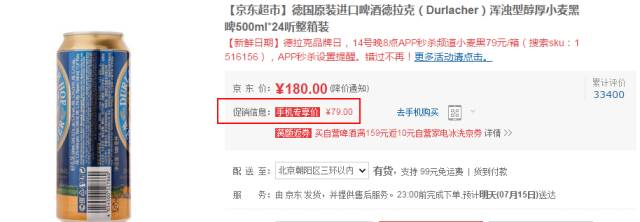
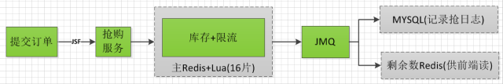
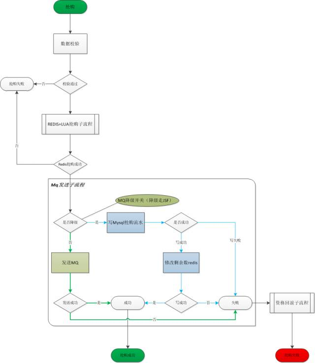

# 京东抢购服务高并发实践


> > 声明：本位来自京东张开涛的微信公众号（kaitao-1234567），授权CSDN转载，如需转载请联系作者。 
> > 作者：张子良，京东高级开发工程师，在京东负责抢购后端服务系统架构和开发工作。 
> > 责编：钱曙光，关注架构和算法领域，寻求报道或者投稿请发邮件qianshg@csdn.net，另有「CSDN 高级架构师群」，内有诸多知名互联网公司的大牛架构师，欢迎架构师加微信qshuguang2008申请入群，备注姓名+公司+职位。

### 服务介绍

限时抢购又称闪购，英文Flash sale，起源于法国网站Vente Privée。闪购模式即是以互联网为媒介的B2C电子零售交易活动，以限时特卖的形式，定期定时推出国际知名品牌的商品，一般以原价1-5折的价格供专属会员限时抢购，每次特卖时间持续5-10天不等，先到先买，限时限量，售完即止。顾客在指定时间内（一般为20分钟）必须付款，否则商品会重新放到待销售商品的行列里。

模式特征：

品牌丰富 —— 推出国内外一二线名牌商品，供消费者购买选择；

时间短暂 —— 每个品牌推出时间短暂，一般为5—10天，先到先买，限量售卖，售完即止；

折扣超低 —— 以商品原价1—5折的价格销售，折扣力度大。

摘自[【百度百科】](http://baike.baidu.com/link?url=l1lnT-iW4yjQzSiCYtag0K0LqxmBfWVrS8EOUbH0Zgece0uKZIPpQ__OHhE0jkMTMhRNlsC4kyUgJKWrR8WDEq)，通过这段简介相信对限时抢购有了一定的了解，我们内部称之为抢购系统。

对于抢购系统来说，首先要有可抢购的活动，而且这些活动具有促销性质，比如直降500元。其次要求可抢购的活动类目丰富，用户才有充分的选择性。618（6.1-6.20）期间增量促销活动量非常多，可能某个活动力度特别大，大多用户都在抢，必然对系统是一个考验。这样抢购系统具有秒杀特性，并发访问量高，同时用户也可选购多个限时抢商品，与普通商品一起进购物车结算。这种大型活动的负载可能是平时的几十倍，所以通过增加硬件、优化瓶颈代码等手段是很难达到目标的，所以抢购系统得专门设计。

服务主要功能

创建促销服务：采销创建促销后，促销管理系统审核通过后，会调用抢购系统创建促销；

抢服务：为符合条件的订单操作剩余数，主要是扣减剩余数；

针对哪些SKU

目前主要为单品促销，直降或者一口价，比如：



主要渠道

移动APP、微信、手Q和主站

限购类型

限数量、限ip、限pin和限制ip与pin

### 系统设计要点

如何实现实时库存？

这里说的库存不是真正意义上的库存，其实是该促销可以抢购的数量，真正的库存在基础库存服务。用户点击『提交订单』按钮后，在抢购系统中获取了资格后才去基础库存服务中扣减真正的库存；而抢购系统控制的就是资格/剩余数。传统方案利用数据库行锁，但是在促销高峰数据库压力过大导致服务不可用，目前采用redis集群（16分片）缓存促销信息，例如促销id、促销剩余数、抢次数等，抢的过程中按照促销id散列到对应分片，实时扣减剩余数。当剩余数为0或促销删除，价格恢复原价。

如何设计抢购redis数据结构？

采销人员发布促销后，在抢购redis中生成一笔记录，给抢服务提供基本信息。每一个促销对应一个促销id，促销信息是Hashes结构。

例如促销A，对应的类型为单品促销，我们暂且认为类型值为1，对应redis中的key为 C_A_1，数据结构内容类似于如下：

```
o:  100 // 原始数量
b:  99  // 可抢购数量，假如抢购了一个剩下了99
c:  1   // 抢购次数记录，用来限流，后面会介绍到
```

如何保证不超卖？

因为扣减资格是一组操作，我们利用EVAL操作redis剩余数实现原子化操作，伪代码如下：

```
local key = KEYS[1]

local tag  = "b"local num   = tonumber(ARGV[1]); 

local lastNum = redis.call('HINCRBY',key,tag,-num);

if业务性判断ortonumber(lastNum) == 0thenreturn lastNum

end
```

如上代码会返回剩余数，如果小于等于0了，则没有库存了。

如何提高吞吐量？

减少网络交互（一次抢数据通过 EVALSHA 一次性提交给redis集群）；数据库操作异步化（使用JMQ异步记录日志）。

如何保证可用性？

采用JSF（京东内部SOA框架）对外开放服务（抢服务和发布促销服务），可降级为系统自身webservice服务；

抢购系统主要依赖于redis集群，redis采用一主三从集群方案，部署在两个机房，每个集群16个分片，每两分片共用一台物理机，可通过配置中心切换主从；

如果Redis挂掉了，如何恢复呢？通过汇总MySQL中的抢购和取消流水日志，并恢复Redis的抢购数量。

### 系统架构

这里主要涉及抢服务架构剖析，因为它具有典型的高并发特性，下面是基本架构概图：



> 注：此处的库存是可抢购数量设置，或者叫做资格/剩余数，并非真正的实际库存。

抢服务流程

Redis使用单个Lua解释器去运行所有脚本，并且Redis 也保证脚本会以原子性(atomic)的方式执行：当某个脚本正在运行的时候，不会有其他脚本或Redis命令被执行。这种特性很好的解决了抢服务流程中并发带来的问题。



REDIS+LUA抢购子流程：

此流程通过lua Script脚本实现，我们暂时命名为q.lua（主要功能限流和扣减促销活动剩余数）。这样把抢购流程与Script脚本结合，一次性提交给Redis减少网络交互，使得性能大大提升。

q.lua伪代码：

```
--[[

--!@brief 促销Id下限流：可以防止某个促销过热导致服务不可以用

--]]local function limited()-- todo: 实现end--[[

--!@brief 限制逻辑(ip和pin)：比如有的促销是限制ip,这里校验ip是否存在,如果为限ip类型抢购活动,存在抛出异常告知ip已经存在不能抢购

--]]local function check_ip_pin()-- todo: 实现end--[[

--!@brief 记录订单号：主要目的实现抢方法幂等性,调用方网络超时可以重复调用,存在订单号直接返回抢购成功,不至于超卖

--]]local function record_order_id()-- todo: 实现end--[[

--!@brief 扣减剩余数

--]]local function scalebuy()--local lastNum = redis.call('HINCRBY',key,tag,-num);

    --end-- 调用顺序不可调整-- 1 限流local status,msg = limited()

if status == 0thenreturn msg

end-- 2 校验

status,msg = check_ip_pin()

if status == 0 thenreturn msg

end-- 3 记录订单

status,msg = record_order_id()

if status == 0 thenreturn msg

end-- 4 扣减剩余数

status,msg = scalebuy()

if status == 0 thenreturn msg

end-- 5 返回成功标示return 1
```

子流程具体如下：

1、解析请求参数，根据促销Id按照Jedis中MurmurHash算法获取分片，然后按照分片包装Pipeline批量发送请求参数argList；

2、获取系统初始化时SCRIPT LOAD加载q.lua返回的串shaValue；

3、执行EVALSHA，伪代码如下：

```
// 其他操作

Pipeline p;

// 初始化p

p.evalsha(shaValue,keyList, argList);

// 其他操作
```

4、处理返回结果，只要有一个分片失败，本次抢购就失败。

> 补充：详细Script操作可以参考Jedis中 ScriptingCommandsTest。

### JMQ发送子流程：

执行REDIS+LUA抢购子流程成功仅仅代表着操作redis成功，发送jmq（京东mq基础服务）成功（后端异步将实时库存更新到MySQL）才算一笔抢购成功，否则算抢购失败。这么设计的原因主要是保证抢购redis和mysql记录最终一致，发送失败需要回滚REDIS+LUA抢购子流程（恢复Redis的库存和抢购资格）。当然要考虑降级，jmq不可用时，直接切到jsf服务模拟jmq，也就是直接写MySQL库，前提是限流次数调小，否则数据库有压力过大的风险。这样虽然用户体验下降了，但是服务依然可用。开关都在配置中心操作，一分钟内生效。

资格回滚子流程：

发送JMQ失败必须回滚，否则就出现了超卖现象，具体流程同REDIS+LUA抢购子流程类似，是它的逆向流程，只不过运行脚本不同罢了。

限流处理

方法级限流，限流阈值通过配置中心配置，一分钟生效，伪代码如下：

```
private static AtomicInteger atomic = new AtomicInteger(0);

public void test() {

    try {

         // 限流int limitNum = XXX.getLimitNum(); 

        int nowConcurrent = atomic.incrementAndGet();

        if(nowConcurrent > limitNum) {

            // 异常处理

        }   

        // 正常业务逻辑

    } catch(Exception e) {

        // 异常处理

    } finally {

        atomic.decrementAndGet();

    }

}
```

q.lua中促销级别的限流，主要利用C_A_1中c的抢次数和阈值比对。比如促销A，60秒内只能抢60000次，超过阈值60000该促销就会抢购失败。

到此抢购系统的核心逻辑就介绍完了，这里边还有一些细节问题需要大家在设计时思考，如限购（如每个人限购2个）、真实库存不足取消、用户取消订单归还资格、Redis挂了恢复数据、停促销（时间过期停、库存不足停）等。

相关阅读：

- [京东抢购服务高并发实践](http://geek.csdn.net/news/detail/93986)
- [京东商品详情页前端开发宝典](http://geek.csdn.net/news/detail/93578)
- [京东上千页面搭建基石——CMS前后端分离演进史](http://geek.csdn.net/news/detail/92070)
- [京东一元抢宝系统的数据库架构优化](http://geek.csdn.net/news/detail/89653)

> 2016年8月12-13日由CSDN主办的SDCC 2016架构&运维峰会将在成都站召开，5人以上团购或者购买两场峰会通票更有特惠，余票不足，预购从速。（[票务详情链接](http://huiyi.csdn.net/activity/product/goods_list?project_id=3024)）。 
> 更多详细内容参见官网网址：[SDCC数据库&架构峰会成都站](http://bss.csdn.net/m/topic/sdcc_invite/chengdu)，[大会报名](http://bss.csdn.net/m/topic/sdcc_invite/chengdu#goupiaoxinxi)。
>
> 来源： [http://geek.csdn.net/news/detail/93986](http://geek.csdn.net/news/detail/93986)