## 技术面试宝典： 很全面的算法和数据结构知识（含代码实现）

原创*2017-04-17**伯乐在线*[程序员的那些事](##)

（点击上方公众号，可快速关注）

> 编译：伯乐在线/心灵是一棵开花的树
>
> [如有好文章投稿，请点击 → 这里了解详情](http://mp.weixin.qq.com/s?__biz=MjM5OTA1MDUyMA==&mid=2655435719&idx=3&sn=db6e755b555bdabc79366d75e99e3a6e&scene=21#wechat_redirect)

本文汇总了技术面试时需要了解的算法和数据结构知识。

## **数据结构部分**

#### **链表**

- 链表是一种由节点（Node）组成的线性数据集合，每个节点通过指针指向下一个节点。它是一种由节点组成，并能用于表示序列的数据结构。

- 单链表：每个节点仅指向下一个节点，最后一个节点指向空（null）。

- 双链表：每个节点有两个指针p，n。p指向前一个节点，n指向下一个节点；最后一个节点指向空。

- 循环链表：每个节点指向下一个节点，最后一个节点指向第一个节点。

- 时间复杂度：

- - 索引：O(n)
  - 查找：O(n)
  - 插入：O(1)
  - 删除：O(1)

#### **栈**

- 栈是一个元素集合，支持两个基本操作：push用于将元素压入栈，pop用于删除栈顶元素。

- 后进先出的数据结构（Last In First Out, LIFO）

- 时间复杂度

- - 索引：O(n)
  - 查找：O(n)
  - 插入：O(1)
  - 删除：O(1)

#### **队列**

- 队列是一个元素集合，支持两种基本操作：enqueue 用于添加一个元素到队列，dequeue 用于删除队列中的一个元素。

- 先进先出的数据结构（First In First Out, FIFO）。

- 时间复杂度

- - 索引：O(n)
  - 查找：O(n)
  - 插入：O(1)
  - 删除：O(1)

#### **树**

- 树是无向、联通的无环图。

**二叉树**

- 二叉树是一个树形数据结构，每个节点最多可以有两个子节点，称为左子节点和右子节点。
- 满二叉树（Full Tree）：二叉树中的每个节点有 0 或者 2 个子节点。
- 完美二叉树（Perfect Binary）：二叉树中的每个节点有两个子节点，并且所有的叶子节点的深度是一样的。
- 完全二叉树：二叉树中除最后一层外其他各层的节点数均达到最大值，最后一层的节点都连续集中在最左边。

**二叉查找树**

- 二叉查找树（BST）是一种二叉树。其任何节点的值都大于等于左子树中的值，小于等于右子树中的值。

- 时间复杂度

- - 索引：O(log(n))
  - 查找：O(log(n))
  - 插入：O(log(n))
  - 删除：O(log(n))

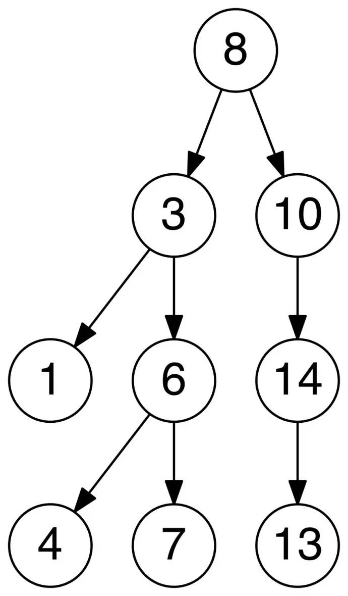

**字典树**

- 字典树，又称为基数树或前缀树，是一种用于存储键值为字符串的动态集合或关联数组的查找树。树中的节点并不直接存储关联键值，而是该节点在树中的位置决定了其关联键值。一个节点的所有子节点都有相同的前缀，根节点则是空字符串。

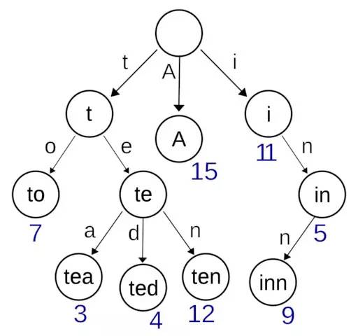

**树状数组**

- 树状数组，又称为二进制索引树（Binary Indexed Tree，BIT），其概念上是树，但以数组实现。数组中的下标代表树中的节点，每个节点的父节点或子节点的下标可以通过位运算获得。数组中的每个元素都包含了预计算的区间值之和，在整个树更新的过程中，这些计算的值也同样会被更新。

- 时间复杂度

- - 区间求和：O(log(n))
  - 更新：O(log(n))

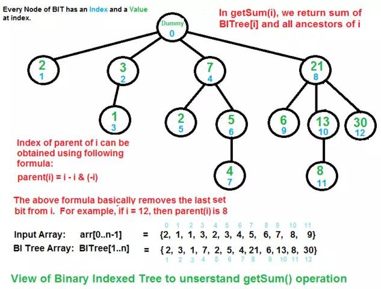

**线段树**

- 线段树是用于存储区间和线段的树形数据结构。它允许查找一个节点在若干条线段中出现的次数。

- 时间复杂度

- - 区间查找：O(log(n))
  - 更新：O(log(n))

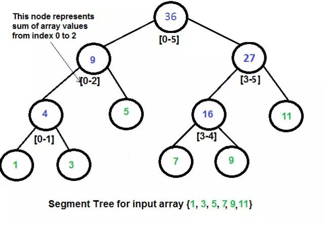

#### **堆**

- 堆是一种基于树的满足某些特性的数据结构：整个堆中的所有父子节点的键值都满足相同的排序条件。堆分为最大堆和最小堆。在最大堆中，父节点的键值永远大于等于所有子节点的键值，根节点的键值是最大的。最小堆中，父节点的键值永远小于等于所有子节点的键值，根节点的键值是最小的。

- 时间复杂度

- - 索引：O(log(n))
  - 查找：O(log(n))
  - 插入：O(log(n))
  - 删除：O(log(n))
  - 删除最大值/最小值：O(1)

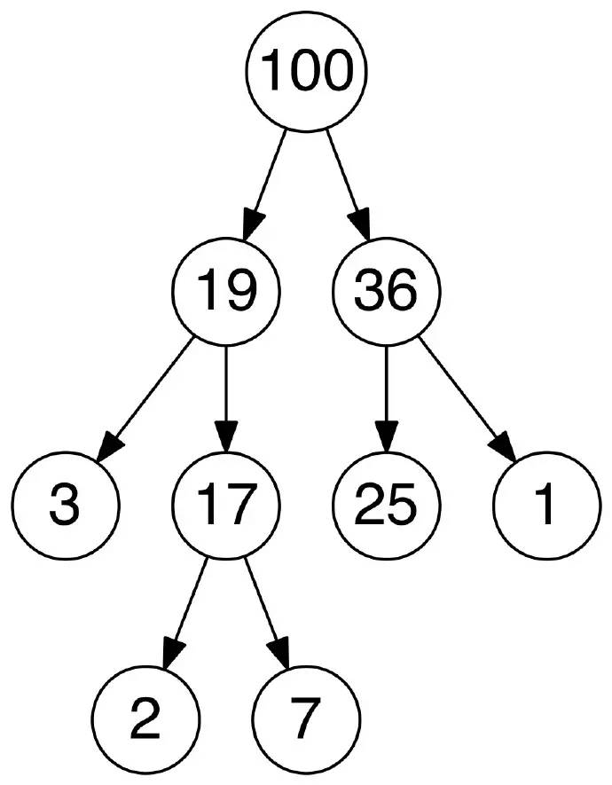

#### **哈希**

- 哈希用于将任意长度的数据映射到固定长度的数据。哈希函数的返回值被称为哈希值、哈希码或者哈希。如果不同的主键得到相同的哈希值，则发生了冲突。

- Hash Map：hash map 是一个存储键值间关系的数据结构。HashMap 通过哈希函数将键转化为桶或者槽中的下标，从而便于指定值的查找。

- 冲突解决

- - 链地址法（Separate Chaining）：在链地址法中，每个桶（bucket）是相互独立的，每一个索引对应一个元素列表。处理HashMap 的时间就是查找桶的时间（常量）与遍历列表元素的时间之和。
  - 开放地址法（Open Addressing）：在开放地址方法中，当插入新值时，会判断该值对应的哈希桶是否存在，如果存在则根据某种算法依次选择下一个可能的位置，直到找到一个未被占用的地址。开放地址即某个元素的位置并不永远由其哈希值决定。

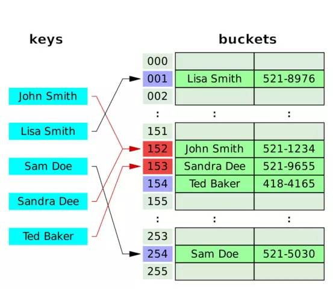

#### **图**

- 图是G =（V，E）的有序对，其包括顶点或节点的集合 V 以及边或弧的集合E，其中E包括了两个来自V的元素（即边与两个顶点相关联 ，并且该关联为这两个顶点的无序对）。
- 无向图：图的邻接矩阵是对称的，因此如果存在节点 u 到节点 v 的边，那节点 v 到节点 u 的边也一定存在。
- 有向图：图的邻接矩阵不是对称的。因此如果存在节点 u 到节点 v 的边并不意味着一定存在节点 v 到节点 u 的边。

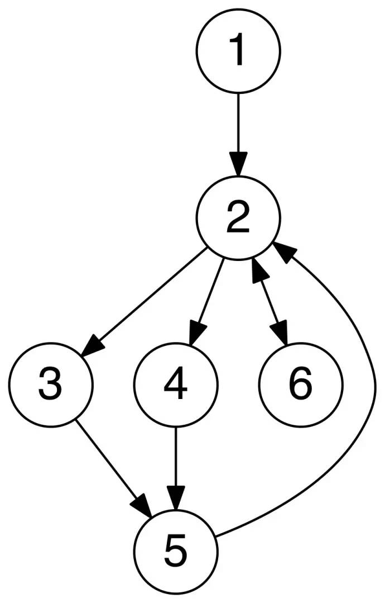

## **算法部分**

#### **排序**

##### **快速排序**

- 稳定：否

- 时间复杂度

- - 最优：O(nlog(n))
  - 最差：O(n^2)
  - 平均：O(nlog(n))

##### **合并排序**

- 合并排序是一种分治算法。这个算法不断地将一个数组分为两部分，分别对左子数组和右子数组排序，然后将两个数组合并为新的有序数组。

- 稳定：是

- 时间复杂度：

- - 最优：O(nlog(n))
  - 最差：O(nlog(n))
  - 平均：O(nlog(n))

##### **桶排序**

- 桶排序是一种将元素分到一定数量的桶中的排序算法。每个桶内部采用其他算法排序，或递归调用桶排序。

- 时间复杂度

- - 最优：Ω(n + k)
  - 最差: O(n^2)
  - 平均：Θ(n + k)

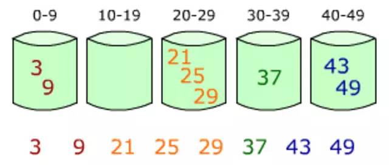

##### **基数排序**

- 基数排序类似于桶排序，将元素分发到一定数目的桶中。不同的是，基数排序在分割元素之后没有让每个桶单独进行排序，而是直接做了合并操作。

- 时间复杂度

- - 最优：Ω(nk)
  - 最差: O(nk)
  - 平均：Θ(nk)

#### **图算法**

##### **深度优先搜索**

- 深度优先搜索是一种先遍历子节点而不回溯的图遍历算法。
- 时间复杂度：O(|V| + |E|)

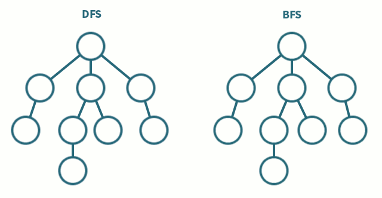

##### **广度优先搜索**

- 广度优先搜索是一种先遍历邻居节点而不是子节点的图遍历算法。
- 时间复杂度：O(|V| + |E|)

##### **拓扑排序**

- 拓扑排序是有向图节点的线性排序。对于任何一条节点 u 到节点 v 的边，u 的下标先于 v。
- 时间复杂度：O(|V| + |E|)

##### **Dijkstra算法**

- Dijkstra 算法是一种在有向图中查找单源最短路径的算法。
- 时间复杂度：O(|V|^2)

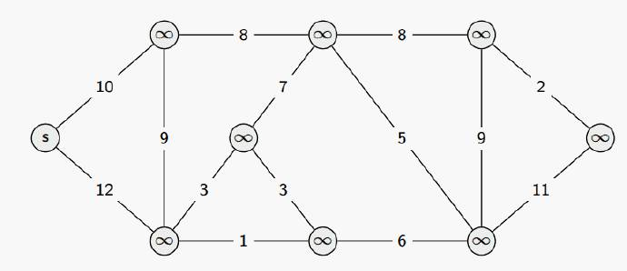

##### **Bellman-Ford算法**

- Bellman-Ford 是一种在带权图中查找单一源点到其他节点最短路径的算法。

- 虽然时间复杂度大于 Dijkstra 算法，但它可以处理包含了负值边的图。

- 时间复杂度：

- - 最优：O(|E|)
  - 最差：O(|V||E|)

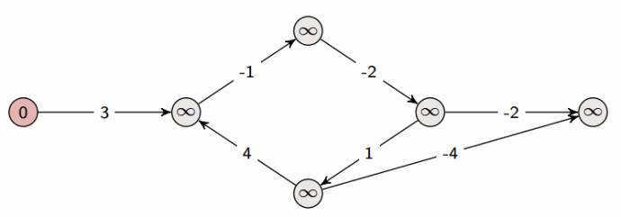

##### **Floyd-Warshall 算法**

- Floyd-Warshall 算法是一种在无环带权图中寻找任意节点间最短路径的算法。

- 该算法执行一次即可找到所有节点间的最短路径（路径权重和）。

- 时间复杂度：

- - 最优：O(|V|^3)
  - 最差：O(|V|^3)
  - 平均：O(|V|^3)

##### **最小生成树算法**

- 最小生成树算法是一种在无向带权图中查找最小生成树的贪心算法。换言之，最小生成树算法能在一个图中找到连接所有节点的边的最小子集。
- 时间复杂度：O(|V|^2)

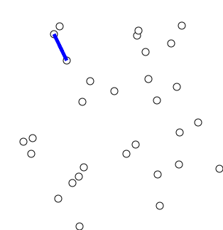

##### **Kruskal 算法**

- Kruskal 算法也是一个计算最小生成树的贪心算法，但在 Kruskal 算法中，图不一定是连通的。
- 时间复杂度：O(|E|log|V|)

#### **贪心算法**

- 贪心算法总是做出在当前看来最优的选择，并希望最后整体也是最优的。

- 使用贪心算法可以解决的问题必须具有如下两种特性：

- - 最优子结构

  - - 问题的最优解包含其子问题的最优解。

  - 贪心选择

  - - 每一步的贪心选择可以得到问题的整体最优解。

- 实例-硬币选择问题

- 给定期望的硬币总和为 V 分，以及 n 种硬币，即类型是 i 的硬币共有 coinValue[i] 分，i的范围是 [0…n – 1]。假设每种类型的硬币都有无限个，求解为使和为 V 分最少需要多少硬币？

- 硬币：便士（1美分），镍（5美分），一角（10美分），四分之一（25美分）。

- 假设总和 V 为41,。我们可以使用贪心算法查找小于或者等于 V 的面值最大的硬币，然后从 V 中减掉该硬币的值，如此重复进行。

- - V = 41 | 使用了0个硬币
  - V = 16 | 使用了1个硬币(41 – 25 = 16)
  - V = 6 | 使用了2个硬币(16 – 10 = 6)
  - V = 1 | 使用了3个硬币(6 – 5 = 1)
  - V = 0 | 使用了4个硬币(1 – 1 = 0)

#### **位运算**

- 位运算即在比特级别进行操作的技术。使用位运算技术可以带来更快的运行速度与更小的内存使用。
- 测试第 k 位：s & (1 << k);
- 设置第k位：s |= (1 << k);
- 关闭第k位：s &= ~(1 << k);
- 切换第k位：s ^= (1 << k);
- 乘以2n：s << n;
- 除以2n：s >> n;
- 交集：s & t;
- 并集：s | t;
- 减法：s & ~t;
- 提取最小非0位：s & (-s);
- 提取最小0位：~s & (s + 1);
- 交换值：x ^= y; y ^= x; x ^= y;

#### **运行时分析**

**大 O 表示**

- 大 O 表示用于表示某个算法的上界，用于描述最坏的情况。

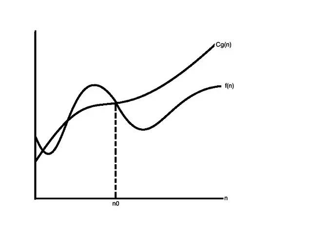

**小 O 表示**

- 小 O 表示用于描述某个算法的渐进上界，二者逐渐趋近。

**大 Ω 表示**

- 大 Ω 表示用于描述某个算法的渐进下界。

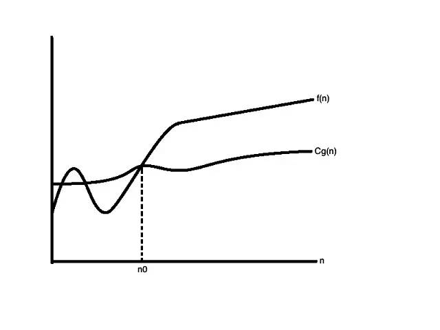

**小 ω 表示**

- 小 ω 表示用于描述某个算法的渐进下界，二者逐渐趋近。

**Theta Θ 表示**

- Theta Θ 表示用于描述某个算法的确界，包括最小上界和最大下界。

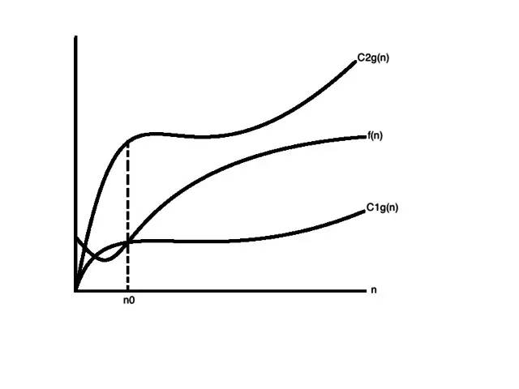

**以为这就结束了？No, 这些知识不仅仅是停留在理论，还有代码实现。**

Java 代码目录如下：

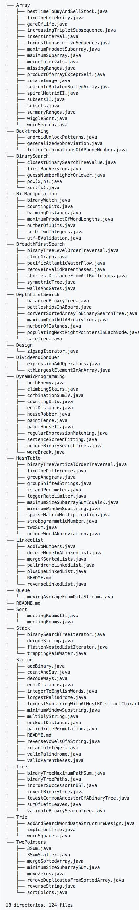

这其实是来自 GitHub 的一个 repo：https://github.com/kdn251/interviews 

除了上述 算法和数据结知识外，其中还有推荐了一些算法练习网站、视频教程、面试宝典、Google、Facebook 等知名公司面试题及解答代码。点击 **阅读原文** 可以直达这个 repo，下载实例代码或者收藏练习网站。

Enjoy!

来源： [http://mp.weixin.qq.com/s/HzS7bPeLTbBwlJacNv7uSA?ADUIN=845460348&ADSESSION=1495111811&ADTAG=CLIENT.QQ.5521_.0&ADPUBNO=26669](http://mp.weixin.qq.com/s/HzS7bPeLTbBwlJacNv7uSA?ADUIN=845460348&ADSESSION=1495111811&ADTAG=CLIENT.QQ.5521_.0&ADPUBNO=26669)

觉得本文有帮助？请分享给更多人

**推荐关注「算法爱好者」，修炼编程内功**

[阅读原文](##)