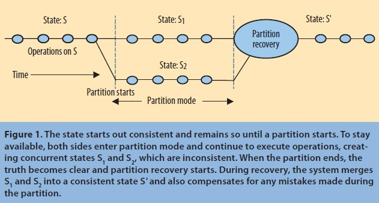

# 谈谈对CAP定理的理解 网络分区

`Misc`

------

CAP定理的常规解释是任何分布式系统只能在一致性(Consitency)，可用性(Availability)和分区容忍性(Partition Tolerance)中三选二。这个解释很让人费解，笔者在看了一些文章后谈谈我对它的理解，还请斧正。

## 从问题出发

假设我们用一台服务器A对外提供存储服务，为了避免这台服务器宕机导致服务不可用，我们又在另外一台服务器B上运行了同样的存储服务。每次用户在往服务器A写入数据的时候，A都往服务器B上写一份，然后再返回客户端。一切都运行得很好，用户的每份数据都存了两份，分别在A和B上，用户访问任意一台机器都能读取到最新的数据。 
这时不幸的事情发生，A和B之间的网络断了导致A和B无法通信，也就是说网络出现了分区，那么用户在往服务器A写入数据的时候，服务器A无法将该数据写入到服务器B。这时，服务器A就必须要做出一个艰难的选择：

- 要么选择一致性(C)而牺牲可用性(A)：为了保证服务器A和B上的数据是一致的，服务器A决定暂停对外提供数据写入服务，从而保证了服务器A和B上的数据是一致，但是牺牲了可用性。 
  **注意**：这里的可用性不是我们通常所说的高可用性(比如，服务器宕机导致服务不可用)，而是指服务器虽然活着，但是却不能对外提供写入服务。
- 要么选择可用性(A)而牺牲一致性(C)：为了保证服务不中断，服务器A先把数据写入到了本地，然后返回客户端，从而让客户端感觉数据已经写入了。这导致了服务器A和B上的数据就不一致了。

这就是CAP定理试图解释的问题。

## 分布式系统无法放弃网络分区容忍性

网络分区准确地说是指两台机器无法在期望的时间内完成数据交换。这不仅仅是指两台机器之间的网络完全断开了,还可能有其他情况产生网络分区，比如对方机器宕机了，网络延时等情况。因此，在分布式系统中，通常是无法放弃Partition Tolerance的，也就只能在CP和AP之间做选择了。如果有个分布式系统号称是CA的，那一定是扯淡。

## 可用性和一致性的选择

可用性和一致性之间的选择不是非此即彼的，而是根据业务的需求在它们两者之间做妥协。比如，我们可以放弃对强一致性的追求，让其变成最终一致性，也就是说当服务器A不能把数据传给服务器B时，它先将数据缓存在其本地，等到网络恢复以后再将数据传给服务器B。这样，服务还是可用的，只是在一定的时间窗口内两者的数据是不一致的。

## 对网络分区的处理

对网络分区的处理有以下几个步骤： 
\1. 检测网络是否出现分区 
\2. 当分区出现了，进入分区模式并限制某些操作 
\3. 当网络恢复后，启动分区恢复

 
从图中可见（图片来自 [InfoQ](http://www.infoq.com/articles/cap-twelve-years-later-how-the-rules-have-changed)），系统最开始是处于一致的状态S，然后分区出现了，每个分区的状态分别变成了S1和S2（这是为了保证系统的可用性，每个分区继续响应客户端的请求）。接着，网络恢复后开始分区合并，将S1和S2状态合并成为新的一致状态S‘。是不是看起来和代码版本管理很类似？

## 小结

其实CAP定理本身很简单，只是被人为地搞复杂了。简单地说，就是分布式系统中，架构师只能在一致性和可用性之间妥协。而复杂的是如何根据业务系统的需要在二者之间取舍，以及如何应对网络出现分区。

## 参考文献

- <http://codahale.com/you-cant-sacrifice-partition-tolerance/>
- <http://ksat.me/a-plain-english-introduction-to-cap-theorem/>
- <http://www.quora.com/Can-someone-provide-an-intuitive-proof-explanation-of-CAP-theorem>
- <http://robertgreiner.com/2014/08/cap-theorem-revisited/>
- <http://www.infoq.com/articles/cap-twelve-years-later-how-the-rules-have-changed>
- <http://blog.foundationdb.com/minimal-explanation-of-the-cap-theorem>
- <http://blog.cloudera.com/blog/2010/04/cap-confusion-problems-with-partition-tolerance/>