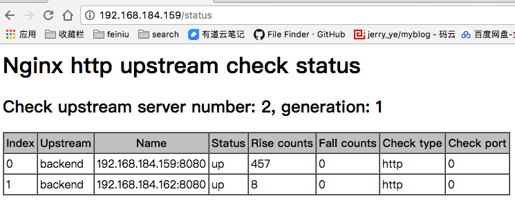

# nginx反向代理

##  什么是反向代理?

通常的代理服务器，只用于代理内部网络对Internet的连接请求，客户机必须指定 代理服务器,并将本来要直接发送到Web服务器上的http请求发送到代理服务器中 由代理服务器向Internet上的web服务器发起请求，最终达到客户机上网的目的。
而反向代理(Reverse Proxy)方式是指以代理服务器来接受internet上的连 接请求，然后将请求转发给内部网络上的服务器，并将从服务器上得到的结果返回 给internet上请求连接的客户端，此时代理服务器对外就表现为一个反向代理服务 器


## 经典的反向代理结构


## 示例和说明

[官方文档](http://tengine.taobao.org/nginx_docs/cn/docs/http/ngx_http_upstream_module.html)

`ngx_http_upstream_module`模块 允许定义一组服务器。它们可以在指令[proxy_pass](http://tengine.taobao.org/nginx_docs/cn/docs/http/ngx_http_proxy_module.html#proxy_pass)、 [fastcgi_pass](http://tengine.taobao.org/nginx_docs/cn/docs/http/ngx_http_fastcgi_module.html#fastcgi_pass)和 [memcached_pass](http://tengine.taobao.org/nginx_docs/cn/docs/http/ngx_http_memcached_module.html#memcached_pass)中被引用到。

### 配置例子

自己demo

```
upstream backend {
    server 192.168.184.159:8080;
    server 192.168.184.162:8080;
}

server {
    location / {
        proxy_pass http://backend;
    }
}
```

官网的配置

```
upstream backend {
    server backend1.example.com       weight=5;
    server backend2.example.com:8080;
    server unix:/tmp/backend3;

    server backup1.example.com:8080   backup;
    server backup2.example.com:8080   backup;
}

server {
    location / {
        proxy_pass http://backend;
    }
}
```


### 指令

#### upstream

语法:	upstream name { ... }
默认值:	—
上下文:	http
定义一组服务器。 这些服务器可以监听不同的端口。 而且，监听在TCP和UNIX域套接字的服务器可以混用。

例子：

```
upstream backend {
    server backend1.example.com weight=5;
    server 127.0.0.1:8080       max_fails=3 fail_timeout=30s;
    server unix:/tmp/backend3;
}
```


默认情况下，nginx按加权轮转的方式将请求分发到各服务器。 在上面的例子中，每7个请求会通过以下方式分发： 5个请求分到backend1.example.com， 一个请求分到第二个服务器，一个请求分到第三个服务器。 与服务器通信的时候，如果出现错误，请求会被传给下一个服务器，直到所有可用的服务器都被尝试过。 如果所有服务器都返回失败，客户端将会得到最后通信的那个服务器的（失败）响应结果。

#### server

语法:	server address [parameters];
默认值:	—
上下文:	upstream
定义服务器的地址address和其他参数parameters。 地址可以是域名或者IP地址，端口是可选的，或者是指定“unix:”前缀的UNIX域套接字的路径。如果没有指定端口，就使用80端口。 如果一个域名解析到多个IP，本质上是定义了多个server。

你可以定义下面的参数：

weight=number
设定服务器的权重，默认是1。
max_fails=number
设定Nginx与服务器通信的尝试失败的次数。在fail_timeout参数定义的时间段内，如果失败的次数达到此值，Nginx就认为服务器不可用。在下一个fail_timeout时间段，服务器不会再被尝试。 失败的尝试次数默认是1。设为0就会停止统计尝试次数，认为服务器是一直可用的。 你可以通过指令proxy_next_upstream、 fastcgi_next_upstream和 memcached_next_upstream来配置什么是失败的尝试。 默认配置时，http_404状态不被认为是失败的尝试。
fail_timeout=time
设定
统计失败尝试次数的时间段。在这段时间中，服务器失败次数达到指定的尝试次数，服务器就被认为不可用。
服务器被认为不可用的时间段。
默认情况下，该超时时间是10秒。
backup
标记为备用服务器。当主服务器不可用以后，请求会被传给这些服务器。
down
标记服务器永久不可用，可以跟ip_hash指令一起使用。
Example:

```
upstream backend {
    server backend1.example.com     weight=5;
    server 127.0.0.1:8080           max_fails=3 fail_timeout=30s;
    server unix:/tmp/backend3;

    server backup1.example.com:8080 backup;
}
```


#### ip_hash

语法:	ip_hash;
默认值:	—
上下文:	upstream
指定服务器组的负载均衡方法，请求基于客户端的IP地址在服务器间进行分发。 IPv4地址的前三个字节或者IPv6的整个地址，会被用来作为一个散列key。 这种方法可以确保从同一个客户端过来的请求，会被传给同一台服务器。除了当服务器被认为不可用的时候，这些客户端的请求会被传给其他服务器，而且很有可能也是同一台服务器。

从1.3.2和1.2.2版本开始支持IPv6地址。
如果其中一个服务器想暂时移除，应该加上down参数。这样可以保留当前客户端IP地址散列分布。

例子：

```
upstream backend {
    ip_hash;

    server backend1.example.com;
    server backend2.example.com;
    server backend3.example.com down;
    server backend4.example.com;
}
```


从1.3.1和1.2.2版本开始，ip_hash的负载均衡方法才支持设置服务器权重值。

#### **keepalive**

语法:	keepalive connections;
默认值:	—
上下文:	upstream
这个指令出现在版本 1.1.4.
激活对上游服务器的连接进行缓存。

connections参数设置每个worker进程与后端服务器保持连接的最大数量。这些保持的连接会被放入缓存。 如果连接数大于这个值时，最久未使用的连接会被关闭。

需要注意的是，keepalive指令不会限制Nginx进程与上游服务器的连接总数。 新的连接总会按需被创建。 connections参数应该稍微设低一点，以便上游服务器也能处理额外新进来的连接。
配置memcached上游服务器连接keepalive的例子：

```
upstream memcached_backend {
    server 127.0.0.1:11211;
    server 10.0.0.2:11211;

    keepalive 32;
}

server {
    ...

    location /memcached/ {
        set $memcached_key $uri;
        memcached_pass memcached_backend;
    }

}
```


对于HTTP代理，proxy_http_version指令应该设置为“1.1”，同时“Connection”头的值也应被清空。

```
upstream http_backend {
    server 127.0.0.1:8080;

    keepalive 16;
}

server {
    ...

    location /http/ {
        proxy_pass http://http_backend;
        proxy_http_version 1.1;
        proxy_set_header Connection "";
        ...
    }
}
```


另外一种选择是，HTTP/1.0协议的持久连接也可以通过发送“Connection: Keep-Alive”头来实现。不过不建议这样用。
对于FastCGI的服务器，需要设置 fastcgi_keep_conn 指令来让连接keepalive工作：

```
upstream fastcgi_backend {
    server 127.0.0.1:9000;

    keepalive 8;
}

server {
    ...

    location /fastcgi/ {
        fastcgi_pass fastcgi_backend;
        fastcgi_keep_conn on;
        ...
    }
}
```


当使用的负载均衡方法不是默认的轮转法时，必须在keepalive 指令之前配置。
针对SCGI和uwsgi协议，还没有实现其keepalive连接的打算。

#### **least_conn**

语法:	least_conn;
默认值:	—
上下文:	upstream
这个指令出现在版本 1.3.1 和 1.2.2.
指定服务器组的负载均衡方法，根据其权重值，将请求发送到活跃连接数最少的那台服务器。 如果这样的服务器有多台，那就采取有权重的轮转法进行尝试。

### 嵌入的变量

ngx_http_upstream_module模块支持以下嵌入变量：

$upstream_addr
保存服务器的IP地址和端口或者是UNIX域套接字的路径。 在请求处理过程中，如果有多台服务器被尝试了，它们的地址会被拼接起来，以逗号隔开，比如： “192.168.1.1:80, 192.168.1.2:80, unix:/tmp/sock”。 如果在服务器之间通过“X-Accel-Redirect”头或者error_page有内部跳转，那么这些服务器组之间会以冒号隔开，比如：“192.168.1.1:80, 192.168.1.2:80, unix:/tmp/sock : 192.168.10.1:80, 192.168.10.2:80”。
$upstream_response_time
以毫秒的精度保留服务器的响应时间，（输出）单位是秒。 出现多个响应时，也是以逗号和冒号隔开。
$upstream_status
保存服务器的响应代码。 出现多个响应时，也是以逗号和冒号隔开。
$upstream_http_...
保存服务器的响应头的值。比如“Server”响应头的值可以通过$upstream_http_server变量来获取。 需要注意的是只有最后一个响应的头会被保留下来。


### tengine新增的健康检查模块


[官方文档](http://tengine.taobao.org/document_cn/http_upstream_check_cn.html)


页面效果：



**ngx_http_upstream_check_module**

该模块可以为Tengine提供主动式后端服务器健康检查的功能。

该模块在Tengine-1.4.0版本以前没有默认开启，它可以在配置编译选项的时候开启：`./configure --with-http_upstream_check_module`

#### Examples


自己demo

```
upstream backend {
    server 192.168.184.159:8080;
    server 192.168.184.162:8080;
    
    #健康检查 1，在upstream配置如下
    check interval=3000 rise=2 fall=5 timeout=1000 type=http;
    check_http_send "HEAD / HTTP/1.0\r\n\r\n";
    check_http_expect_alive http_2xx http_3xx;
}

server {
    location / {
        proxy_pass http://backend;
    }
    
    #健康检查 2，配置一个status的location
    location /status {
       check_status;
	}
}

```

官方

```
http {
    upstream cluster1 {
        # simple round-robin
        server 192.168.0.1:80;
        server 192.168.0.2:80;

        check interval=3000 rise=2 fall=5 timeout=1000 type=http;
        check_http_send "HEAD / HTTP/1.0\r\n\r\n";
        check_http_expect_alive http_2xx http_3xx;
    }

    upstream cluster2 {
        # simple round-robin
        server 192.168.0.3:80;
        server 192.168.0.4:80;

        check interval=3000 rise=2 fall=5 timeout=1000 type=http;
        check_keepalive_requests 100;
        check_http_send "HEAD / HTTP/1.1\r\nConnection: keep-alive\r\n\r\n";
        check_http_expect_alive http_2xx http_3xx;
    }

    server {
        listen 80;

        location /1 {
            proxy_pass http://cluster1;
        }

        location /2 {
            proxy_pass http://cluster2;
        }

        location /status {
            check_status;

            access_log   off;
            allow SOME.IP.ADD.RESS;
            deny all;
        }
    }
}
```

#### 指令

> Syntax: **check** `interval=milliseconds [fall=count] [rise=count] [timeout=milliseconds] [default_down=true|false] [type=tcp|http|ssl_hello|mysql|ajp] [port=check_port]`
> Default: 如果没有配置参数，默认值是：`interval=30000 fall=5 rise=2 timeout=1000 default_down=true type=tcp`
> Context: `upstream`

该指令可以打开后端服务器的健康检查功能。

指令后面的参数意义是：

- `interval`：向后端发送的健康检查包的间隔。

- `fall`(fall_count): 如果连续失败次数达到fall_count，服务器就被认为是down。

- `rise`(rise_count): 如果连续成功次数达到rise_count，服务器就被认为是up。

- `timeout`: 后端健康请求的超时时间。

- `default_down`: 设定初始时服务器的状态，如果是true，就说明默认是down的，如果是false，就是up的。默认值是true，也就是一开始服务器认为是不可用，要等健康检查包达到一定成功次数以后才会被认为是健康的。

- ```
  type
  ```

  ：健康检查包的类型，现在支持以下多种类型

  - `tcp`：简单的tcp连接，如果连接成功，就说明后端正常。
  - `ssl_hello`：发送一个初始的SSL hello包并接受服务器的SSL hello包。
  - `http`：发送HTTP请求，通过后端的回复包的状态来判断后端是否存活。
  - `mysql`: 向mysql服务器连接，通过接收服务器的greeting包来判断后端是否存活。
  - `ajp`：向后端发送AJP协议的Cping包，通过接收Cpong包来判断后端是否存活。

- `port`: 指定后端服务器的检查端口。你可以指定不同于真实服务的后端服务器的端口，比如后端提供的是443端口的应用，你可以去检查80端口的状态来判断后端健康状况。默认是0，表示跟后端server提供真实服务的端口一样。该选项出现于Tengine-1.4.0。

------

> Syntax: **check_keepalive_requests** `request_num`
> Default: `1`
> Context: `upstream`

该指令可以配置一个连接发送的请求数，其默认值为1，表示Tengine完成1次请求后即关闭连接。

------

> Syntax: **check_http_send** `http_packet`
> Default: `"GET / HTTP/1.0\r\n\r\n"`
> Context: `upstream`

该指令可以配置http健康检查包发送的请求内容。为了减少传输数据量，推荐采用`"HEAD"`方法。

当采用长连接进行健康检查时，需在该指令中添加keep-alive请求头，如：`"HEAD / HTTP/1.1\r\nConnection: keep-alive\r\n\r\n"`。
同时，在采用`"GET"`方法的情况下，请求uri的size不宜过大，确保可以在1个`interval`内传输完成，否则会被健康检查模块视为后端服务器或网络异常。

------

> Syntax: **check_http_expect_alive** `[ http_2xx | http_3xx | http_4xx | http_5xx ]`
> Default: `http_2xx | http_3xx`
> Context: `upstream`

该指令指定HTTP回复的成功状态，默认认为2XX和3XX的状态是健康的。

------

> Syntax: **check_shm_size** `size`
> Default: `1M`
> Context: `http`

所有的后端服务器健康检查状态都存于共享内存中，该指令可以设置共享内存的大小。默认是1M，如果你有1千台以上的服务器并在配置的时候出现了错误，就可能需要扩大该内存的大小。

------

> Syntax: **check_status** `[html|csv|json]`
> Default: `check_status html`
> Context: `location`

显示服务器的健康状态页面。该指令需要在http块中配置。

在Tengine-1.4.0以后，你可以配置显示页面的格式。支持的格式有: `html`、`csv`、 `json`。默认类型是`html`。

你也可以通过请求的参数来指定格式，假设‘/status’是你状态页面的URL， `format`参数改变页面的格式，比如：

```
/status?format=html
/status?format=csv
/status?format=json
```

同时你也可以通过status参数来获取相同服务器状态的列表，比如：

```
/status?format=html&amp;status=down
/status?format=csv&amp;status=up
```

下面是一个HTML状态页面的例子（server number是后端服务器的数量，generation是Nginx reload的次数。Index是服务器的索引，Upstream是在配置中upstream的名称，Name是服务器IP，Status是服务器的状态，Rise是服务器连续检查成功的次数，Fall是连续检查失败的次数，Check type是检查的方式，Check port是后端专门为健康检查设置的端口）：

```
<!DOCTYPE html PUBLIC "-//W3C//DTD XHTML 1.0 Strict//EN
    "http://www.w3.org/TR/xhtml1/DTD/xhtml1-strict.dtd">
    <html xmlns="http://www.w3.org/1999/xhtml">
    <head>
    <title>Nginx http upstream check status</title>
    </head>
    <body>
        <h1>Nginx http upstream check status</h1>
        <h2>Check upstream server number: 1, generation: 3</h2>
        <table style="background-color:white" cellspacing="0" cellpadding="3" border="1">
            <tr bgcolor="#C0C0C0">
                <th>Index</th>
                <th>Upstream</th>
                <th>Name</th>
                <th>Status</th>
                <th>Rise counts</th>
                <th>Fall counts</th>
                <th>Check type</th>
                <th>Check port</th>
            </tr>
            <tr>
                <td>0</td>
                <td>backend</td>
                <td>106.187.48.116:80</td>
                <td>up</td>
                <td>39</td>
                <td>0</td>
                <td>http</td>
                <td>80</td>
            </tr>
        </table>
    </body>
    </html>
```

下面是csv格式页面的例子：

```
0,backend,106.187.48.116:80,up,46,0,http,80
```

下面是json格式页面的例子：


