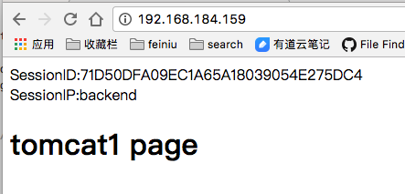
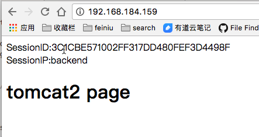

# Nginx的session一致性问题

前提环境 是  一个nginx反向代理两个tomcat

## 抛出Session一致性问题

在tomcat的webapps/ROOT文件夹下添加index.jsp文件，内容如下。使其可以打印SessionID和SessionIP

```
<%@ page language="java" import="java.util.*" pageEncoding="UTF-8" %>
<%
    String path = request.getContextPath();
    String basePath = request.getScheme() + "://" + request.getServerName() + ":" + request.getServerPort() + path + "/";
%>

<!DOCTYPE HTML PUBLIC "-//W3C//DTD HTML 4.01 Transitional//EN">
<html>
<head>
  
    <title>My JSP 'index.jsp' starting page</title>
    <meta http-equiv="pragma" content="no-cache">
    <meta http-equiv="cache-control" content="no-cache">
    <meta http-equiv="expires" content="0">
    <meta http-equiv="keywords" content="keyword1,keyword2,keyword3">
    <meta http-equiv="description" content="This is my page">
</head>

<body>

SessionID:<%=session.getId()%>
<br/>
SessionIP:<%=request.getServerName()%> 
<br/>
<h1>tomcat1 page</h1>

</body>
</html>
```

访问nginx服务器两次的结果证明session是不一致的：






## 解决session不一致问题

### 利用memcached实现session共享

两个tocmat都做如下配置

1. 将[memcached-session-manager-lib包](image-201709281032/memcached-session-manager-lib)拷贝到tomcat的lib下

2. 在context.xml的Context配置Manager

   n1名称随便写

```
<Manager className="de.javakaffee.web.msm.MemcachedBackupSessionManager" 
	memcachedNodes="n1:192.168.17.4:11211 n2:192.168.17.5:11211" 
    sticky="false" 
    lockingMode="auto"
    sessionBackupAsync="false"
	requestUriIgnorePattern=".*\.(ico|png|gif|jpg|css|js)$"
    sessionBackupTimeout="1000" transcoderFactoryClass="de.javakaffee.web.msm.serializer.kryo.KryoTranscoderFactory" 
/>
```


### 利用redis实现session共享

两个tocmat都做如下配置

1. 将[redis-session-manager-lib包](image-201709281032/redis-session-manager-lib)拷贝到tomcat的lib下
2. 在context.xml的Context配置Manager

```
<Valve className="com.orangefunction.tomcat.redissessions.RedisSessionHandlerValve" />
<Manager className="com.orangefunction.tomcat.redissessions.RedisSessionManager"
         host="10.200.240.241"
         port="6379"
         database="0"
         maxInactiveInterval="60" />

```


