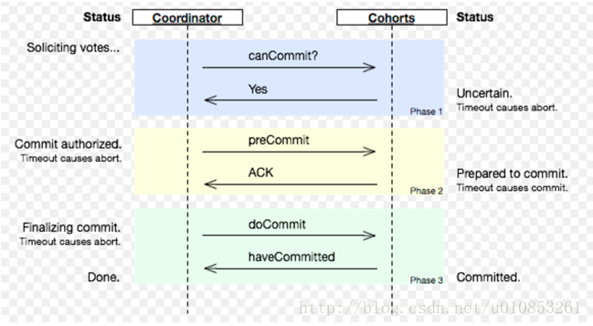

[TOC]

# 【一致性协议算法】2PC和3PC

# 分布式一致性：2PC和3PC

> 在一个分布式系统中，为了保持分布式集群中所有节点事务的一致性，需要引入一个称为**“协调者”**的组件来同一调度所有的分布式节点的执行逻辑，这些被调度的分布式节点被称为**“参与者”**。协调者负责调度参与者的行为，并最终决定这些参与者是否要把事务真正进行提交。

# 1. 2PC-两阶段提交协议(强一致性算法)

二阶段提交协议是将事务的提交过程分成了两个阶段来进行处理：投票阶段、执行阶段

## 阶段一：提交事务请求(投票阶段)

1 . 协调者向所有参与者发送事务内容，询问是否可以执行事务提交操作，并等待所有参与者响应。

2 . 各个参与结点执行事务操作，并将Undo 和 Redo 信息写入事务日志中。

3 .各个参与结点向协调者返回事务询问的响应(参与者成功执行了事务就返回YES，否则表示事务不可执行并返回NO)

阶段一类似于协调者组织所有的参与者对某个事务操作做了一个投票过程，各个参与者表明是否可以进行事务的提交过程。

## 阶段二：执行事务提交(执行阶段)

根据阶段一的投票过程的结果，决定是否进行事务提交操作，也就是包括两种结果：

### 执行事务提交(投票通过)

1 . 发送提交请求：协调者从所有参与者那里得到的反馈都是YES，那么协调者就向所有的参与者发送commit命令。

2 . 事务提交：参与饥饿接收到commit命令后执行正式的事务提交操作，并在完成commit之后释放资源

3 . 反馈提交结果：参与者完成commit之后向协调者发送ACK信号

4 . 协调者收到所有参与者返回的ACK消息后，事务完成。

### 中断事务

如果出现：任何一个参与者在投票阶段返回NO；或则协调者等待超时之后，参与者仍然没有接收到所有参与者的反馈信息；这是就会中断事务回滚。

1 . 发送回滚请求：协调者向所有参与者发送 Rollback 请求。

2 . 参与者收到 Rollback 请求之后利用再阶段一保留的 Undo 信息执行事务回滚。

3 . 参与者完成回滚之后反馈回滚结果ACK信号给协调者。

4 . 协调者收到所有参与者的反馈ACK信号之后，完成事务中断。

> 二阶段提交协议，就是把事务处理过程分为了投票和执行两个阶段，核心是对事务先尝试后提交过程。

## 优缺点：

优点：原理简单，实现方便。

缺点：每一阶段都存在同步阻塞、协调者单点问题、保守的容错机制(有一个结点宕机就失败)、脑裂。

同步阻塞：二阶段提交协议最明显也是最大问题，极大限制了分布式系统性能。各个参与者在等待其余参与者响应过程中没法进行其他任何操作。

单点问题：协调者一旦出现问题(比如宕机)，那么整个系统都将不可用。

数据不一致(脑裂)：在阶段二，如果协调者发出了一部分commit信号之后宕机，导致最终只有部分参与者收到了commit信号。于是收到了commit信号的参与者执行提交操作，没有收到commit信号的就无法提交，这两部分节点就会出现数据不一致。(脑裂)

太过保守的容错机制：参与者中任何一台机器宕机都会导致整个事务的失败。

# 2 . 3PC-三阶段提交协议

三阶段分为：

1 . CanCommit、 
2 . PreCommit、 
3 . do commit。

协议涉及如下图： 

## 阶段一：CanCommit(判断各个参与者是否是alive的)

1 . 事务询问：协调者向所有参与者发送一个包含事务内容的canCommit请求，询问是否可以执行事务提交操作，并等待参与者响应。

2 . 各参与者向协调者反馈事务询问响应：参与者收到canCommit请求后，一般情况认为自身可以执行并默认返回yes，否则返回No。 这阶段有点像检测参与者是否是 alive 的。

## 阶段二：PreCommit

根据阶段一的反馈结果执行 PreCommit 或则是 中断事务

### 执行事务预提交(阶段一通过)

1 . 发送预提交请求：协调者发送PreCommit请求给各参与者，并进入Prepared阶段

2 . 事务预提交：参与者收到PreCommit之后执行事务操作，并将Undo 和 Redo 信息写入事务日志中。（有点类似二阶段提交的投票阶段）

3 . 参与者反馈响应结果给协调者：参与者成功执行了事务操作就反馈ACK信号给协调者。参与者最后等待commit信号或则abort信号。

### 中断事务(阶段一不通过)

如果CanCommit阶段任何一个参与者反馈了NO响应，或则协调者等待超时之后，那么协调者就会发送abort信号。

1 . 发送中断请求

2 . 中断事务

## 阶段三：Do Commit（提交事务）

这个阶段是真正的事务提交过程。有两种情况：阶段二PreCommit通过，或则是阶段二PreCommit有参与者返回了NO信号。

### 执行事务提交（阶段二通过）

1 . 发送提交请求：协调者向所有参与者发送do commit信号

2 . 事务提交：参与者收到doCommit之后执行事务提交过程。

3 . 反馈提交结果：参与者返回提交结果ACK信号给协调者。

4 . 完成事务：协调者收到ACK信号表示事务完成。

### 中断事务

如果出现：任何一个参与者在PreCommit阶段返回NO信号；或则协调者等待超时之后，参与者仍然没有接收到所有参与者的反馈信息；这是就会中断事务回滚。

1 . 发送中断请求：协调者向所有参与者发送 abort 请求。

2 . 参与者收到 abort 请求之后利用再阶段二保留的 Undo 信息执行事务回滚。

3 . 参与者完成回滚之后反馈回滚结果ACK信号给协调者。

4 . 协调者收到所有参与者的反馈ACK信号之后，完成事务中断。

## Attention：

进入阶段三之后，可能存在一下两种故障：

1）协调者宕机

2）协调者与参与者之间网络故障

只对这两种情况，都会导致参与者无法及时接受到协调者的doCommit信号或则abort信号。 参与者在等待超时之后都会默认执行 commit 操作

## 优缺点：

优点：对比二阶段协议，三阶段协议降低了同步阻塞范围。

缺点：降低了参与者的阻塞范围但是也引入新的问题：参与者在接收到PreCommit信号之后，如果出现网络故障，协调者与参与者无法通信，参与者在超时之后仍然会执行事务提交，这必然会带来数据一致性。

> 二阶段和三阶段来说：有点类似于把二阶段的投票阶段分为了三阶段的阶段一和阶段二。

版权声明：本文为博主原创文章，未经博主允许不得转载。 http://blog.csdn.net/u010853261/article/details/77687020

