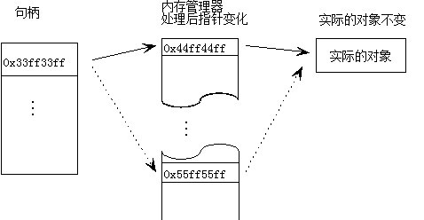

[TOC]

# 指针与句柄的区别

​    最近两天在复习一些c++的知识，中间发现了许多以前没有注意过的问题。关于句柄以前总是将其理解为指针，其实不然，他们之间有着明显的区别。

​    首先，指针指向系统中物理内存的地址，而句柄是windows在内存中维护的一个对象内存物理地址列表的整数索引，句柄是一种指向指针的指针。

​    在windows系统中的内存管理一般会将当前处于空闲状态的对象的内存释放掉，当需要访问的时候再重新提交分配物理内存，从而导致对象的物理地址是变化的，

这样就不允许系统直接通过指针来访问（物理地址不断变化）的对象。

​    句柄是一种指向指针的指针。由于windows是一种以虚拟内存为基础的操作系统，其内存管理器经常会在内存中来回的移动对象，以此来满足各种应用程序对内存的需求。

而对象的移动意味着对象内存地址的变化，正是因为如此，如果直接使用指针，在内存地址被改变后，系统将不知道到哪里去再调用这个对象。

​    windows系统为论文解决这个问题，系统专门为各种应用程序腾出了一定的**内存地址（句柄）**专门用来记录这些变化的地址（这些内存地址就是指向指针的指针），这些**内存地址**本身是一直不变化的。windows内存管理器在移动某些对象之后，他会将这些对象新的内存地址传给句柄，告诉他移动后对象去了哪里。

​    句柄（稳定的）----->记载着对象在内存中的地址---->对象在内存中的地址（不稳定的）---->记载着实际对象的地址。

[图中实线表示初始化的情况，虚线表示在内存管理器处理之后的情况](http://blog.csdn.net/qingtingchen1987)

http://www.cnblogs.com/h2-database/archive/2012/06/27/2572498.html