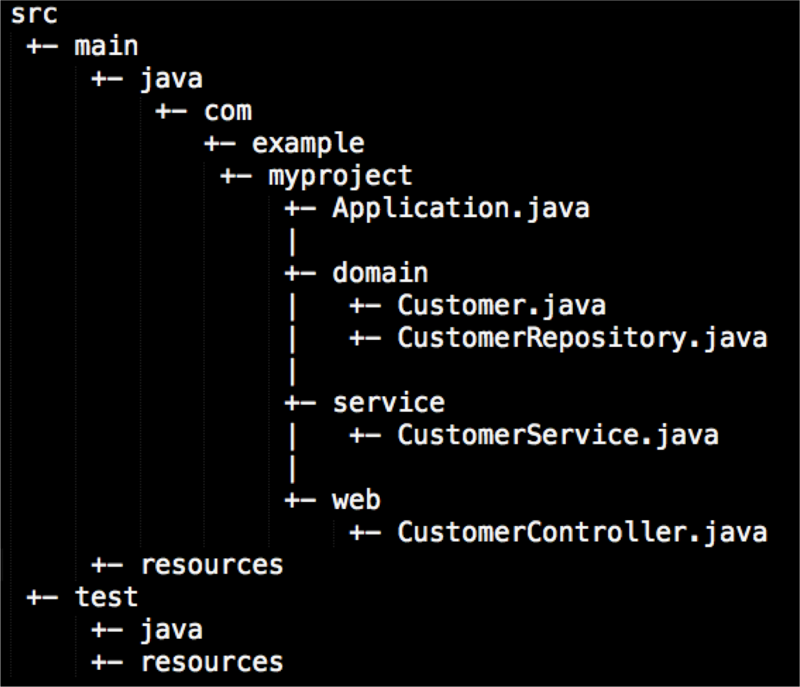

# Maven和Gradle对比

FEB 23RD, 2016 | [COMMENTS](http://www.huangbowen.net/blog/2016/02/23/gradle-vs-maven/#disqus_thread)

Java世界中主要有三大构建工具：Ant、Maven和Gradle。经过几年的发展，Ant几乎销声匿迹、Maven也日薄西山，而Gradle的发展则如日中天。笔者有幸见证了Maven的没落和Gradle的兴起。Maven的主要功能主要分为5点，分别是依赖管理系统、多模块构建、一致的项目结构、一致的构建模型和插件机制。我们可以从这五个方面来分析一下Gradle比起Maven的先进之处。

## 依赖管理系统

Maven为Java世界引入了一个新的依赖管理系统。在Java世界中，可以用groupId、artifactId、version组成的Coordination（坐标）唯一标识一个依赖。任何基于Maven构建的项目自身也必须定义这三项属性，生成的包可以是Jar包，也可以是war包或者ear包。一个典型的依赖引用如下所示：

```
<dependency>
    <groupId>junit</groupId>
    <artifactId>junit</artifactId>
    <version>4.12</version>
    <scope>test</scope>
</dependency>
<dependency>
    <groupId>org.springframework</groupId>
    <artifactId>spring-test</artifactId>
</dependency>
```

从上面可以看出当引用一个依赖时，version可以省略掉，这样在获取依赖时会选择最新的版本。而存储这些组件的仓库有远程仓库和本地仓库之分。远程仓库可以使用世界公用的central仓库，也可以使用Apache Nexus自建私有仓库；本地仓库则在本地计算机上。通过Maven安装目录下的settings.xml文件可以配置本地仓库的路径，以及采用的远程仓库的地址。

Gradle在设计的时候基本沿用了Maven的这套依赖管理体系。不过它在引用依赖时还是进行了一些改进。首先引用依赖方面变得非常简洁。

```
dependencies {
    compile 'org.hibernate:hibernate-core:3.6.7.Final'
    testCompile ‘junit:junit:4.+'
}
```

第二，Maven和Gradle对依赖项的scope有所不同。在Maven世界中，一个依赖项有6种scope，分别是complie(默认)、provided、runtime、test、system、import。而grade将其简化为了4种，compile、runtime、testCompile、testRuntime。那么如果想在gradle使用类似于provided的scope怎么办？别着急，由于gradle语言的强大表现力，我们可以轻松编写代码来实现类似于provided scope的概念（例如[How to use provided scope for jar file in Gradle build?](http://stackoverflow.com/questions/18738888/how-to-use-provided-scope-for-jar-file-in-gradle-build)）。

第三点是Gradle支持动态的版本依赖。在版本号后面使用+号的方式可以实现动态的版本管理。

第四点是在解决依赖冲突方面Gradle的实现机制更加明确。使用Maven和Gradle进行依赖管理时都采用的是传递性依赖；而如果多个依赖项指向同一个依赖项的不同版本时就会引起依赖冲突。而Maven处理这种依赖关系往往是噩梦一般的存在。而Gradle在解决依赖冲突方面相对来说比较明确。在[Chapter 23. Dependency Management](https://docs.gradle.org/current/userguide/dependency_management.html)中的23.2.3章节详细解读了gradle是如何处理版本冲突的。

## 多模块构建

在SOA和微服务的浪潮下，将一个项目分解为多个模块已经是很通用的一种方式。在Maven中需要定义个parent POM作为一组module的聚合POM。在该POM中可以使用`<modules>`标签来定义一组子模块。parent POM不会有什么实际构建产出。而parent POM中的build配置以及依赖配置都会自动继承给子module。

而Gradle也支持多模块构建。而在parent的build.gradle中可以使用allprojects和subprojects代码块来分别定义里面的配置是应用于所有项目还是子项目。对于子模块的定义是放置在setttings.gradle文件中的。在gradle的设计当中，每个模块都是Project的对象实例。而在parent build.gradle中通过allprojects或subprojects可以对这些对象进行各种操作。这无疑比Maven要灵活的多。

比如在parent的build.gradle中有以下代码：

```
allprojects {
    task hello << { task -> println "I'm $task.project.name" }
}
```

执行命令`gradle -q hello`会依次打印出父module以及各个submodule的项目名称。这种强大的能力能让gradle对各个模块具有更强的定制化。

## 一致的项目结构

在Ant时代大家创建Java项目目录时比较随意，然后通过Ant配置指定哪些属于source，那些属于testSource等。而Maven在设计之初的理念就是Conversion over configuration（约定大于配置）。其制定了一套项目目录结构作为标准的Java项目结构。一个典型的Maven项目结构如下：



Gradle也沿用了这一标准的目录结构。如果你在Gradle项目中使用了标准的Maven项目结构的话，那么在Gradle中也无需进行多余的配置,只需在文件中包含`apply plugin:'java'`,系统会自动识别source、resource、test srouce、 test resource等相应资源。不过Gradle作为JVM上的构建工具，也同时支持groovy、scala等源代码的构建，甚至支持Java、groovy、scala语言的混合构建。虽然Maven通过一些插件（比如[maven-scala-plugin](http://scala-tools.org/mvnsites/maven-scala-plugin/)）也能达到相同目的，但配置方面显然Gradle要更优雅一些。

## 一致的构建模型

为了解决Ant中对项目构建活动缺乏标准化的问题，Maven特意设置了标准的项目构建周期，其默认的构建周期如下所示：

```
<phases>
  <phase>validate</phase>
  <phase>initialize</phase>
  <phase>generate-sources</phase>
  <phase>process-sources</phase>
  <phase>generate-resources</phase>
  <phase>process-resources</phase>
  <phase>compile</phase>
  <phase>process-classes</phase>
  <phase>generate-test-sources</phase>
  <phase>process-test-sources</phase>
  <phase>generate-test-resources</phase>
  <phase>process-test-resources</phase>
  <phase>test-compile</phase>
  <phase>process-test-classes</phase>
  <phase>test</phase>
  <phase>prepare-package</phase>
  <phase>package</phase>
  <phase>pre-integration-test</phase>
  <phase>integration-test</phase>
  <phase>post-integration-test</phase>
  <phase>verify</phase>
  <phase>install</phase>
  <phase>deploy</phase>
</phases>
```

而这种构建周期也是Maven最为人诟病的地方。因为Maven将项目的构建周期限制的太死，你无法在构建周期中添加新的phase，只能将插件绑定到已有的phase上。而现在项目的构建过程变得越来越复杂，而且多样化，显然Maven对这种复杂度缺少足够的应变能力。比如你想在项目构建过程中进行一项压缩所有javascript的任务，那么就要绑定到Maven的现有的某个phase上，而显然貌似放在哪个phase都不太合适。而且这些phase都是串行的，整个执行下来是一条线，这也限制了Maven的构建效率。而Gradle在构建模型上则非常灵活。在Gradle世界里可以轻松创建一个task，并随时通过`depends`语法建立与已有task的依赖关系。甚至对于Java项目的构建来说，Gradle是通过名为`java`的插件来包含了一个对Java项目的构建周期，这等于Gradle本身直接与项目构建周期是解耦的。

## 插件机制

Maven和Gradle设计时都采用了插件机制。但显然Gradle更胜一筹。主要原因在于Maven是基于XML进行配置。所以其配置语法太受限于XML。即使实现很小的功能都需要设计一个插件，建立其与XML配置的关联。比如想在Maven中执行一条shell命令，其配置如下：

```
<plugin>
  <groupId>org.codehaus.mojo</groupId>
  <artifactId>exec-maven-plugin</artifactId>
  <version>1.2</version>
  <executions>
    <execution>
      <id>drop DB => db_name</id>
      <phase>pre-integration-test</phase>
      <goals>
        <goal>exec</goal>
      </goals>
      <configuration>
        <executable>curl</executable>
        <arguments>
          <argument>-s</argument>
          <argument>-S</argument>
          <argument>-X</argument>
          <argument>DELETE</argument>
          <argument>http://${db.server}:${db.port}/db_name</argument>
        </arguments>
      </configuration>
    </execution>
  </executions>
</plugin>
```

而在Gradle中则一切变得非常简单。

```
task dropDB(type: Exec) {
 commandLine ‘curl’,’-s’,’s’,’-x’,’DELETE’,"http://${db.server}:{db.port}/db_name"
}
```

在创建自定义插件方面，Maven和Gradle的机制都差不多，都是继承自插件基类，然后实现要求的方法。这里就不展开说明。

------

从以上五个方面可以看出Maven和Gradle的主要差异。Maven的设计核心`Convention Over Configuration`被Gradle更加发扬光大，而Gradle的`配置即代码`又超越了Maven。在Gradle中任何配置都可以作为代码被执行的，我们也可以随时使用已有的Ant脚本（Ant task是Gradle中的一等公民）、Java类库、Groovy类库来辅助完成构建任务的编写。

这种采用本身语言实现的DSL对本身语言项目进行构建管理的例子比比皆是。比如Rake和Ruby、Grunt和JavaScript、Sbt和Ruby…..而Gradle之所以使用Groovy语言实现，是因为Groovy比Java语言更具表现力，其语法特性更丰富，又兼具函数式的特点。这几年兴起的语言（比如Scala、Go、Swift）都属于强类型的语言，兼具面向对象和函数式的特点。

最后想说的Gradle的命令行比Maven的要强大的多。以前写过一篇文章专门讲述了Gradle的命令行操作，详情请见[Gradle命令行黑魔法](http://www.huangbowen.net/blog/2013/09/01/command-line-of-gradle/)。

Posted by 黄博文 Feb 23rd, 2016  [Gradle](http://www.huangbowen.net/blog/categories/gradle/) [Gradle](http://www.huangbowen.net/blog/tags/gradle/), [Maven](http://www.huangbowen.net/blog/tags/maven/)

http://www.huangbowen.net/blog/2016/02/23/gradle-vs-maven/