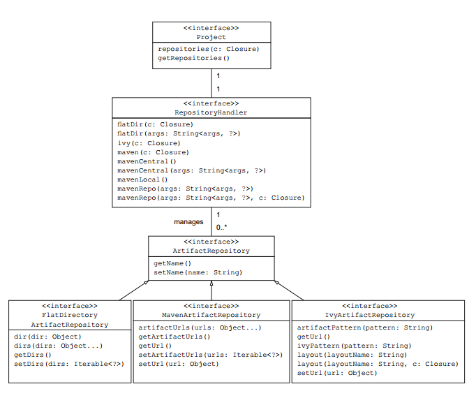

# 配置远程仓库

Gradle支持下面三种不同类型的仓库：


下图是配置不同仓库对应的Gradle API：



下面以Maven仓库来介绍，Maven仓库是Java项目中使用最为广泛的一个仓库，库文件一般是以JAR文件的形式存在，用XML(POM文件)来来描述库的元数据和它的传递依赖。所有的库文件都存储在仓库的指定位置，当你在构建脚本中声明了依赖时，这些属性用来找到库文件在仓库中的准确位置。group属性标识了Maven仓库中的一个子目录，下图展示了Cargo依赖属性是怎么对应到仓库中的文件的：


RepositoryHandler接口提供了两个方法来定义Maven仓库，mavenCentral方法添加一个指向仓库列表的引用，mavenLocal方法引用你文件系统中的本地Maven仓库。

## **添加Maven仓库**

要使用Maven仓库你只需要调用mavenCentral方法，如下所示：

```
repositories {
    mavenCentral()
}
```

## **添加本地仓库**

本地仓库默认在 /.m2/repository目录下，只需要添加如下脚本来引用它：

```
repositories {
    mavenLocal()
}
```

## **添加自定义Maven仓库**

如果指定的依赖不存在与Maven仓库或者你想通过建立自己的企业仓库来确保可靠性，你可以使用自定义的仓库。仓库管理器允许你使用Maven布局来配置一个仓库，这意味着你要遵守artifact的存储模式。你也可以添加验证凭证来提供访问权限，Gradle的API提供两种方法配置自定义的仓库：maven()和mavenRepo()。下面这段代码添加了一个自定义的仓库，如果Maven仓库中不存在相应的库会从自定义仓库中查找：

```
    repositories {
        maven {
            name 'feiniu maven私服'
            url 'http://maven.fn.com/nexus/content/groups/public'
        }
        maven {
            name '本地仓库'
            url 'file:///D:/java/maven/repository'
        }
        mavenCentral()
    }
```


https://lippiouyang.gitbooks.io/gradle-in-action-cn/content/dependency-management/configure-respositories.html


## 设置全局仓库

Feb 7, 2015

近来迁移了一些项目到[Android Studio](http://developer.android.com/tools/studio/index.html)，采用[Gradle构建](http://developer.android.com/sdk/installing/studio-build.html)确实比原来的Ant方便许多。但是编译时下载依赖的网速又着实令人蛋疼不已。

如果能切换到国内的Maven镜像仓库，如[开源中国的Maven库](http://maven.oschina.net/index.html)，又或者是换成自建的Maven私服，那想必是极好的。

一个简单的办法，修改项目根目录下的build.gradle，将`jcenter()`或者`mavenCentral()`替换掉即可：

```
allprojects {
    repositories {
        maven{ url 'http://maven.oschina.net/content/groups/public/'}
    }
}
```

但是架不住项目多，难不成每个都改一遍么？

自然是有省事的办法，将下面这段Copy到名为`init.gradle`文件中，并保存到 `USER_HOME/.gradle/`文件夹下即可。

**自己用的：**

```
allprojects {
    repositories {
        mavenLocal()
        maven {
            name '国内maven仓库'
            url 'http://maven.oschina.net/content/groups/public/'
        }
        mavenCentral()
    }
}
```

其他：

```
allprojects{
    repositories {
        def REPOSITORY_URL = 'http://maven.oschina.net/content/groups/public'
        all { ArtifactRepository repo ->
            if(repo instanceof MavenArtifactRepository){
                def url = repo.url.toString()
                if (url.startsWith('https://repo1.maven.org/maven2') || url.startsWith('https://jcenter.bintray.com/')) {
                    project.logger.lifecycle "Repository ${repo.url} replaced by $REPOSITORY_URL."
                    remove repo
                }
            }
        }
        maven {
            url REPOSITORY_URL
        }
    }
}
```

`init.gradle`文件其实是Gradle的`初始化脚本`(Initialization Scripts)，也是运行时的全局配置。
更详细的介绍请参阅 <http://gradle.org/docs/current/userguide/init_scripts.html>

https://yrom.net/blog/2015/02/07/change-gradle-maven-repo-url/