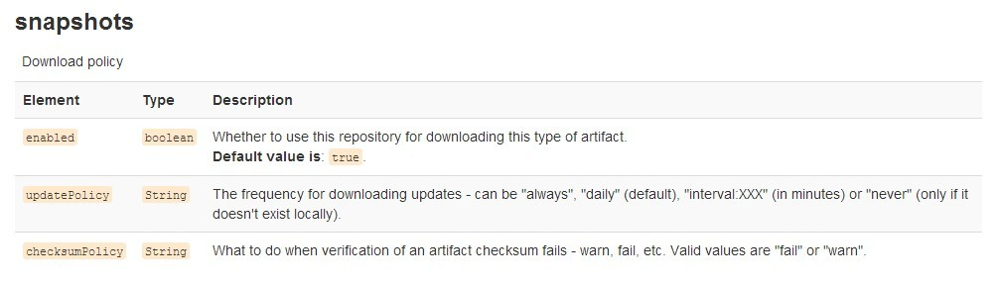

# MAVEN发布固定版本(Snapshot实时更新依赖的方法)

接触Maven有几年时间了，不得不说，它是个好东西，一旦接触之后就有种爱不释手的感觉。 

最近在开发中遇到一个疑问，开发阶段的依赖中往往更改一小丁点东西都需要升级版本发布，十分繁琐。 

对此查了很多资料，国内的资料十分有限，看来国内还很少有朋友遇到这个问题，大家应该都是使用升级版本更新依赖的方式。 

上了官网查查资料，还真有解决方案。 

首先要分清楚Snapshot和Release的区别 

maven中的仓库分为两种，snapshot快照仓库和release发布仓库。snapshot快照仓库用于保存开发过程中的不稳定版本，release正式仓库则是用来保存稳定的发行版本。定义一个组件/模块为快照版本，只需要在pom文件中在该模块的版本号后加上-SNAPSHOT即可(注意这里必须是大写)， 

如 

```
<groupId>org.quinn</groupId>
  <artifactId>accounts</artifactId>
  <version>0.0.1-SNAPSHOT</version>
 <packaging>jar</packaging>
```

以下两种方式解决Snapshot实时更新依赖的方法

## 1，修改setting.xml配置方式

修改setting.xml的发布部分如下设置 

```
<profile>
      <id>dev</id>
      <repositories>
        <repository>
          <id>nexus</id>
          <url>http://ip:8081/nexus/content/groups/public</url>
          <releases>
            <enabled>true</enabled>
          </releases>
          <snapshots>
            <enabled>true</enabled>
            <updatePolicy>always</updatePolicy>
            <checksumPolicy>warn</checksumPolicy>
          </snapshots>
        </repository>
      </repositories>
      <pluginRepositories>
        <pluginRepository>
          <id>nexus</id>
          <url>http://ip:8081/nexus/content/groups/public</url>
          <releases>
            <enabled>true</enabled>
          </releases>
          <snapshots>
            <enabled>true</enabled>
            <updatePolicy>always</updatePolicy>
            <checksumPolicy>warn</checksumPolicy>
          </snapshots>
        </pluginRepository>
      </pluginRepositories>
    </profile>
```

可以看到我在snapshot下面加了如下设置 

```
<enabled>true</enabled>
<updatePolicy>always</updatePolicy>
<checksumPolicy>warn</checksumPolicy>
```

看下maven官方对这个属性做出的解释,重点就是updatePolicy属性 



enabled设置为true 

updatePolicy更新snapshot包的频率，属性有四个值always(实时更新) daily（每天更新） interval:xxx（隔xxx分钟更新一次）  never（从不更新） 默认为daily 

checksumPolicy为warn 

如果是使用eclipse开发，集成了maven插件的，还需要做如下事情。 

Window>Preferences>Maven>User Settings>Update Settings 

完成以上操作可完成无需更改版本发布，依赖方也不需要更改pom，只需执行一下mvn clean install 即可完成依赖更新

 

## 2，打包的时候 install的时候加上 -U 参数方式

注意：maven会自动从仓库中检查模块A的快照版本的最新版本，当发现有更新时便进行下载。默认情况下，maven每天检查一次更新(由仓库配置的updatePolicy控制)，用户也可以使用命令-U参数强制让maven检查更新，如maven clean install -U。
元素updatePlocy说明：用来配置maven从远程仓库检查更新的频率，默认的值为daily,表示每天检查一次。

来源： <http://www.tuicool.com/articles/ErIneq>