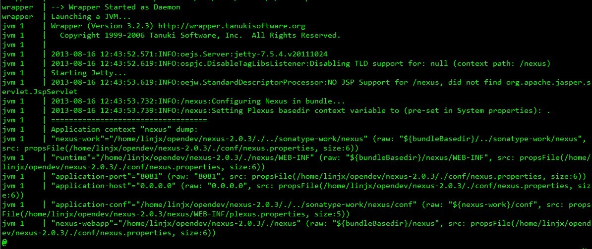
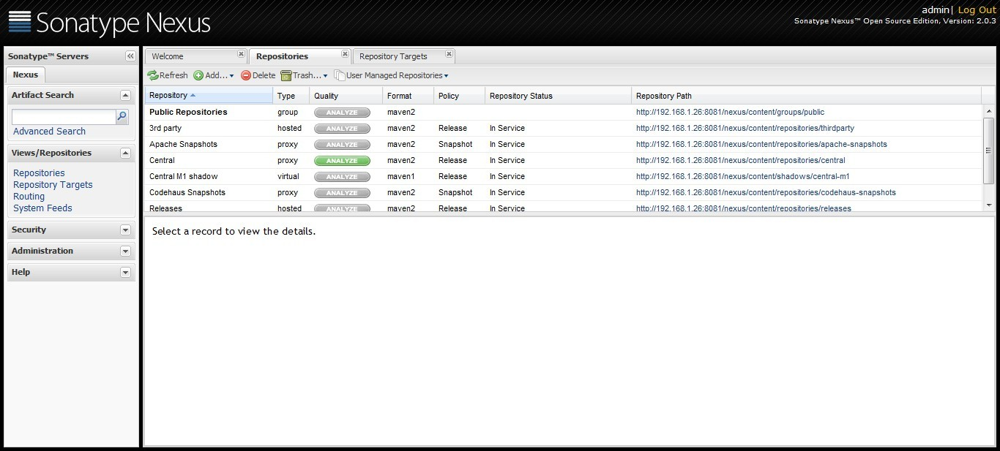

# linux系统之上搭建maven 之nexus服务篇

​       今天刚好有点时间，就想在公司的服务器搭建一个私服，以便以后可以唯我所用，当然前提是服务器最好可以上网，否则还需要配置代理服务器，前两天刚好把服务器的网络给配置了下，这边就不详述了！大家一定着急了吧，稍安务燥，这就进入正题，O(∩_∩)O~

​        linux安装过程和window主机还是差别挺大的。

## **1.下载nexus集成版**

到这个地方<http://www.sonatype.org/nexus/go> 下载压缩包，我这边下载的是nexus-2.0.3-bundle.tar.gz这个版本。

## **2. 解压到相应的目录**

tar  -xzvf  nexus-2.0.3-bundle.tar.gz ， 我这边放在/home/linjx/opendev/nexus-2.0.3目录下。

 

## **3. 设置为系统服务**

这里需要使用root权限，具体请看<http://books.sonatype.com/nexus-book/reference/install-sect-service.html>

简单如下：

\# cd  /etc/init.d

\# cp  /home/linjx/opendev/nexus-2.0.3/bin/jsw/linux-x86-64/nexus ./nexus

\# chmod 755 nexus

\# chkconfig --add nexus

\# chkconfig --levels 345 nexus on

 

## **4. 编辑/etc/init.d/nexus的文本**

4.1. 添加以下变量

RUN_AS_USER=linjx    ## 这个主要为了后面使用，不需要使用root用户启动服务

NEXUS_HOME=/home/linjx/opendev/nexus-2.0.3/

PLATFORM=linux-x86-64

PLATFORM_DIR="${NEXUS_HOME}/bin/jsw/${PLATFORM}"

4.2. 修改以下变量

WRAPPER_CMD="${PLATFORM_DIR}/wrapper"

WRAPPER_CONF="${PLATFORM_DIR}/../conf/wrapper.conf"

 

 

PIDDIR="${NEXUS_HOME}"

 

## **5. 启动服务**

切换会自己的用户，不需要使用root用户；

\# service nexus start

 

这个大家出现什么情况，是不是失败了！界面上出现 ：Could not write pid file /etc/rc.d/init.d/./nexus.pid: Permission denied通过查看日志文件：

fzdev#[/home/linjx/opendev/nexus-2.0.3/logs] cat w*  

wrapper  | ERROR: Could not write pid file /etc/rc.d/init.d/./nexus.pid: Permission denied

 

怎么办呢，根据信息提示，nexus.pid无法写入，应该还是权限问题，这个应该跟启动当前服务有关。

 

查文档<http://books.sonatype.com/nexus-book/reference/install-sect-service.html>后发现，一有段信息没有配置，

Change PIDDIR to a directory where this user has read/write permissions. In most Linux distributions, /var/run is only writable by root. The properties you need to add to customize the PID file location is "wrapper.pid". For more information about this property and how it would be configured in wrapper.conf, see: <http://wrapper.tanukisoftware.com/doc/english/properties.html>

 

大概意思就是服务启动时无法写入pid，就是说init.d这个目录当前用户是没有权限写的，怎么办呢。可以自定义pid写入目录，那么在哪里配置呢，是不是又想起了wrapper.conf了，其他文档中也说明了。

好吧，那就再加个配置吧，这样：PIDDIR="/home/linjx/piddir"

 

然后再启动服务，果然成功了！具体可以看看附件中的详细的日志！

## **6. **启动之后，可以登录首页查看nexus的界面

http://192.168.1.26:8081/nexus/index.html

 

默认管理员用户名/密码: admin/admin123

 

http://www.blogjava.net/javalinjx/archive/2013/08/21/403110.html