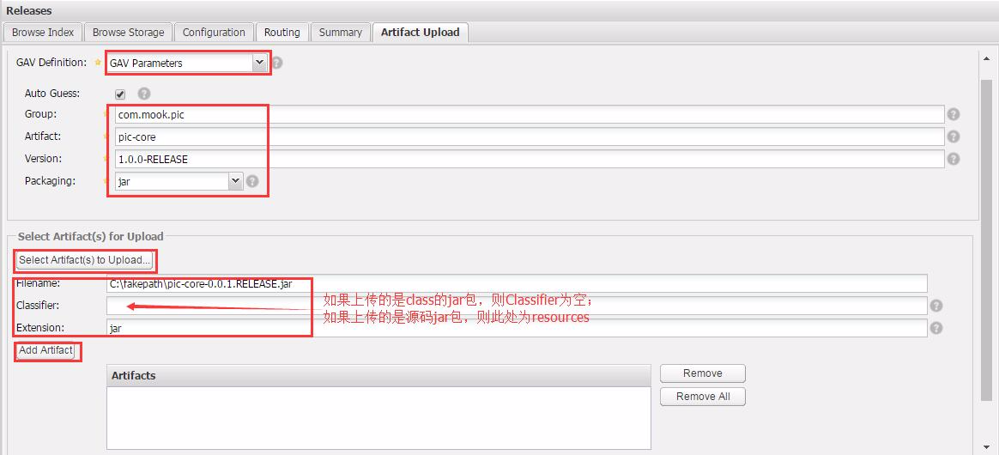

### 前言：

　　公司一般都有个自己的私服来管理各种jar包，原因大概有这么3个，分别是：

　　　　1、有的公司不能访问外网，只能通过私服来管理jar包和插件；

　　　　2、公司网速比较慢，通过公司的私服来获取jar包比较快；

　　　　3、内部的的一些jar包放在私服上，比较方便的大家使用。

　　这里简单介绍下搭建Nexus环境，并且在eclipse mvn插件环境下来上传jar包。

### Nexus环境搭建：

　　　说明：这里是Windows环境，Linux类似。

　　1、下载Nexus安装文件：<http://www.sonatype.org/nexus/go> ，目前是[nexus-2.13.0-01-bundle.tar.zip](http://www.sonatype.com/oss-thank-you-zip)这个最新版本；

　　2、解压到任意目录，我这里解压到E盘，进入E:\nexus-2.13.0-01\bin\jsw\windows-x86-64，点击install-nexus.bat安装成为windows服务，这里选择自己计算机对应的文件；

　　3、访问http://localhost:8081/nexus/，这就是私服；

　　4、点击右上角登录，默认帐号admin，密码admin123；

　　5、点击左边Repositories，可以看到一系列仓库类型，我们一般使用3个，分别是Releases，Snapshots和3rd party。这3个仓库风别是装稳定版，开发版和第三方jar包　。

　　

　　6、举例，手动上传一个jar到Releases仓库里面。

　　　

　　7、上面是手动方式，另外一种是利用mvn直接发布到私服上面来，需要修改2个地方，第一是在settings文件的servers节点下加入，这是配置私服的密码和仓库，配合pom文件中的仓库地址就构成了完成的访问私服的要素，帐号和密码之所以在settings中设置，是由于settings文件是本地的，而pom.xml文件是公共的，不安全，所以放在settings中：

```
    <server>
      <id>nexus-releases</id>
      <username>admin</username>
      <password>admin123</password>
    </server>
    <server>
        <id>nexus-snapshots</id>
        <username>admin</username>
        <password>admin123</password>
    </server>
```

　　第二是在pom.xml中增加，下面的id和settings中的id必须要一样。

```
    <distributionManagement>
        <repository>
            <id>nexus-releases</id>
            <name>Nexus Release Repository</name>
            <url>http://localhost:8081/nexus/content/repositories/releases/</url>
        </repository>
        <snapshotRepository>
            <id>nexus-snapshots</id>
            <name>Nexus Snapshot Repository</name>
            <url>http://localhost:8081/nexus/content/repositories/snapshots/</url>
        </snapshotRepository>
    </distributionManagement>
```

　　8、新建一个mvn项目，

　　　　1、运行source:jar在target下生成源码jar包；

　　　　2、运行deploy，class的jar包发布到私服；

　　　　***3、运行source:jar deploy，连同源码一起发布到私服。***

　　9、完成，在其他项目中可以使用上面的jar包了。

　　10、a.贴两个以前遇到过的小异常过来，在eclipse中配置mvn的时候可以分别配置mvn的目录和settings文件，不过最好是二者是同一个版本的，不然有可能就会出问题。

　　　　 b.我们有时候明明<dependency>没写错，却偏偏各种报错，可以删掉本地对应的jar，重新下载，就ok了。

　　11、学习建议：mvn这个东西，就是难者不会，会者不难。基本上按照这样一个路线就问题不大，基本使用 => 了解继承/聚合 => 了解jar包冲突机制，并解决冲突 =>了解mvn的3个默认声明周期 ，生命周期的各个阶段phase ，各个阶段的目标goal => mvn的插件开发 => Nexus私服搭建及其使用。大致这样一个过程下来，就能非常熟悉mvn，如果在稍微看看mvn的源码，大致看一看，基本上可以说是精通mvn了。

来源： <http://www.cnblogs.com/dreamroute/p/5440419.html>