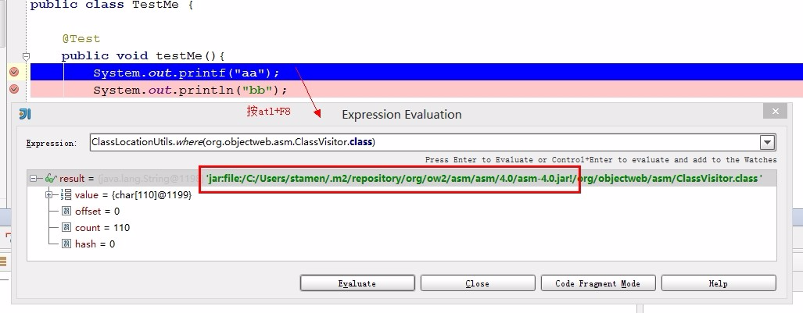

# Maven类包冲突终极解决小技若干

**那句话怎么讲来着的...**

 

引用

如果你爱他，就请让他用Maven，因为那里是天堂，如果你恨他，就请让他用Maven，因为那里是地狱.

Maven对于新手来说是《步步惊心》，因为它包罗万象，博大精深，因为当你初来乍到时，你就像一个进入森林的陌生访客一样迷茫。 

Maven对于老手来说是《真爱配方》，因为它无所不能，利如刀锋，使用Maven做开发，如饮美酒如悦美人。 

Maven对于新手来说，最痛苦的一件事莫过于包之间的冲突，由于Maven的依赖传递性，当你引入一个依赖类时，其身后的依赖类也一起如过江之鲫纷至沓来了。 

**举个栗子**

 

A依赖于B及C，而B又依赖于X、Y，而C依赖于X、M，则A除引B及C的依赖包下，还会引入X，Y，M的依赖包（一般情况下了，Maven可通过<scope>等若干种方式控制传递依赖）。 

这里有一个需要特别注意的，即B和C同时依赖于X，假设B依赖于X的1.0版本，而C依赖于X的2.0版本，A究竟依赖于X的1.0还是2.0版本呢？ 

这就看Classloader的加载顺序了，假设Classloader先加载X_1.0，而它就不会再加载X_2.0了，如果A恰恰希望使用X_2.0呢，血案就这样不期而遇了。 

**我常抡的三板斧**

 

## **第一板斧:找到传递依赖的鬼出在哪里？**

 

dependency:tree

是把照妖照，pom.xml用它照照，所有传递性依赖都将无处遁形，并且会以层级树方式展现，非常直观。 

以下就是执行dependency:tree后的一个输出： 

引用

```
[INFO] --- maven-dependency-plugin:2.1:tree (default-cli) @ euler-foundation --- 
[INFO] com.hsit:euler-foundation:jar:0.9.0.1-SNAPSHOT 
[INFO] +- com.rop:rop:jar:1.0.1:compile 
[INFO] |  +- org.slf4j:slf4j-api:jar:1.7.5:compile 
[INFO] |  +- org.slf4j:slf4j-log4j12:jar:1.7.5:compile 
[INFO] |  +- log4j:log4j:jar:1.2.16:compile 
[INFO] |  +- commons-lang:commons-lang:jar:2.6:compile 
[INFO] |  +- commons-codec:commons-codec:jar:1.6:compile 
[INFO] |  +- javax.validation:validation-api:jar:1.0.0.GA:compile 
[INFO] |  +- org.hibernate:hibernate-validator:jar:4.2.0.Final:compile 
[INFO] |  +- org.codehaus.jackson:jackson-core-asl:jar:1.9.5:compile 
[INFO] |  +- org.codehaus.jackson:jackson-mapper-asl:jar:1.9.5:compile 
[INFO] |  +- org.codehaus.jackson:jackson-jaxrs:jar:1.9.5:compile 
[INFO] |  +- org.codehaus.jackson:jackson-xc:jar:1.9.5:compile 
[INFO] |  \- com.fasterxml.jackson.dataformat:jackson-dataformat-xml:jar:2.2.3:compile 
[INFO] |     +- com.fasterxml.jackson.core:jackson-core:jar:2.2.3:compile 
[INFO] |     +- com.fasterxml.jackson.core:jackson-annotations:jar:2.2.3:compile 
[INFO] |     +- com.fasterxml.jackson.core:jackson-databind:jar:2.2.3:compile 
[INFO] |     +- com.fasterxml.jackson.module:jackson-module-jaxb-annotations:jar:2.2.3:compile 
[INFO] |     \- org.codehaus.woodstox:stax2-api:jar:3.1.1:compile 
[INFO] |        \- javax.xml.stream:stax-api:jar:1.0-2:compile 
```


​     刚才吹嘘dependency:tree时，我用到了“无处遁形”，其实有时你会发现简单地用dependency:tree往往并不能查看到所有的传递依赖。不过如果你真的想要看所有的，必须得加一个-Dverbose参数，这时就必定是最全的了。 


​    全是全了，但显示出来的东西太多，头晕目眩，有没有好法呢？当然有了，加上Dincludes或者Dexcludes说出你喜欢或讨厌，dependency:tree就会帮你过滤出来： 

引用

```
Dincludes=org.springframework:spring-tx
```

   过滤串使用groupId:artifactId:version的方式进行过滤，可以不写全啦，如： 

Java代码  

```
mvn dependency:tree -Dverbose -Dincludes=asm:asm  
```

   就会出来asm依赖包的分析信息： 

引用

```
[INFO] --- maven-dependency-plugin:2.1:tree (default-cli) @ ridge-test --- 
[INFO] com.ridge:ridge-test:jar:1.0.2-SNAPSHOT 
[INFO] +- asm:asm:jar:3.2:compile 
[INFO] \- org.unitils:unitils-dbmaintainer:jar:3.3:compile 
[INFO]    \- org.hibernate:hibernate:jar:3.2.5.ga:compile 
[INFO]       +- cglib:cglib:jar:2.1_3:compile 
[INFO]       |  \- (asm:asm:jar:1.5.3:compile - omitted for conflict with 3.2) 
[INFO]       \- (asm:asm:jar:1.5.3:compile - omitted for conflict with 3.2) 
[INFO] ------------------------------------------------------------------------ 
```

   对asm有依赖有一个直接的依赖(asm:asm:jar:3.2)还有一个传递进入的依赖(asm:asm:jar:1.5.3) 

## **第二板斧:将不想要的传递依赖剪除掉**

 

   承上，假设我们不希望asm:asm:jar:1.5.3出现，根据分析，我们知道它是经由org.unitils:unitils-dbmaintainer:jar:3.3引入的，那么在pom.xml中找到这个依赖，做其它的调整： 

Xml代码  

```
<dependency>  
    <groupId>org.unitils</groupId>  
    <artifactId>unitils-dbmaintainer</artifactId>  
    <version>${unitils.version}</version>  
    <exclusions>  
        <exclusion>  
            <artifactId>dbunit</artifactId>  
            <groupId>org.dbunit</groupId>  
        </exclusion>  
        <!-- 这个就是我们要加的片断 -->  
        <exclusion>  
            <artifactId>asm</artifactId>  
            <groupId>asm</groupId>  
        </exclusion>  
    </exclusions>  
</dependency>  
```

   再分析一下，你可以看到传递依赖没有了： 

Xml代码  

```
[INFO]  
[INFO] --- maven-dependency-plugin:2.1:tree (default-cli) @ ridge-test ---  
[INFO] com.ridge:ridge-test:jar:1.0.2-SNAPSHOT  
[INFO] \- asm:asm:jar:3.2:compile  
[INFO] ------------------------------------------------------------------------  
[INFO] BUILD SUCCESS 
```

## **第三板斧:查看运行期类来源的JAR包**

 

有时，你以为解决了，但是偏偏还是报类包冲突（典型症状是java.lang.ClassNotFoundException或Method不兼容等异常），这时你可以设置一个断点，在断点处通过下面这个我做的工具类来查看Class所来源的JAR包： 

Java代码  

```
package com.ridge.util;  
  
import java.io.File;  
import java.net.MalformedURLException;  
import java.net.URL;  
import java.security.CodeSource;  
import java.security.ProtectionDomain;  
  
/** 
 * @author : chenxh 
 * @date: 13-10-31 
 */  
public class ClassLocationUtils {  
  
    /** 
     * 获取类所有的路径 
     * @param cls 
     * @return 
     */  
    public static String where(final Class cls) {  
        if (cls == null)throw new IllegalArgumentException("null input: cls");  
        URL result = null;  
        final String clsAsResource = cls.getName().replace('.', '/').concat(".class");  
        final ProtectionDomain pd = cls.getProtectionDomain();  
        if (pd != null) {  
            final CodeSource cs = pd.getCodeSource();  
            if (cs != null) result = cs.getLocation();  
            if (result != null) {  
                if ("file".equals(result.getProtocol())) {  
                    try {  
                        if (result.toExternalForm().endsWith(".jar") ||  
                                result.toExternalForm().endsWith(".zip"))  
                            result = new URL("jar:".concat(result.toExternalForm())  
                                    .concat("!/").concat(clsAsResource));  
                        else if (new File(result.getFile()).isDirectory())  
                            result = new URL(result, clsAsResource);  
                    }  
                    catch (MalformedURLException ignore) {}  
                }  
            }  
        }  
        if (result == null) {  
            final ClassLoader clsLoader = cls.getClassLoader();  
            result = clsLoader != null ?  
                    clsLoader.getResource(clsAsResource) :  
                    ClassLoader.getSystemResource(clsAsResource);  
        }  
        return result.toString();  
    }  
  
}  
```

随便写一个测试，设置好断点，在执行到断点处按alt+F8动态执行代码（intelij idea），假设我们输入： 

Java代码  

```
ClassLocationUtils.where(org.objectweb.asm.ClassVisitor.class)  
```

即可马上查出类对应的JAR了： 
 


这就是org.objectweb.asm.ClassVisitor类在运行期对应的JAR包，如果这个JAR包版本不是你期望你，就说明是你的IDE缓存造成的，这时建议你Reimport一下maven列表就可以了，如下所示(idea)： 

 

Reimport一下，IDE会强制根据新的pom.xml设置重新分析并加载依赖类包，以得到和pom.xml设置相同的依赖。（这一步非常重要哦，经常项目组pom.xml是相同的，但是就是有些人可以运行，有些人不能运行，俗称人品问题，其实都是IDE的缓存造成的了

 ） 

##### 评论

3 楼 [stamen](http://stamen.iteye.com/) 2015-07-27  

qq4628241 写道

谢谢分享
补充一点
关于idea清除缓存,为了提高效率不建议采用reimport重新起开启项目的方式,建议采用idea自带的功能,File->Invalidate Caches 功能直接完成清除idea cache

来源： <http://stamen.iteye.com/blog/2030552>