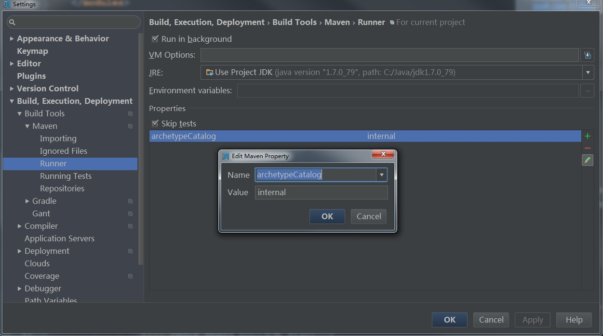

# [maven generating project in batch mode hang](http://www.cnblogs.com/beiyeren/p/4566485.html)

# 现象：

执行 archetype:generate 的时候，会产生

```
[INFO] Generating project in Batch mode
```

```
然后就一直阻塞在这里
```

原因是：网速问题，

# 解决方法：

设置maven不要从远程服务器上获取catalog，增加参数-DarchetypeCatalog=internal

如何在idea里设置maven参数：



来源： <http://www.cnblogs.com/beiyeren/p/4566485.html>