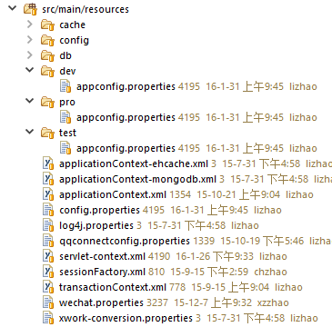

# maven profile如何为不同的环境打包 -开发、测试和生产环境

代码位置：/Users/jerryye/backup/studio/AvailableCode/Project-build-tool/maven/Maven针对不同的环境使用Profile完成打包部署/maven_profile_demo

作为一名程序员，在开发的过程中，经常需要面对不同的运行环境（开发环境、测试环境、生产环境、内网环境、外网环境等等），在不同的环境中，相关的配置一般不一样，比如数据源配置、日志文件配置、以及一些软件运行过程中的基本配置。每次在不同环境部署程序时，都需要修改相应的配置文件，使之完成环境的配置。这么做存在一个比较大的问题：每次修改配置非常麻烦，而且配置错误会产生不可预估的影响，比如，在发布生产环境时用的开发环境的配置还好，但如果在开发环境下用生产环境的数据，将会造成生产数据的污染，导致生产环境崩溃。

目前JAVA相关的项目基本都是使用Maven来进行构建。在maven中实现多环境的构建可移植性需要使用profile，通过不同的环境激活不同的profile来达到构建的可移植性。

## 一、POM中profile的配置

首先是profile配置，在pom.xml中添加如下profile的配置：

```
<profiles>
    <profile>
        <!-- 本地开发环境 -->
        <id>dev</id>
        <properties>
            <profiles.active>dev</profiles.active>
        </properties>
        <activation>
            <activeByDefault>true</activeByDefault>
        </activation>
    </profile>
    <profile>
        <!-- 测试环境 -->
        <id>test</id>
        <properties>
            <profiles.active>test</profiles.active>
        </properties>
    </profile>
    <profile>
        <!-- 生产环境 -->
        <id>pro</id>
        <properties>
            <profiles.active>pro</profiles.active>
        </properties>
    </profile>
</profiles>

```

这里定义了三个环境，dev（开发环境）、test（测试环境）、pro（生产环境），其中开发环境是默认激活的（activeByDefault为true），这样如果在不指定profile时默认是开发环境。

同时每个profile还定义了两个属性，其中profiles.active表示被激活的profile的配置文件的目录。

## 二、工程目录

针对不同的环境，我们定义不同的配置文件，而这些配置文件都做为资源文件放到maven工程的resources目录下，即src/main/resources目录下，且各个环境的配置分别放到相应的目录下，而所有环境都公用的配置，直接放到src/main/resources目录下即可。如下图所示：


如图所示，开发环境、测试环境、生产环境的配置文件分别放到src/main/resources目录下的dev、test、pro三个子目录中，剩余公共的配置文件放于resources目录下。

## 三、POM文件中build配置

在pom中的build节点下，配置资源文件的位置，如下所示：

```
    <build>
        <resources>
            <resource>
                <directory>src/main/resources</directory>
                <!-- 资源根目录排除各环境的配置，防止在生成目录中多余其它目录 -->
                <excludes>
                    <exclude>test/*</exclude>
                    <exclude>pro/*</exclude>
                    <exclude>dev/*</exclude>
                </excludes>
            </resource>
            <resource>
                <directory>src/main/resources/${profiles.active}</directory>
            </resource>
        </resources>
    </build>
```

首先第一个资源文件位置src/main/resources需要排队提各个环境的配置文件，各个环境的配置我们在第二个节点中通过前面在profile中配置的profiles.active属性来指定。即src/main/resources/${profiles.active}。这样在激活指定的profile时，会加载指定目录下的配置文件，如当前激活的是pro profile，那么这个资源目录就是src/main/resources/pro。这样就达到了不同环境加载不同配置的目的。

## 五、项目编译生成

所有需要的配置就完成了，通过在运行maven命令时指定不同的profile即可构建不同环境需要的war包或发布到不同的环境了 。如：

> mvn clean package -Ppro即构建出生产环境需要的war包

由于默认的profile是dev，所以如果我们不指定profile，那么加载就是开发环境dev下的配置文件了。即我们在本地开发测试时，不用关心profile的问题。

## 其它方法

在resource节点中可以增加如下节点

```
<resource>
    <directory>src/main/resources</directory>
    <!-- 资源根目录排除各环境的配置，使用单独的资源目录来指定 -->
    <excludes>
        <exclude>test/*</exclude>
        <exclude>pro/*</exclude>
        <exclude>dev/*</exclude>
    </excludes>
    <filtering>true</filtering>
</resource>

```

在某个resource中如果设置filtering为true，将会根据输入参数动态修改相关内容。

配置文件app.config中为

```
url=${url}
```

### 方式一，使用profile的properties

```
<properties>
    <profiles.active>test</profiles.active>
    <url>localhost</url>
</properties>
```

maven在resources过程中会替换为localhost

### 方式二，使用命令参数-D

> mvn clean package -Durl=localhost

同样的效果，都会copy资源文件的时候设置这个url的参数

## 参考链接

<http://maven.apache.org/guides/introduction/introduction-to-profiles.html>
<http://www.petrikainulainen.net/programming/tips-and-tricks/creating-profile-specific-configuration-files-with-maven/>
[http://blog.csdn.net/mhmyqn/article/details/24501281](http://blog.csdn.net/mhmyqn/article/details/24501281)

[来源： ](http://blog.csdn.net/mhmyqn/article/details/24501281)<https://my.oschina.net/u/2300159/blog/811587>