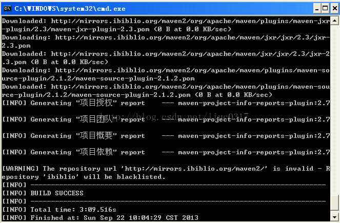
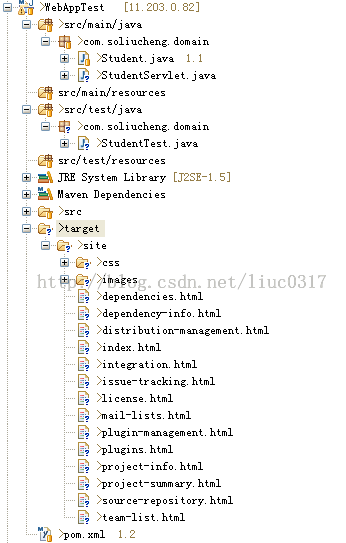
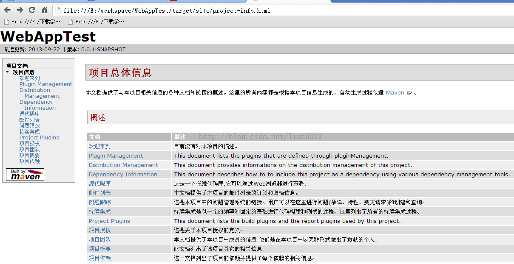

使用maven 的site 插件 生成一个 可以在 浏览器中 查看项目的站点，以下的blog 是最基本的操作，可以添加其他的属性生成更加完善的站点文档。

首先在项目的pom.xml 添加一个插件site

```
    <build>
        <!--<finalName>test</finalName>-->
        <pluginManagement>
            <plugins>
                <plugin>
                    <groupId>org.apache.maven.plugins</groupId>
                    <artifactId>maven-site-plugin</artifactId>
                    <version>3.3</version>
                    <configuration>
                        <locales>zh_CN</locales>
                    </configuration>
                </plugin>
            </plugins>
        </pluginManagement>
    </build>
```

然后打开dos 下，跳转到项目上路径下


也可以使用eclipse 中的maven 插件运行 maven build...   直接 输入site 就可以.

如图会下载所需要的Jar 和文件



就可以在项目target 下看到 有生成的文件



可以查看生成的网页

