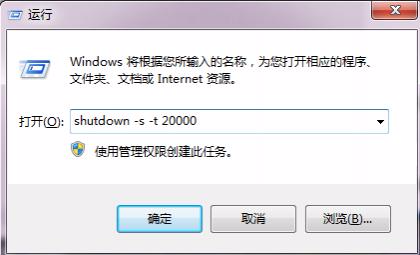

# 用CMD dos 命令进行关机-重启

看到题目，和多人就会说，这个就是个装B的技巧。不过我承认，这个技巧确实可以装逼，但是有时候还真是有用。如，你电脑卡得不行，关机的菜单的调不出来时，这个时候win+R，命令行解决；如你在下载大片，但预计还要2小时才能下载完，但是又很晚很困了，想去睡觉，放在那挂一个晚上机自然浪费电了，这时候用命令行定时关机就有用了，总比自己去网上找个这种功能的软件强多了。

用CMD命令进行关机/重启步骤：

1.win+R，换出输入框

2.在输入框输入命令，如关机：shutdown -s -t 20，该命令是20秒后关机。

​                                          重启 ：shutdown -r -t 20

命令说明

-s 关机

-r 重启

-t 时间，后面是数字是你要设置的秒数

-a 取消命令，如果要取消定时命令可以  shutdown -a

来源： [http://www.wusiwei.com/post-185.html](http://www.wusiwei.com/post-185.html)