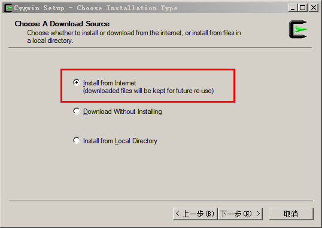

# 让windows cmd也用上linux命令

使用Linux时间长了 还是对Linux强大的命令折服，虽说Windows中doc肯定也会有命令，但是感觉一个是熟悉程度不佳，另一个就是不够强大。所以想在Windows下使用Linux命令，进行一些问题处理

我遇到一个在Windows下想看下文件的格式，因为是别人从数据库中导出的大文件，上几个G的文件，打开就报内存不够，要不就是txt好久无响应。

有这个想到了Linux的more命令  由此想装个支持Linux命令的工具（当然另外的解决办法也有装一个Linux虚拟机，但是还需要再上传，不是好的解决办法）

 

先，下载Cygwin安装程序 [点击下载](http://www.cygwin.com/setup.exe)

 

### 安装：

\1. 双击setup.exe

\2. 按照安装提示“下一步”

\3. 选择从“互联网”安装：

 

\4. 选择安装的路径，一般是C:\Cygwin，选择本地临时目录，用于存放下载的软件；选择您连接互联网的方式，一般选“直接连接”就可以了。

\5. 选择下载源，您可以在下载列表里选择：http://www.[cygwin](http://shuai.be/tags/cygwin/).cn 或者，直接在URL里输入http://www.[cygwin](http://shuai.be/tags/cygwin/).cn/pub/

\6. 根据安装提示，选择需要安装的软件包，完成安装。

### 使用

\1. 双击桌面的Cygwin图标，即可启动Cygwin里的Bash。

\2. 或者，你可将C:/Cygwin/bin加到%PATH%当中，您就可以直接在cmd.exe里面使用Linux命令了，比如less, cat, wc , wget

\3. 如果您有一个Bash脚本，您可以直接用C:/Cygwin/bin/bash.exe X:/scripts/Monitor.sh的形式调用。

 

/////////////////////////////////////////////////////

（gnuwin32首页：[http://gnuwin32.sourceforge.net/](http://gnuwin32.sourceforge.net/)）
1.先下载wget，我最喜欢的下载器（迅雷无广告版排第二0.0）
[http://downloads.sourceforge.net/gnuwin32/wget-1.11.4-1-setup.exe](http://downloads.sourceforge.net/gnuwin32/wget-1.11.4-1-setup.exe)   呵呵
下下来放到C:\WINDOWS下,就能像linux下一样直接用了
2.本地语言支持库LibIntl(以下软件包用wget下载比较好,迅雷等下载器对付http\ftp不稳定)：
下载首页：[ http://gnuwin32.sourceforge.net/packages/libintl.htm](http://gnuwin32.sourceforge.net/packages/libintl.htm)
软件下载：
wget -c [http://switch.dl.sourceforge.net/sourceforge/gnuwin32/libintl-0.14.4-bin.zip](http://switch.dl.sourceforge.net/sourceforge/gnuwin32/libintl-0.14.4-bin.zip)
3.字符编码切换库
下载首页：[ http://gnuwin32.sourceforge.net/packages/libiconv.htm](http://gnuwin32.sourceforge.net/packages/libiconv.htm)
软件下载：
wget -c [http://switch.dl.sourceforge.net/sourceforge/gnuwin32/libiconv-1.9.2-1-bin.zip](http://switch.dl.sourceforge.net/sourceforge/gnuwin32/libiconv-1.9.2-1-bin.zip)
4.Linux核心命令库：
下载首页：[http://gnuwin32.sourceforge.net/packages/coreutils.htm](http://gnuwin32.sourceforge.net/packages/coreutils.htm)
软件下载：
wget -c [http://switch.dl.sourceforge.net/sourceforge/gnuwin32/coreutils-5.3.0-bin.zip](http://switch.dl.sourceforge.net/sourceforge/gnuwin32/coreutils-5.3.0-bin.zip)
5.安装说明：
1）解压文件coreutils-5.3.0-bin.zip到C:\WINDOWS\coreutils-5.3.0-bin
2）解压文件libiconv-1.9.2-1-bin.zip，并且把目bin下的文件复制到C:\WINDOWS\coreutils-5.3.0-bin\bin下
3）解压文件libintl-0.14.4-bin.zip，并且把目bin下的文件复制到C:\WINDOWS\coreutils-5.3.0-bin\bin下
4）我的电脑上右键--属性--高级环境变量
在环境变量Path中增加最后一句";C:\WINDOWS\coreutils-5.3.0-bin\bin"（不包含引号，别把原来的删了）
装好后有以下命令可用了（“[”是什么命令，没见过。。）：
[，basename，cat，chgrp，chmod，chown，chroot，cksum，comm，cp，csplit，cut，date，dd，
df，dir，dircolors，dirname，du，echo，env，expand，expr，factor，false，fmt，fold，
gdate，gecho，ginstall，gln，gmkdir，grmdir，groupsgsort，head，hostid，hostname，id，
install，join，kill，link，ln，logname，ls，md5sum，mkdir，mkfifo，mknod，mv，nice，
nl，nohup，od，paste，pathchk，pinky，pr，printenv，printf，ptx，pwd，readlink，rm，
rmdir，seq，setuidgid，sha1sum，shred，sleep，sort，split，stat，stty，su，sum，sync，
tac，tail，tee，test，touch，tr，true，tsort，tty，uname，unexpand，uniq，unlink，
uptime，users，vdir，wc，who，whoami，yes
6.缺少的命令：
1）
grep
wget -c http://downloads.sourceforge.net/gnuwin32/grep-2.5.4-bin.zip
解压后把bin下的三个文件放到C:\WINDOWS\coreutils-5.3.0-bin\bin，可见egrep、fgrep也有了
现在grep还不能用，需要几个dll文件
wget -c http://gnuwin32.sourceforge.net/downlinks/pcre-bin-zip.php
解压后把bin下的几个文件放到C:\WINDOWS\coreutils-5.3.0-bin\bin
2）
tree（gnuwin32.sourceforge.net的都要用wget下，我用其他下载器下载未遂）
wget -c http://downloads.sourceforge.net/gnuwin32/tree-1.5.2.2-bin.zip
解压后把bin下的tree.exe放到C:\WINDOWS\coreutils-5.3.0-bin\bin下
3）
file
wget -c http://downloads.sourceforge.net/gnuwin32/file-5.03-bin.zip
解压把bin下的两个文件放到C:\WINDOWS\coreutils-5.3.0-bin\bin
把share\misc目录放到C:\WINDOWS\coreutils-5.3.0-bin\share下
wget -c http://gnuwin32.sourceforge.net/downlinks/filetype-bin-zip.php
解压把bin下的两个文件放到C:\WINDOWS\coreutils-5.3.0-bin\bin
然后下载file依赖的两个dll
wget -c http://gnuwin32.sourceforge.net/downlinks/regex-bin-zip.php
解压，把bin下文件放到C:\WINDOWS\coreutils-5.3.0-bin\bin下
wget -c http://gnuwin32.sourceforge.net/downlinks/zlib-bin-zip.php
解压，把bin下文件放到C:\WINDOWS\coreutils-5.3.0-bin\bin下
4）
find、locate和xargs
wget -c http://gnuwin32.sourceforge.net/downlinks/findutils-bin-zip.php
解压，把bin下文件放到C:\WINDOWS\coreutils-5.3.0-bin\bin下，它们依赖的dll在前面装libint跟libiconv时装好了
5）less
wget -c http://ncu.dl.sourceforge.net/sourceforge/gnuwin32/less-394-bin.zip
解压，把bin下文件放到C:\WINDOWS\coreutils-5.3.0-bin\bin下
6）
gzip,bzip2,tar
wget -c http://gnuwin32.sourceforge.net/downlinks/gzip-bin-zip.php
wget -c http://gnuwin32.sourceforge.net/downlinks/bzip2-bin-zip.php
wget -c http://gnuwin32.sourceforge.net/downlinks/tar-bin-zip.php
解压，把bin下文件放到C:\WINDOWS\coreutils-5.3.0-bin\bin下
7)
which
wget -c http://downloads.sourceforge.net/gnuwin32/which-2.20-bin.zip
解压，把bin下文件放到C:\WINDOWS\coreutils-5.3.0-bin\bin下
8)
make
wget -c http://gnuwin32.sourceforge.net/downlinks/make-bin-zip.php
9)
还没发现，想到再加

 

来源： [http://www.cnblogs.com/xd502djj/archive/2010/08/05/1793404.html](http://www.cnblogs.com/xd502djj/archive/2010/08/05/1793404.html)