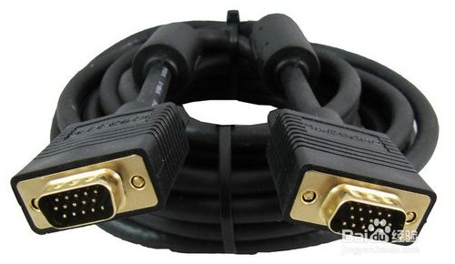
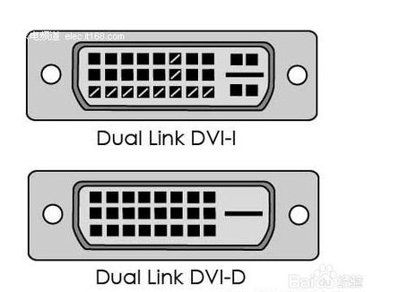
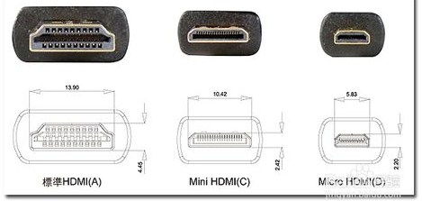

# VGA、DVI、HDMI三种视频信号接口有什么差别

 家里的高清电视越来越普遍，而这些高清电视大多带了VGA、DVI、HDMI的接口。笔记本电脑的屏幕太小，办公的人大多想要外接一个显示器。所以明白这三种视频信号接口的区别，是选购合适显示器的前提。

## 方法/步骤

1,提前说明下：三种接口的转接头都存在公针和母针的区别，购买转接线时要注意需要的是公针头还是母针头。

2, VGA接头：针数为15的视频接口，主要用于老式的电脑输出。VGA输出和传递的是模拟信号。大家都知道计算机显卡产生的是数字信号，显示器使用的也是数字信号。所以使用VGA的视频接口相当于是经历了一个数模转换和一次模数转换。信号损失，显示较为模糊。

3, DVI接口：DVI接口有两个标准，25针和29针，如下图所示。直观来说，这两种接口没有区别。DVI接口传输的是数字信号，可以传输大分辨率的视频信号。DVI连接计算机显卡和显示器时不用发生转换，所以信号没有损失。

 

4,HDMI接口：HDMI接口传输的也是数字信号，所以在视频质量上和DVI接口传输所实现的效果基本相同。HDMI接口还能够传送音频信号。假如显示器除了有显示功能，还带有音响时，HDMI的接口可以同时将电脑视频和音频的信号传递给显示器。HDMI有三个接口。主要考虑到设备的需要。如数码相机的体积小，需要小的接口，就使用micro HDMI。三种接口只是在体积上有区别，功能相同。

 

## VGA、DVI、HDMI相互转换的说明

1, VGA和DVI互转：模拟信号和数字信号的转换，视频信号损失，造成失真。最好不要这样转换。

2, DVI和HDMI互转：都是数字信号，转换不会发生是真。可以转换。但是从HDMI转换成DVI时会自动舍去音频信号。

## 注意事项

视频接口的发展经历是：VGA->DVI->HDMI。

http://jingyan.baidu.com/article/4dc408488241bec8d846f152.html