# 如何用百度云下载迅雷任务

百度云的好用大家都知道，比如空间大，在线观看方便，离线下载总类多等。美中不足的是百度云的离线下载却不支持迅雷连接格式。本文便以小编的个人经验为大家提供百度云离线下载迅雷任务诸多方法中的一种，这样以后大家遇到迅雷连接也可以将其下载内容存到自己的百度云中。

[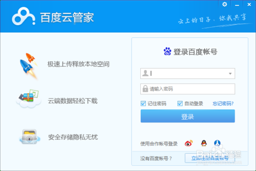](http://jingyan.baidu.com/album/219f4bf7ec31fbde452d3862.html?picindex=1)

[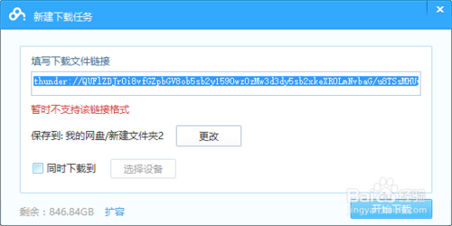](http://jingyan.baidu.com/album/219f4bf7ec31fbde452d3862.html?picindex=2)

工具/原料

·软件1：百度云管家

·软件2：QQ旋风

·平台：PC

方法/步骤

1.    打开百度云管家和QQ旋风，为下载迅雷连接格式任务做好准备。

[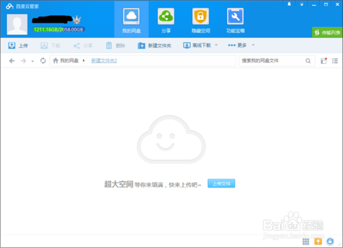](http://jingyan.baidu.com/album/219f4bf7ec31fbde452d3862.html?picindex=3)

[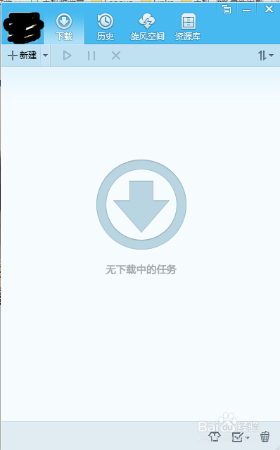](http://jingyan.baidu.com/album/219f4bf7ec31fbde452d3862.html?picindex=4)

2.    右击复制自己想要下载到百度云的迅雷连接格式的地址。

[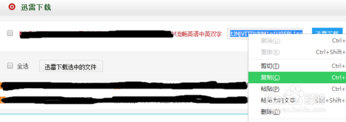](http://jingyan.baidu.com/album/219f4bf7ec31fbde452d3862.html?picindex=5)

3.    切换到QQ旋风界面点击左上角的“+新建”，在弹出的新窗口左下角点击“下载”下载该迅雷任务。

[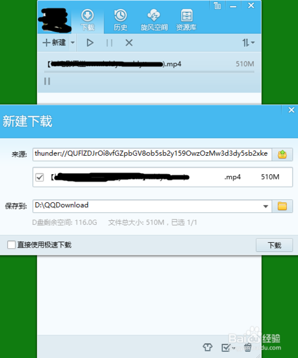](http://jingyan.baidu.com/album/219f4bf7ec31fbde452d3862.html?picindex=6)

4.    选中QQ旋风界面正在下的任务，然后右键选择“复制原始连接”一项。

[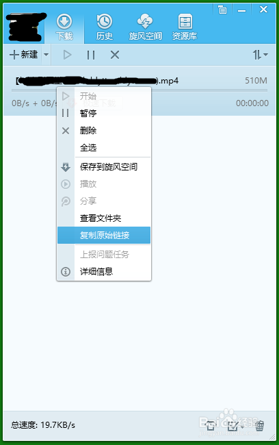](http://jingyan.baidu.com/album/219f4bf7ec31fbde452d3862.html?picindex=7)

5.    再切换到百度云管家，点击离线下载，将上一步复制的原始连接粘帖到“填写下载文件连接”处，这时可以发现连接已经解码为ed2k的格式。

[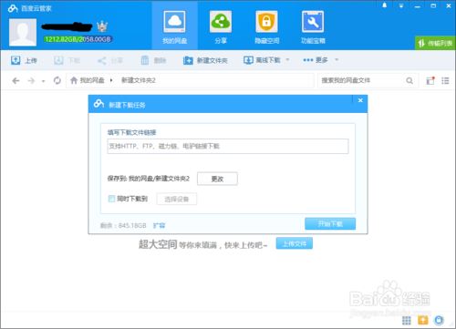](http://jingyan.baidu.com/album/219f4bf7ec31fbde452d3862.html?picindex=8)

[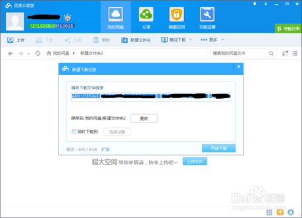](http://jingyan.baidu.com/album/219f4bf7ec31fbde452d3862.html?picindex=9)

6.    承上，点击百度云管家下载窗口左下角的“开始下载”后，就自动弹出“离线下载任务列表”，我们可以发现该任务已成功下载。

[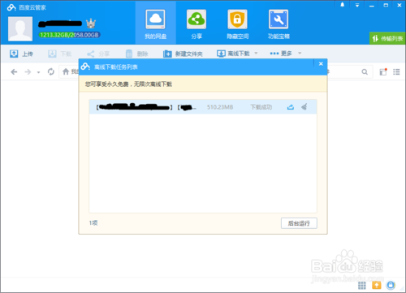](http://jingyan.baidu.com/album/219f4bf7ec31fbde452d3862.html?picindex=10)

7.    最后点击百度云管家左上角的刷新按钮刷新后，我们就可以确认该任务已成功保存到自己的百度云中  ^^.

[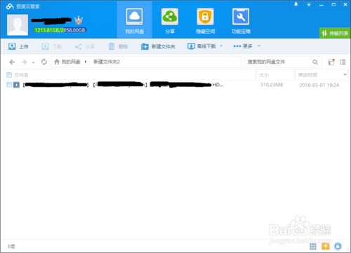](http://jingyan.baidu.com/album/219f4bf7ec31fbde452d3862.html?picindex=11)

 

**同样的道理也可以直接用 迅雷地址在线转换 得到原始地址 ，如：http://tool.lu/urlconvert/**

转载：http://jingyan.baidu.com/article/219f4bf7ec31fbde452d3862.html