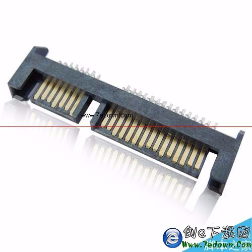
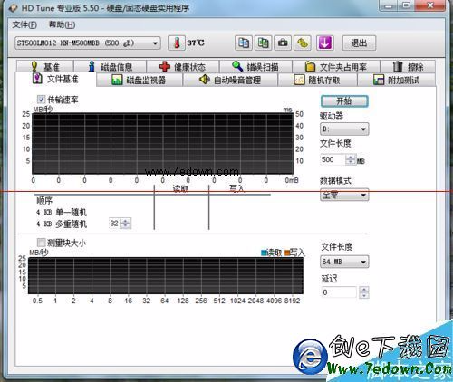
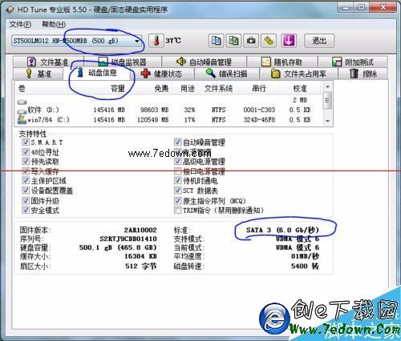

​    

# 怎么查看电脑主板硬盘接口是Sata2还是sata3？

有时候我们需要换ssd固态硬盘，但是不知道电脑是否支持sata3，怕花钱买了大材小用。。比如鲁大师什么的软件，只是看到现在你的硬盘的接口类型是sata2还是3，根本不是知道主板接口类型。

1、下载软件 HD Tune。

**下载：**[**HD Tune Pro 汉化绿色版**](http://www.7edown.com/soft/down/soft_8.html)

2、下载后直接打开。

3、可以看到硬盘的很多信息

4、点击“硬盘信息”也就是Info按钮，看到下面的字体

5、大家可以看到，不管现在你的硬盘是sata2还是sata3，Hd tune显示的都是主板的接口类型。这里显示是Sata3，表示你的笔记本是支持sata3的，放心买吧。

6、直接换ssd，换完以后，再也回不去的，飞一样的感觉。推荐三星英特尔镁光等。