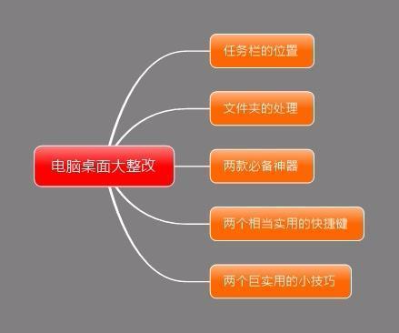
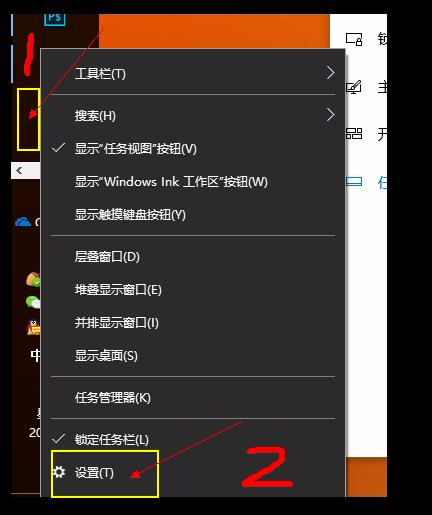
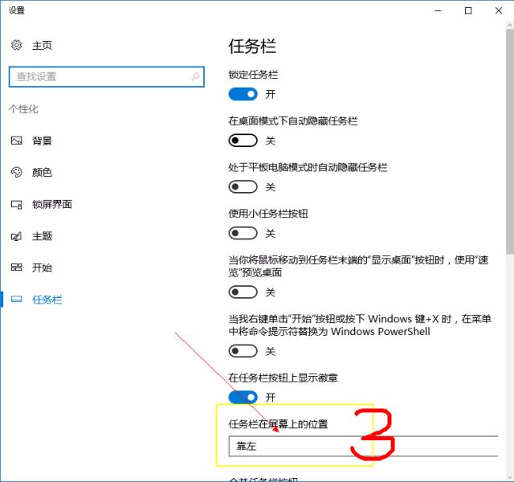
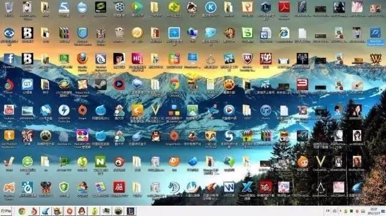
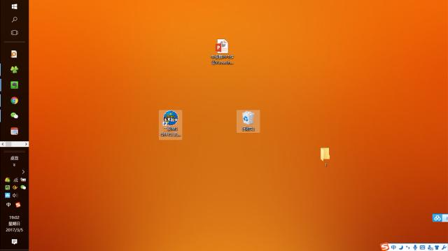
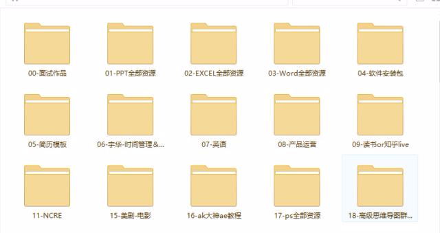
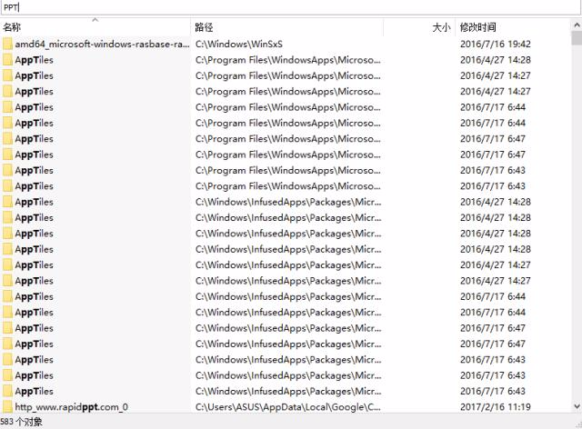
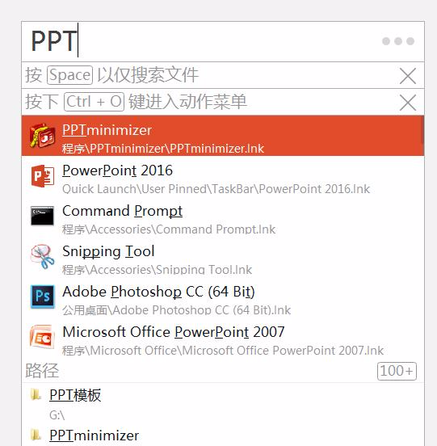
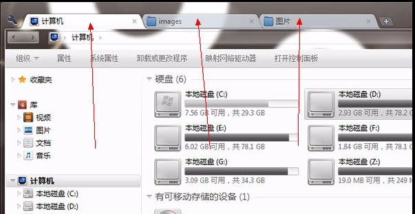

# 这样使用电脑，可以帮你提高工作效率！

海阔鱼鸟飞 2017-03-12 15:13

你有没有这样的经历，使用电脑的时候，总是把文件下载在默认的位置；总是在一堆杂乱无章的文件当中，寻找自己所需要的文件；总是把时间浪费在文件夹的切换上面，要点n多遍才把文件夹全部最小化，回到自己的桌面上来；总是会被不断变换的屏幕所吸引，多多少少浪费了时间和精力；甚至偶尔自己手贱，不小心把电脑桌面给旋转了90°，等各种会降低我们效率的电脑操作。

如果你有上面的经历，建议你花上一点时间去尝试下面的小技巧，绝对会大幅度提高你电脑的工作效率。帮你每年省下100个小时！

可能你会第一个想到为什么我的任务栏会在屏幕的左侧，那是由于我们眼睛的习惯，我们总是会视野左上的地方留下较多的注意力，所以我习惯把应用放在左侧的地方，减少我们找应用的时间，使得我们找文件的时候更加的方便，操作方法如下：

先来看看没经过处理的电脑桌面的应用图标是什么样子的

第一步

a，删除不常用的桌面上应用软件的图标。（需要找的话双击ctrl键就可以了，后文有解释）

b，将常用的应用图标直接拖拽到任务栏上面去，或者右击应用图标，锁定/添加到任务栏上。

第二步

除了当前工作需要用到的文件，其他文件全部放在一个新建的文件夹里面，你没看错，是全部！

如上图所示，文件夹1是我新建的文件夹

第三步

过了几天你就会发现，新建的文件夹里面放了1个星期的电影你还没看；下载好的电子书你也没看；还没做的PPT依旧没做。1个星期后，那些依旧没动过的文件有用的话就存到百度云或者其他网盘，其他就直接删了。

如果是我们工作的时候需要用到的文件呢，直接拖拽到桌面上面来，工作的时候要像张小龙的小程序一样“用完即走”，即那些重要的工作立马做完，不让他占用我们多余的一点时间及电脑桌面。

# 文件夹的处理

使用01-，02- ；a-，b-；按照年份月份的顺序排列：17.2-，17.3- ，等为文件夹命名，而且只需要右击按名字排序就可以使得我们的文件很整齐的摆放。

这样整理桌面的方法同时也可以用于网盘，印象笔记的文件夹中。

# 两款桌面神器

01、Listary

这款神器主要是帮我们快速查找并打开电脑文件和软件。你可能会问，这不就是Everything的功能吗？确实，我看过很多电脑效率的文章，一般都会推荐Everything这款软件。

这两款软件我都用过，Everthing 和 Listary 都属于轻量级软件，但 Everthing 只能搜索文件，比如PPT等，而 Listary 则范围很广，除了文件搜索，还能搜索软件，并且可以直接打开。

这是Everything的搜索结果，只有文件，没有PPT这个应用

这是Listary的搜索结果，软件+文件都有

并且在效率方面， Listary 更胜一筹。当安装了软件之后，我们只需要双击Ctrl 键，即可调出搜索框。而 Everthing则相对繁琐。

02、clover

平时你肯定会同时处理多个文件夹，并且在切换中浪费时间，使用这个神器的话：

1、让文件夹拥有和浏览器页面切换一样的功能，我们可以像我们切换浏览器页面一样，切换我们的文件夹。

2、支持收藏的功能，我们也可以像收藏网页一样，来收藏我们的文件夹页面。

# 两个相当实用的快捷键

01、ctrl+alt+↑：用电脑的时候，偶尔你会因为不小心乱点键盘，使桌面旋转了90度，解决方法同时按住ctrl+alt+↑

02、Win+D（老板键）：就是你在工作的时候看...老板一来，你就可以一键将桌面上面所有的窗口全部缩小化，相当实用。

# 两个巨实用的小技巧

a、电脑桌面设置成纯色

如果电脑桌面设置成动态随机的壁纸的话，很可能会让你在工作的时候分心，可能你每天就会在电脑桌面上面多浪费一分钟的时间。换成纯色的电脑桌面，你一年可以省下好几个小时。

b、把所有的文件下载的默认地址全部改为桌面

例如百度云，QQ，谷歌浏览器等等，都可以把它的默改下载地址改为桌面，并且把它的默认安装地址改为非c盘，当你在处理一件工作事务的时候，马上进行处理，工作做完之后，上传到百度云或者其他地方。

最后的小建议：

如果电脑太卡的话，建议使用240G以上的固态硬盘，使用固态硬盘的话，我们电脑的开机时间会降低到差不多10秒左右的时间，虽然很贵，几百上千不等。但是花钱买时间，大大提升你的生活质量，这种事怎么看都是划得来的。如果是128g左右的固态硬盘，怎么看都有点鸡肋的感觉。

来源： <http://www.toutiao.com/a6396501662593319170/?tt_from=weixin&utm_campaign=client_share&app=news_article&utm_source=weixin&iid=8381485716&utm_medium=toutiao_android&wxshare_count=1>