# Araxis Merge基本配置及操作

##  **1.Araxis Merge简介**

$129 / TRY FREE FOR 30 DAYS

Advanced 2 and **3-way** file comparison (diff), merging and folder synchronization for **Windows** & **Mac OS X**.

Merge is the visual **file comparison (diff), merging** and **folder synchronization** application from Araxis. Use it to compare and merge source code, web pages, XML and other text files with native application performance. Directly open and compare the text from Microsoft Office(Word and Excel), Open Document, PDF and RTF files. Compare images and binary files. Synchronize folders. Perform code reviews and audits. Work with folder hierarchies containing thousands of files.

## **2.Araxis Merge一览**

（1）Araxis Merge 2009 for Windows:

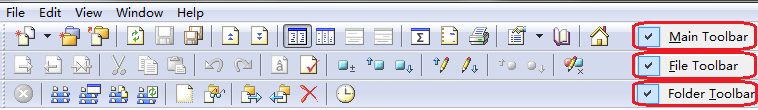

（2）Araxis Merge2012/2013 for Windows:（本文以Araxis Merge 2013 for Windows 7为例）

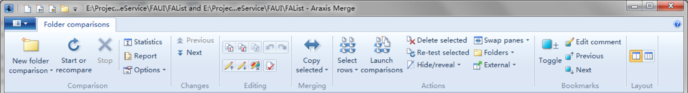

 

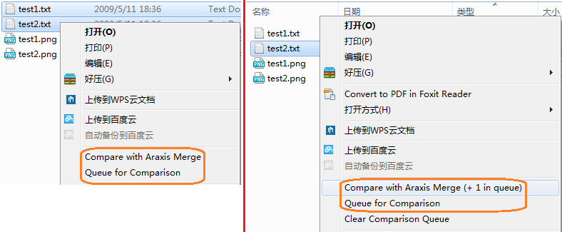

（3）Araxis Merge 2013 for Mac OS X:

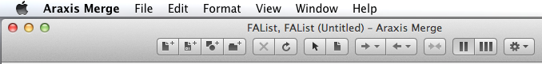

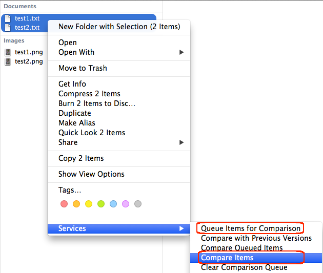

（4）Folder Comparisons:

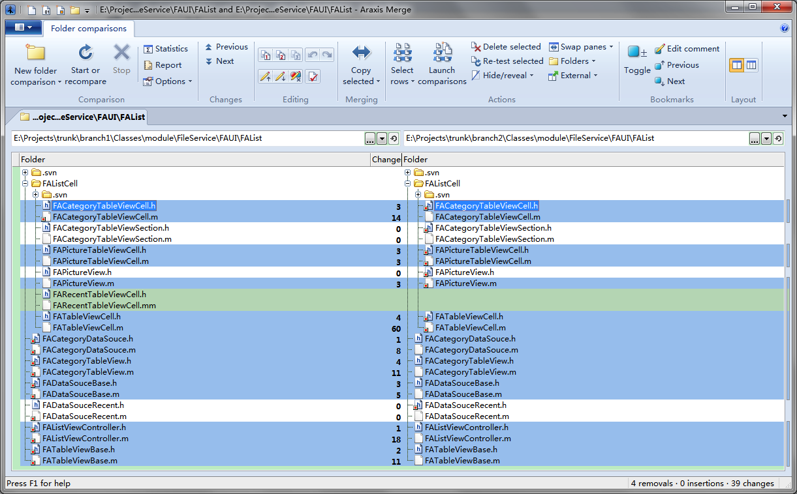

（5）Text Comparisons:

## **3.新建比较**

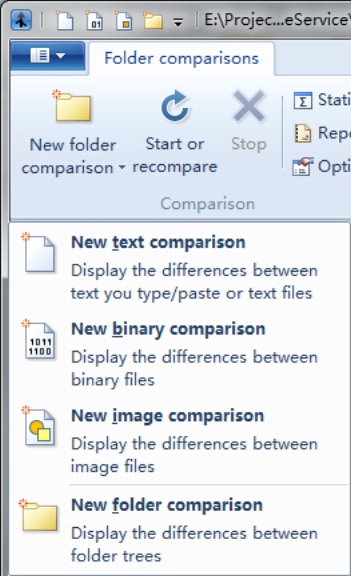

Araxis Merge支持文件夹（folder）、文本文件（text）、图片（image）和二进制（binary）比较。

Ctrl+D：Next Folder Comparison（新建文件夹比较）

Ctrl+L：Next Text Comparison（新建文件计较）

 

**Ctrl+F4**：Close Comparison（关闭当前比较tab/窗口）

Alt+F4：Close Window（关闭应用程序/所有窗口）

## **4.展开/折叠文件夹**

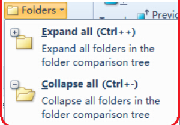

Ctrl++/-：Expand/Collapse All Rows（展开/折叠所有文件）

**F5**：Recompare（刷新/重新比较）

## **5.交换文件（夹）左右比较方向**

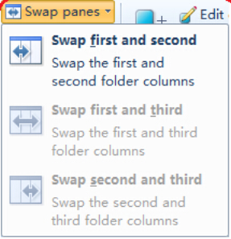

## **6.视图过滤**

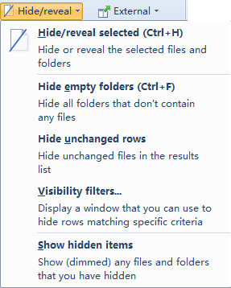

Ctrl+F：Hide Empty Folders（隐藏空文件夹）

**Hide unchanged rows**：隐藏无变动的文件

Show hidden items：显示隐藏（过滤）掉的文件

**Visibility Filters**可以设置隐藏指定**状态**的行（文件夹/文件）

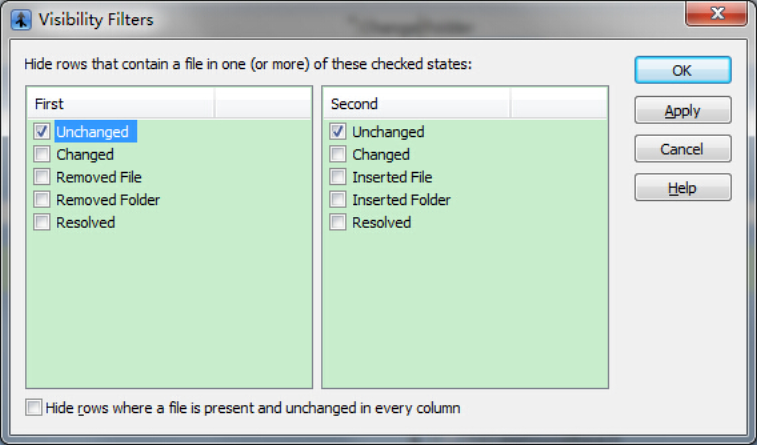

## **7.选择操作**

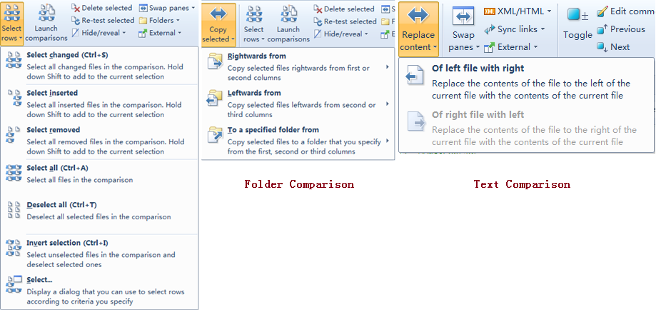

Ctrl+S：Select Changed（选择所有有改动的文件，方便批量操作）

Ctrl+T：Deselect All（取消所选）

Ctrl+I：Invert Selection（颠倒所选）

Ctrl+M：Launch File Comparisons for Selections（启动所选比较）

**Ctrl+R**：Re-Test Selected（重新比较所选差异，区别F5全量刷新）

Ctrl+K：Mark Resolved（灰显已解决）

Ctrl+W/Q：Copy Selected Items From: First To Second/SecondTo First

## **8.编辑变动点**

**Alt+Left/Right**：Previous/NextChange in folder/text comparison

对比文件中有差异的地方可以手动编辑，也可以执行快速替换、插入和删除操作：

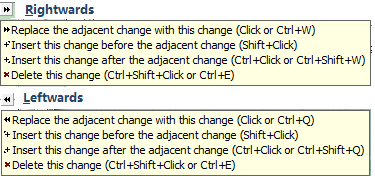

## **9.设置编码格式**

我们看到上面文件比较中文乱码，可以设置文本文件的编码解决该问题。

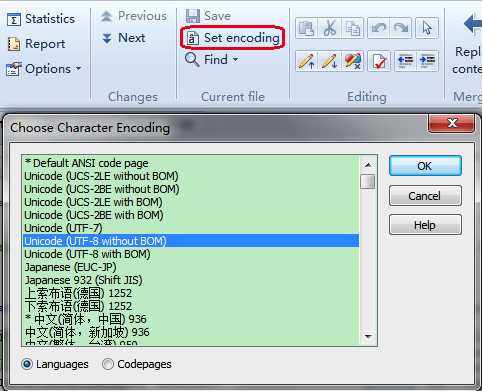

确认对话框点击“Cancel”取消保存，否则可能破坏原有代码编码格式。

关于编码格式参考：《UTF-8 and UTF-8without BOM》《UTF8与UTF8without BOM之间的问题》⎡带 BOM 的 UTF-8⎦和⎡无 BOM 的 UTF-8⎦

## **10.设置tab距离和缩进**

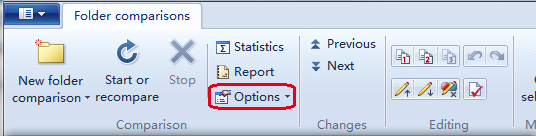

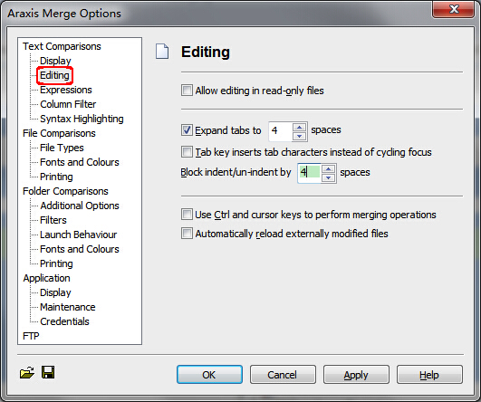

## **11.设置支持比较的文件类型**

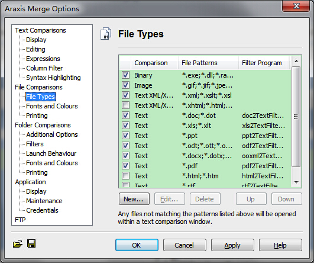

这里可以添加pattern，以支持开发分支中某些特定格式文件。

**BTW**：在“**Fonts and Colours**”中可以设置各种状态（Unchanged、Inserted、Removed、Changed）的背景色和字体。

## **12.设置不支持比较的文件类型过滤器**

（1）勾选“Scan contents of **excluded**”后面的folders和files，使能过滤器。

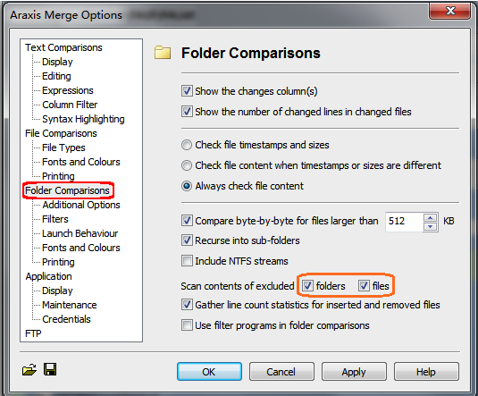

（2）创建exclude过滤器，过滤掉以‘.’开头的目录或文件（例如“**.svn**”目录）。

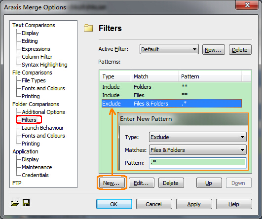

*BTW*：在“**Fonts and Colours**”中勾选"Customize folder comparison fonts and colours"，可以设置各种状态（Unchanged、Inserted、Removed、Changed）的背景色和字体。

## **13.设置Araxis Merge作为TortoiseSVN（Windows）的外部比较/合流工具**

（1）选择任一Revision，右键打开Settings。

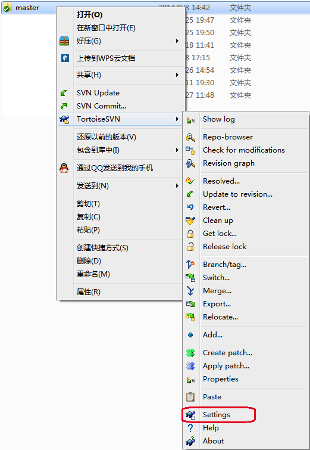

（2）选择External Programs-DiffViewer，设置为External **Diff Viewer**。

（3）选择External Programs-Merge Tool，设置为External **Merge Tool**。

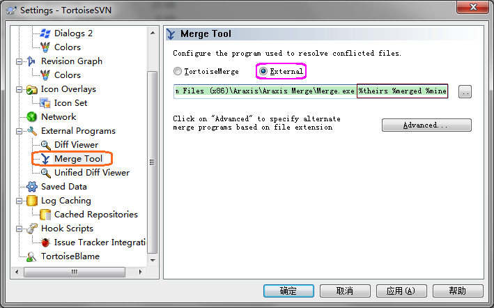

## **14.设置Araxis Merge作为SyncroSVN（Mac OS X）的外部比较/合流工具**

（1）参考Sample Scripts编写Apple Script脚本**AraxisMerge.scpt**。

Sample Scripts在安装包（mount dmg）中：

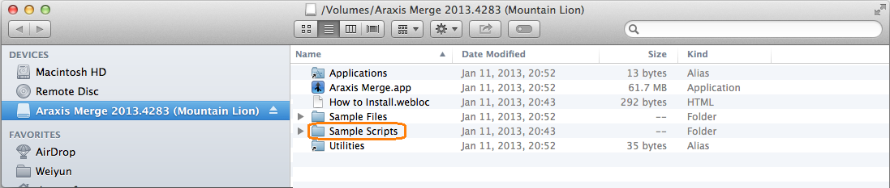

**注意**：由于run Handler只接受一个参数，故这里采用了Handlers with Patterned Positional Parameters。

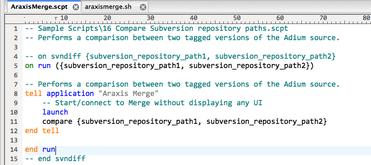

（2）配置外部Diff Tool启动脚本及参数。

**注意**：若使用sh封装osascript，不能将sh所有参数（$@）传递给osacript，因为sh运行的第一个参数（$0）为文件名，故应指定$1和$2。

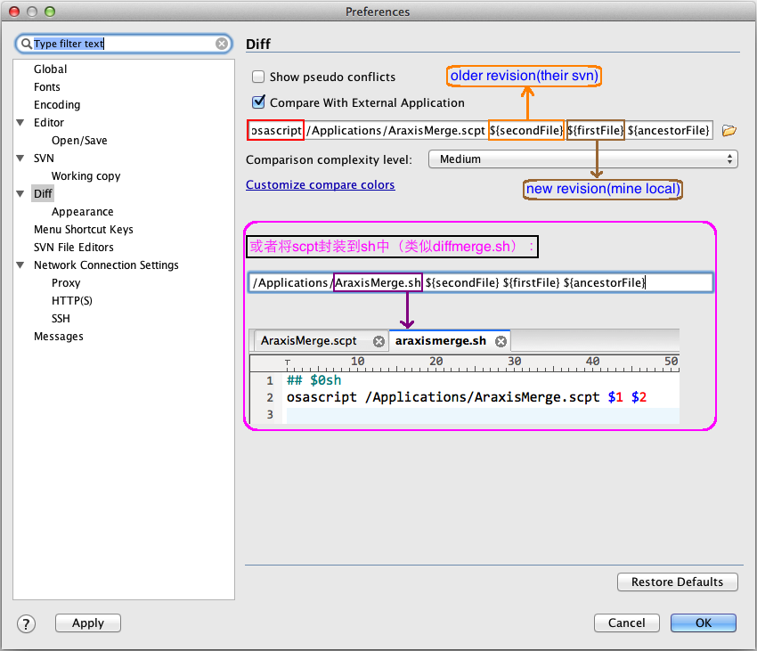

## **15.设置Araxis Merge作为Subversion命令行（Mac/Linux）的外部比较工具**

参考《ARAXIS MERGE for OS X Command-Line Reference》。

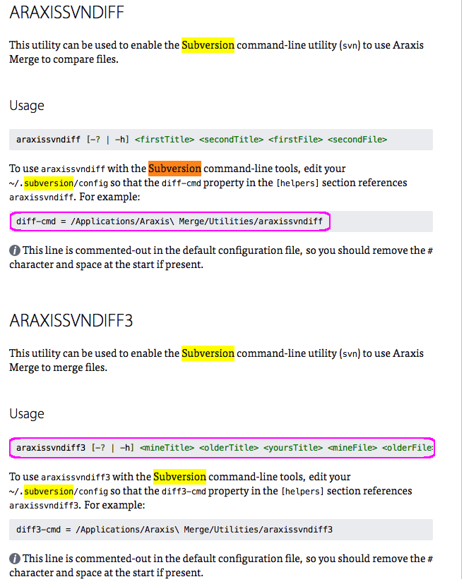

**参考：**

> 《Araxis Merge和Beyond Compare功能对比》
>
> 《Diff Tools on Mac OS X 》 
>
> 《Araxis Merge alternatives 》
>
> 来源： <http://www.ithao123.cn/content-9973889.html>