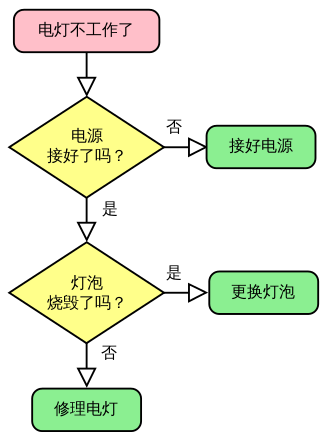
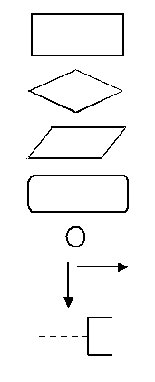
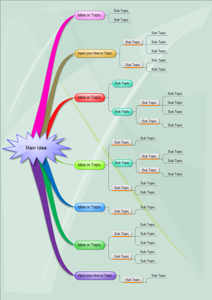
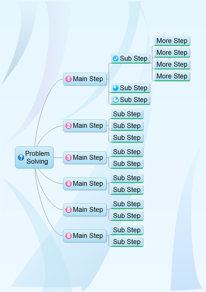
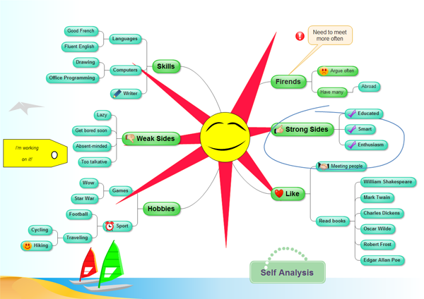
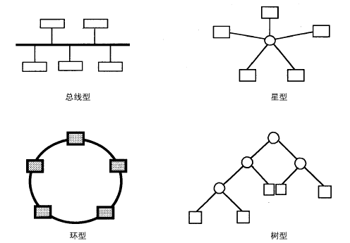
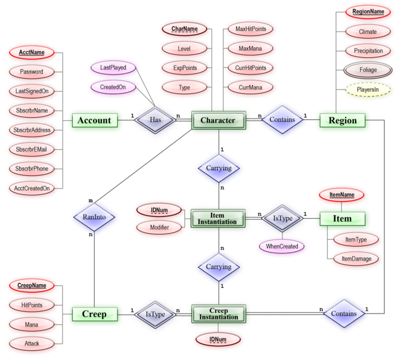

## 流程图

1.定义：**流程图**是对过程、算法、流程的一种图像表示，在技术设计、交流及商业简报等领域有广泛的应用。

2.案例

3.计算机语言只是一种工具。光学习语言的规则还不够，最重要的是学会针对各种类型的问题，拟定出有效的解决方法和步骤即算法。有了正确而有效的算法，可以利用任何一种计算机高级语言编写程序，使计算机进行工作。因此，设计算法是程序设计的核心。

对同一个问题，可以有不同的解题方法和步骤。例如，求1+2+3+…+100，可以先进行1+2，再加3，再加4，一直加到100，也可采取100+(1+99)+(2+98)+…+(49+51)+50＝100+50+49×100＝5050。还可以有其它的方法。当然，方法有优劣之分。有的方法只需进行很少的步骤，而有些方法则需要较多的步骤。一般说，希望采用方法简单，运算步骤少的方法。因此，为了有效地进行解题，不仅需要保证算法正确，还要考虑算法的质量，选择合适的算法。

一个计算问题的解决过程通常包含下面几步:

​          a.确立所需解决的问题以及最后应达到的要求。必须保证在任务一开始就对它有详细而确切的了解，避免模棱两可和含混不清之处。

​          b.分析问题构造模型。在得到一个基本的物理模型后，用数学语言描述它，例如列出解题的数学公式或联立方程式，即建立数学模型。

​          c.选择计算方法。如定积分求值问题，可以用矩形法、梯形法或辛普生法等不同的方法。因此用计算机解题应当先确定用哪一种方法来计算。专门有一门学科“计算方法”，就是研究用什么方法最有效、最近似地实现各种数值计算的，换句话说，计算方法是研究数值计算的近似方法的。

​          d.确定算法和画流程图。在编写程序之前，应当整理好思路，设想好一步一步怎样运算或处理，即为“算法”。把它用框图画出来，用一个框表示要完成的一个或几个步骤，它表示工作的流程，称为流程图。它能使人们思路清楚，减少编写程序中的错误。

​          f.编写程序。

​          g.程序调试，即试算。一个复杂的程序往往不是一次上机就能通过并得到正确的结果的，需要反复试算修改，才得到正确的可供正式运行的程序。

​          h.正式运行得到必要的运算结果。

传统流程图

用图表示的算法就是流程图。流程图是用一些图框来表示各种类型的操作，在框内写出各个步骤，然后用带箭头的线把它们连接起来，以表示执行的先后顺序。用图形表示算法，直观形象，易于理解。

美国国家标准化协会ANSI曾规定了一些常用的流程图符号，为世界各国程序工作者普遍采用。最常用的流程图符号见图。

​        a.处理框（矩形框），表示一般的处理功能。

​        b.判断框（菱形框），表示对一个给定的条件进行判断，根据给定的条件是否成立决定如何执行其后的操作。它有一个入口，二个出口。

​        c.输入输出框（平行四边形框）。

​        d.起止框（圆弧形框），表示流程开始或结束。

​        f.连接点（圆圈），用于将画在不同地方的流程线连接起来。如图中有两个以1标志的连接点(在连接点圈中写上“l”)则表示这两个点是连接在一起的，相当于一个点一样。用连接点，可以避免流程线的交叉或过长，使流程图清晰。

​        g.流程线（指向线），表示流程的路径和方向。

​        h.注释框, 是为了对流程图中某些框的操作做必要的补充说明，以帮助阅读流程图的人更好地理解流程图的作用。它不是流程图中必要的部分，不反映流程和操作。

流程图不仅可以指导编写程序，而且可以在调试程序中用来检查程序的正确性。如果框图是正确的而结果不对，则按照框图逐步检查程序是很容易发现其错误的。流程图还能作为程序说明书的一部分提供给别人，以便帮助别人理解你编写程序的思路和结构。

4.工具软件：Visio，亿图

## 思维导图

1.定义： **心智图**（Mind Map），又称**脑图**、**心智地图**、**脑力激荡图**、**思维导图**、**灵感触发图**、**概念地图**、**树状图**、**树枝图**或**思维地图**，是一种图像式思维的工具以及一种利用图像式思考辅助工具来表达思维的工具。

2.历史：心智图是由英国的托尼·博赞（托尼·布詹）于1970年代提出的一种辅助思考工具。心智图通过在平面上的一个主题出发画出相关联的对象，像一个心脏及其周边的血管图，故称为“心智图”。由于这种表现方式比单纯的文本更加接近人思考时的空间性想像，所以越来越为大家用于创造性思维过程中。

3.案例：

4.工具软件：MindManager，亿图

## 网络拓扑图

1.定义： 拓扑学（TOPOLOGY）是一种研究与大小、距离无关的几何图形特性的方法。 网络拓扑是由网络节点设备和通信介质构成的网络结构图。

拓扑学是数学中一个重要的、基础的分支。起初它是几何学的一支，研究几何图形在连续变形下保持不变的性质(所谓连续变形，形象地说就是允许伸缩和扭曲等变形，但不许割断和粘合)
拓扑图用于计算机网络示意，也就是不考虑计算机实际的位置，只表示网络中每台计算机以及网络设备之间的相互关系。

2.基本术语：

节点，节点就是网络单元。网络单元是网络系统中的各种数据处理设备、数据通信控制设备和数据终端设备。

链路，链路是两个节点间的连线。链路分“物理链路”和“逻辑链路”两种，前者是指实际存在的通信连线，后者是指在逻辑上起作用的网络通路。链路容量是指每个链路在单位时间内可接纳的最大信息量。

通路，通路是从发出信息的节点到接收信息的节点之间的一串节点和链路。

3.常见结构：

### 星型结构

星型结构的优点是结构简单、建网容易、控制相对简单。其缺点是属集中控制，主节点负载过重，可靠性低，通信线路利用率低。

### 总线结构

总线结构的优点是信道利用率较高，结构简单，价格相对便宜。缺点是同一时刻只能有两个网络节点相互通信，网络延伸距离有限，网络容纳节点数有限。在总线上只要有一个点出现连接问题，会影响整个网络的正常运行。目前在局域网中多采用此种结构。

### 环型结构

环型结构的优点是一次通信信息在网中传输的最大传输延迟是固定的；每个网上节点只与其他两个节点有物理链路直接互连，因此，传输控制机制较为简单，实时性强。缺点是一个节点出现故障可能会终止全网运行，因此可靠性较差。

### 树型结构

树型结构实际上是星型结构的一种变形，它将原来用单独链路直接连接的节点通过多级处理主机进行分级连接。

这种结构与星型结构相比降低了通信线路的成本，但增加了网络复杂性。网络中除最低层节点及其连线外，任一节点或连线的故障均影响其所在支路网络的正常工作。

 

## 软件设计图，UML

 1.定义：UML是一种开放的方法，用于说明、可视化、构建和编写一个正在开发的、面向对象的、软件密集系统的制品的开放方法。UML展现了一系列最佳工程实践，这些最佳实践在对大规模，复杂系统进行建模方面，特别是在软件架构层次已经被验证有效。

2.三种模型：

**功能模型，**从用户的角度展示系统的功能，包括用例图。

**对象模型，**采用对象，属性，操作，关联等概念展示系统的结构和基础，包括类别图。

**动态模型，**展现系统的内部行为。包括序列图，活动图，状态图。

3.软件：亿图，Visio，PowerDesigner

## 数据库模型图，实体关系图，数据流程模型图

1.定义：实体关系图，简记E-R图是指以实体、关系、属性三个基本概念概括数据的基本结构，从而描述静态数据结构的概念模式。

2.案例：

3.工具：亿图，Visio

4.说明

1：1，表示1对1的关系，如一个单位部门，只有一个头儿
1：M，表示1对多的关系，如一个单位部门，有多个员工
1：N，同上
M：N，表示多对多的关系，如一个学生可以学习M门课程，而一门课程可以让N个学生学习。

小结：

所谓的图，都是为了辅助设计的，辅助的作用！比文字描述的更清晰！

来源： <http://www.cnblogs.com/jiqing9006/p/3344221.html>