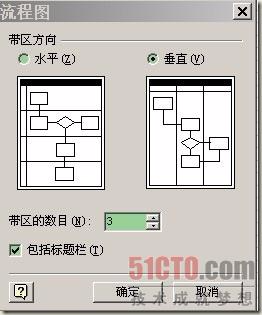
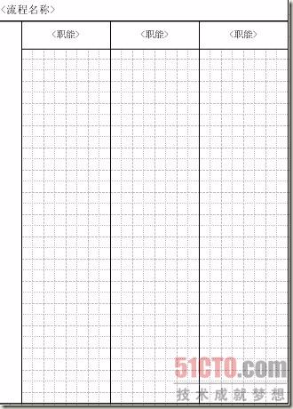
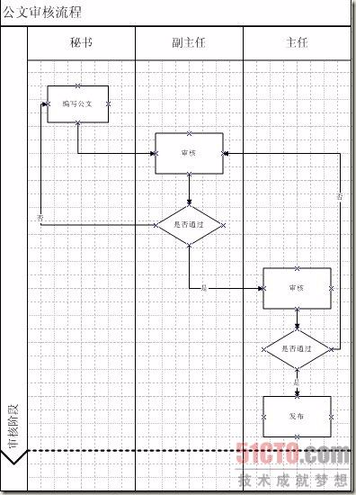
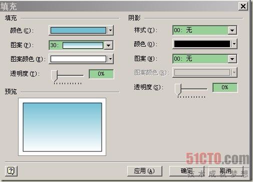
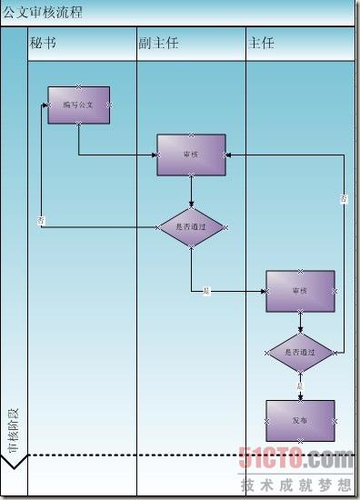

# 实例介绍用Visio画UML流程图方法

2010-07-05 13:21 毁于随 kb.cnblogs.com 字号：[T]() | [T]()

UML流程图的概念你是否熟悉，本文向大家介绍一下用Visio画UML流程图的步骤，希望通过本文的介绍你对用Visio画UML流程图的步骤有一定的认识。

AD：[51CTO 网+ 第十二期沙龙：大话数据之美_如何用数据驱动用户体验](http://mobile.51cto.com/mobile/mdsa12/)

本文和大家重点讨论一下用Visio画UML流程图方面的内容，通过实例 向大家介绍，相信通过本文的虚席你对用Visio画UML流程图有所了解。

用Visio画UML流程图

在一次会议中看到有个同事在讲解业务流程时画了一个与PD中很类似的泳道图,但是在图的左侧确有一个阶段的列,事后与他沟通,才知道他这个图是”拼”出来的,也就是说所有的图都是他一点点的在画图工具中做出来的.我想,他肯定花了不少时间,呵呵.

而这样的图其实Visio中很容易就可以画出来了,这就是”跨职能流程图”.

打开Visio,选择”新建”—>”流程图”,”跨职能流程图”,会提示你是要创建水平的还是垂直的流程图.这里我选择了垂直.

在带区数目中我输入3,勾选”包括标题栏”,点击确定出现如下界面:

用Visio画UML流程图时假设这里面需要处理的业务流程是:秘书编写公文,由办公室副主任审核,通过后再交由主任审核,任何不通过的审核都提交到前一个审核人,所以通过将基本的流程图中的相关图形拖入这个泳道图中,并按业务流程进行处理后,可以得到:

这样基本的业务流程就表现出来了,并且通过添加”分隔符”来说明以上流程是”审核阶段”.但是,这个图是不是与PowerDesigner的相比显示有些难看呢?没关系,可以通过Visio中对各个区域的”填充”功能来美化界面.在需要进行美化的元素上点击右键,选择”格式”—>”填充”,出来以下界面:

在上图中可以选择相应的颜色和图案以及透明度,用Visio画UML流程图在这里我选择了渐变的图案.点击应用后就可以看到效果了.依次将所有的元素进行相应的填充后可以得到最终的效果:

【编辑推荐】

1. [Visio画UML图基本操作及技巧解析](http://developer.51cto.com/art/201007/209150.htm)
2. [解析用Visio画UML图的基本操作和几种小技巧](http://developer.51cto.com/art/201007/209405.htm)
3. [绘制UML图时应避免的六大问题](http://developer.51cto.com/art/201007/209156.htm)
4. [用Visio画UML图类结构图步骤解析](http://developer.51cto.com/art/201007/209402.htm)
5. [九步实现UML包图创建](http://developer.51cto.com/art/201007/209065.htm)

程华权

来源： <http://developer.51cto.com/art/201007/209425.htm>