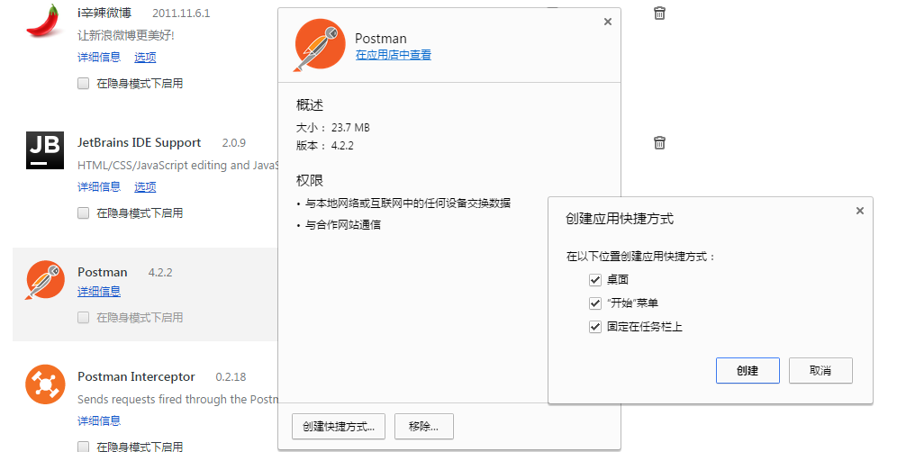
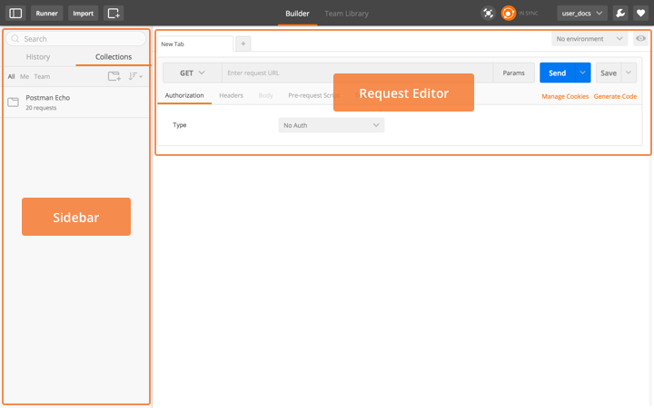
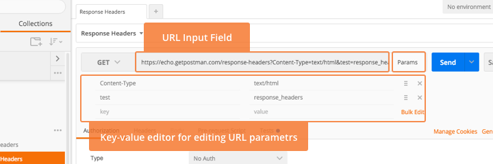
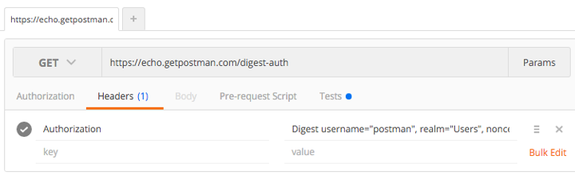
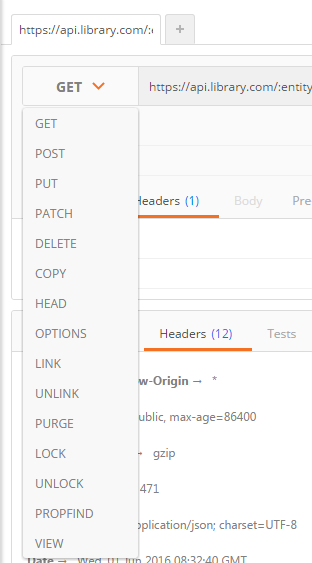
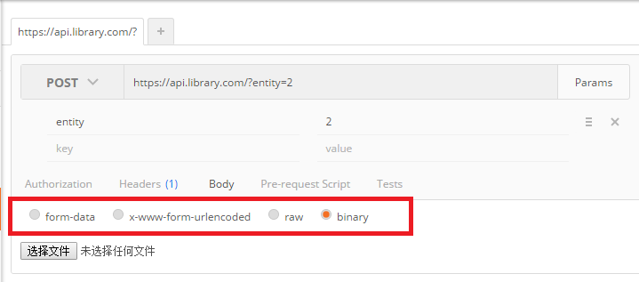
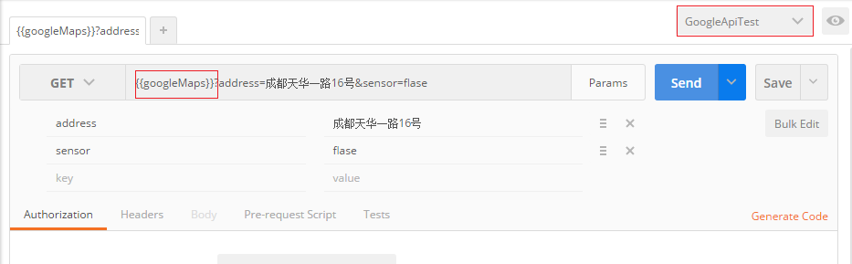
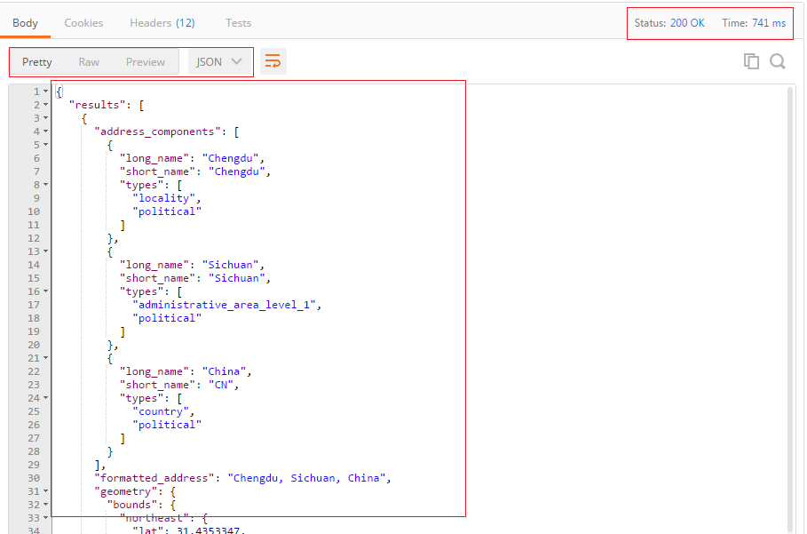

最近需要[测试](http://lib.csdn.net/base/softwaretest)产品中的REST API，无意中发现了PostMan这个chrome插件，把玩了一下，发现postman秉承了一贯以来google工具强大，易用的特质。独乐乐不如众乐乐，特此共享出来给大伙。

### Postman介绍

Postman是google开发的一款功能强大的网页调试与发送网页HTTP请求，并能运行测试用例的的Chrome插件。其主要功能包括：

- **模拟各种HTTP requests**

从常用的 GET、POST 到 RESTful 的 PUT 、 DELETE …等等。 甚至还可以发送文件、送出额外的 header。

- **Collection 功能（测试集合）**

Collection 是 requests的集合，在做完一個测试的時候， 你可以把這次的 request 存到特定的 Collection 里面，如此一來，下次要做同样的测试时，就不需要重新输入。而且一个collection可以包含多条request，如果我们把一个request当成一个test case，那collection就可以看成是一个test suite。通过collection的归类，我们可以良好的分类测试软件所提供的API.而且 Collection 还可以 Import 或是 Share 出來，让团队里面的所有人共享你建立起來的 Collection。

- **人性化的Response整理**

一般在用其他工具來测试的時候，response的内容通常都是纯文字的 raw， 但如果是 JSON ，就是塞成一整行的 JSON。这会造成阅读的障碍 ，而 Postman 可以针对response内容的格式自动美化。 JSON、 XML 或是 HTML 都會整理成我们可以阅读的格式

- **内置测试脚本语言**

Postman支持编写测试脚本，可以快速的检查request的结果，并返回测试结果

- **设定变量与环境**

Postman 可以自由 设定变量与Environment，一般我们在编辑request，校验response的时候，总会需要重复输入某些字符，比如url，postman允许我们设定变量来保存这些值。并且把变量保存在不同的环境中。比如，我們可能会有多种环境， development 、 staging 或 local， 而这几种环境中的 request URL 也各不相同，但我们可以在不同的环境中设定同样的变量，只是变量的值不一样，这样我们就不用修改我们的测试脚本，而测试不同的环境。

### 安装Postman

Postman作为一个chrome的插件，你可以打开chrome，在chrome webstore里面找到。当然，如果是在国内，你需要翻墙，否则的话，你只能百度一下，搜索postman的安装包自己安装到chrome上（这里就不赘述了，有很多类似的文章）。这里需要提一下的是，你可以不用打开chrome而直接使用Postman，具体的方法是：

选项->更多工具->扩展程序

详细信息->创建快捷方式->‘全部勾上’ 
 
这样你就可以在任何地方启动你的Postman了

### Postman sending requests

安装好之后，我们先打开Postman，可以看到界面分成左右两个部分，右边是我们后头要讲的collection，左边是现在要讲的request builder。在request builder中，我们可以通过Postman快速的随意组装出我们希望的request。一般来说，所有的HTTP Request都分成4个部分，URL, method, headers和body。而Postman针对这几部分都有针对性的工具。

#### URL

要组装一条Request, URL永远是你首先要填的内容，在Postman里面你曾输入过的URL是可以通过下拉自动补全的哦。如果你点击**Params**按钮，Postman会弹出一个键值编辑器，你可以在哪里输入URL的Parameter，Postman会帮你自动加入到URL当中，反之，如果你的URL当中已经有了参数，那Postman会在你打开键值编辑器的时候把参数自动载入

#### Headers

点击’Headers’按钮，Postman同样会弹出一个键值编辑器。在这里，你可以随意添加你想要的Header attribute，同样Postman为我们通过了很贴心的auto-complete功能，敲入一个字母，你可以从下拉菜单里选择你想要的标准atrribute

#### Method

要选择Request的Method是很简单的，Postman支持所有的Method，而一旦你选择了Method，Postman的request body编辑器会根据的你选择，自动的发生改变

#### Request Body

如果我们要创建的request是类似于POST，那我们就需要编辑Request Body，Postman根据body type的不同，提供了4中编辑方式：

- form-data
- x-www-form-urlencoded
- raw
- binary
- 

（我们这里是可以传文件的哦）

#### 演示

我这里创建一条发送给google geocode的request，看看是啥结果：

注意，在URL里面我使用了变量googleMaps，并用{{}}调用它，这里是类似于AngulaJs的语法（果然是同一家人），其返回值是：<http://maps.googleapis.com/maps/api/geocode/json>。而这个变量我是定义在我的环境GoogleApiTest里面的。这部分的内容会在接下来的文章里面讲到。

点击了Send之后，可以在Postman上直接看到response的内容，内容很漂亮，Postman根据内容检索自动按JSON的格式显示出来，同时我们可以清楚的看到status code和花费的时间。

写到这，我想大家已经能够了解如何用Postman组装Request并且查看Response的内容了，那我们怎么用Postman去做测试呢，且听下回分解

来源： <http://blog.csdn.net/u013613428/article/details/51557804>