我们已经知道如何用Postman组装并发送消息，那我们如何根据需求用Postman来做[测试](http://lib.csdn.net/base/softwaretest)呢？在这开始之前，我们先来看看Postman的左边面板：

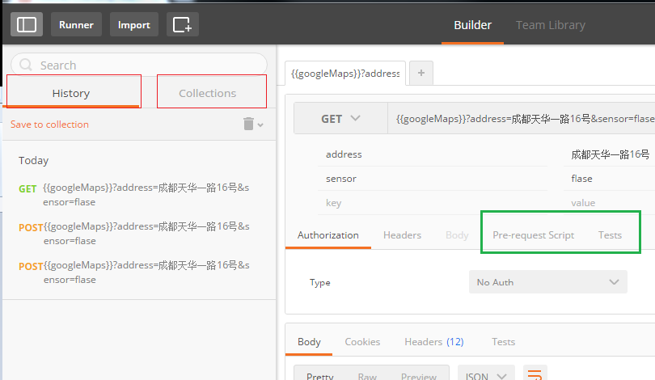

这里包含了History和Collection，我们可以在History里面看到我们曾经发送过的HTTP Request, 我们可以很方便的通过点击上面的项重新构建我们的request。而右边的Request Builder面板上，还有两个按钮，Pre-request Script和Tests。

- Pre-request Script 
  定义我们在发送request之前需要运行的一些脚本，应用场景主要是设置全局变量和环境变量
- Tests 
  定义发送Request之后，需要用脚本检测的内容，也就是Test case的内容。

这里的的Tests是我们关键。

### Test

打开Tests，我们可以看到窗口分成两部分，一部分是左边的代码窗口和右边的Snippet窗口，点击对应的snippet，postman会在左边的窗口为我们生成对应的代码，在下面的图中，我选择了“Response body: is equal to a String”和“Response time is less than 200ms”，可以看到Postman在代码窗口为我加载对应的语句，这里我把希望的responseBody改成了“No valid parameters!!”. 
这样我就完成一条简单的测试用例：

- 当HTTP Get request没有带任何参数的时候，希望response的body返回字符串“No valid parameters!!”
- responseTime小于200ms

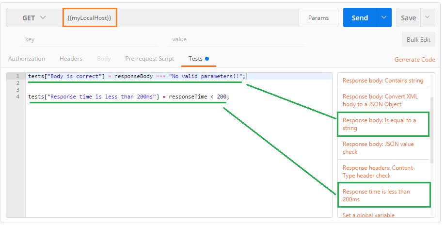

### Variables and Environment

另外，这里大家可以看到在URL输入框中，我使用了{{myLocalHost}}，那我们如何定义变量呢，首先，我们得创建一个Environment，点击Environment那个button（在这里是“SampleEnv”那个button，因为我将其选择我当前使用的Environment）

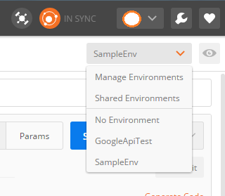

在Postman里面：

- Environements包含global Environment，即全局的Environment，里面定义的变量在任何地方地方都可以看到
- local Environment, 里面定义的变量只有在当前Environment里面才可以看到，这里，我定义了一个“SampleEnv”
- Environment可以被share，通过你的postman账号或者google账号
- Environment可以通过文件import

点击之后，选择Manage Environments。若要新建，选择Add。若要编辑global Environment, 选择Globals

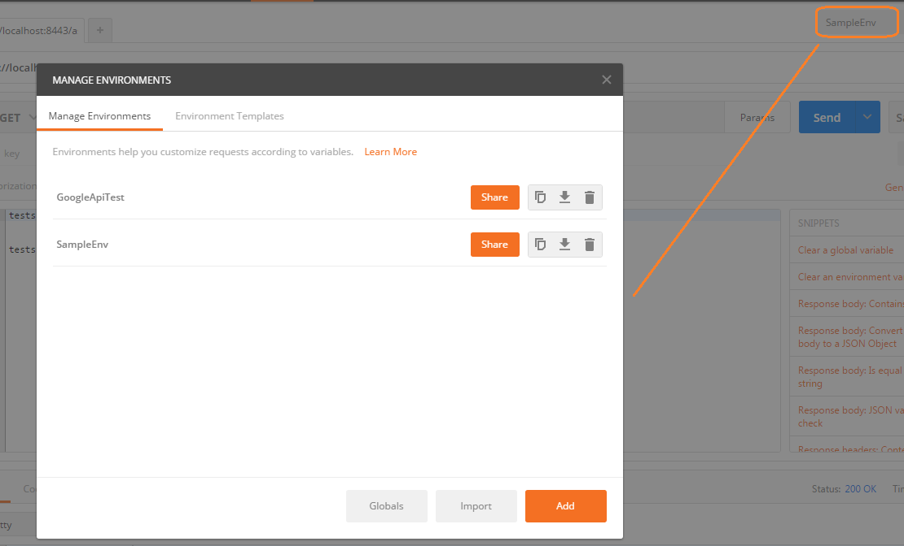

我们来看看我已经创建好的SampleEnv，这里只创建了一个变量myLocalHost，也就是我们之前看到的在URL里的那个变量，这个变量在URL里可以用，在test script里面可以用，任何其他地方你都可以通过{{}}符号获得它的值。

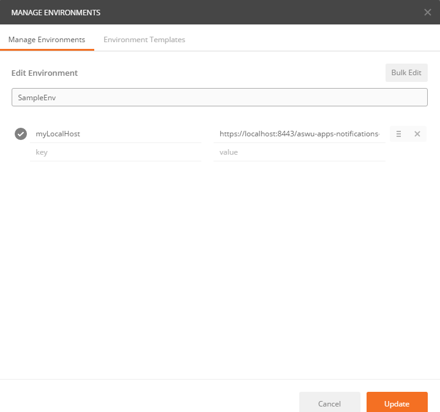

这里稍微举例一下变量的好处，比如你把APP部署在自己的机器上时使用的域名是localhost，而部署在服务器上时，域名就是具体的服务器ip。为了在两种不同环境上测试你的API，你在构建request的时候就需要输入不同的url，但如果你使用了变量，你就可以使用变量来复用你的url，你只需在不同的environment里面给url赋不同的值，那你的request就完全不需要变。同理，在tests里面也是一样的。这里就不赘述

### Collection

定义好了test case （写好的Request和定义好结果检查tests）,我们就需要运行，你可以简单点击send按钮查看结果，但这时候你不会明显的看到测试的结果，你需要把这条request加入到collection当中。我们先创建一个collection:

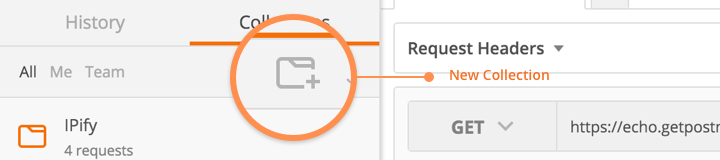

在弹出的窗口中创建你的collection，命名为你test suite的名字：

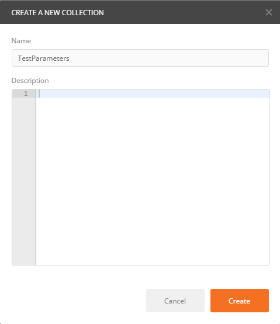

创建collection之后，把已经写好的request(test case)保存到collection（test suite）当中。

- 点击save，把Request Name改成你的test case的名字，比如“test_NoParameter_Expect_WarningInfo”;
- save to exist collection，选择之前创建好的collection, “TestParameters”;

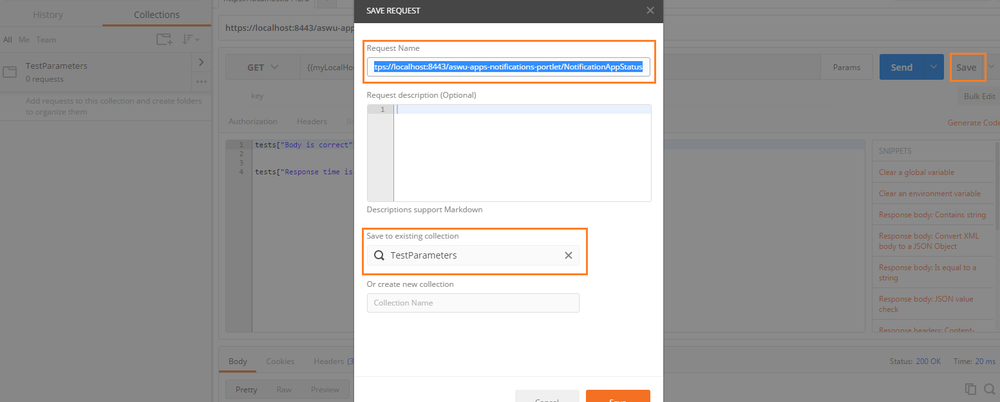

点击窗口中的save之后我们就可以在左界面上看到我们的这个collection和collection中的request了：

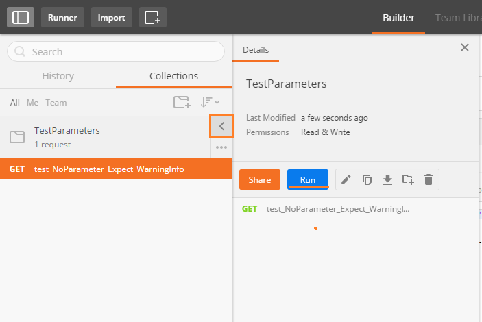

点击 ‘>’按钮（点击了之后会变成 ‘<’）,我们就会看到弹出的窗口中有一个‘Run’，运行一下，就会弹出一个collection runner的窗口。点击一下start test，你就可以看到运行的结果，这里我选择了运行100次，在左边窗口你还可以看到之前的运行记录：

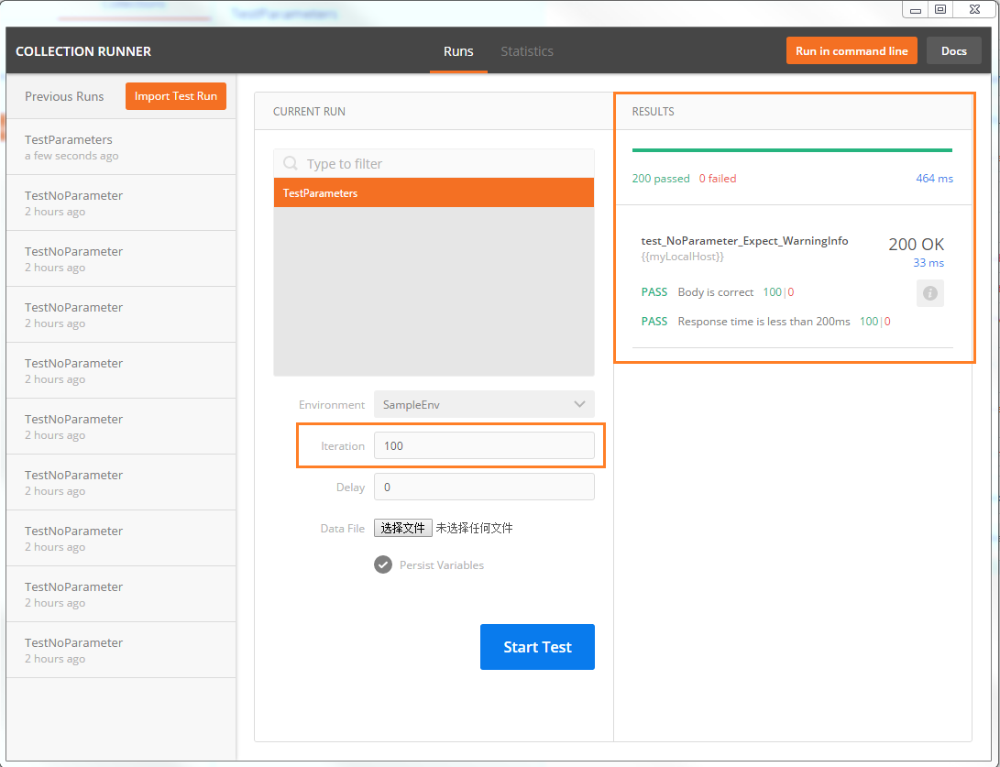

加入我把App的接口改为：

```
@Override protected void doGet( HttpServletRequest request, HttpServletResponse response ) throws ServletException, IOException { if( request.getParameter( "name" ) != null ) { response.getWriter().print( "lex" ); } else { response.getWriter().print( "No valid parameters???" ); } }123456789101112131415123456789101112131415
```

这会导致response body的比较不匹配 No valid parameters??? ！= No valid parameters！！

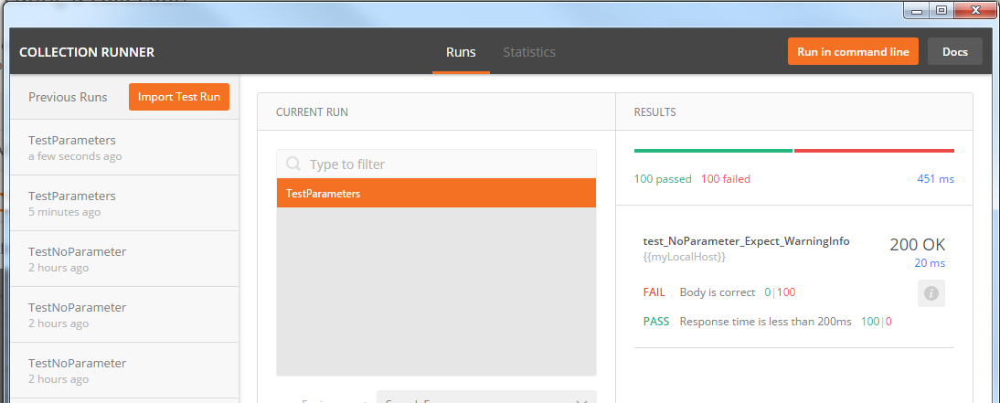

那你就会看到 Body is correct case是FAIL的.

怎么样？学会了吗？

