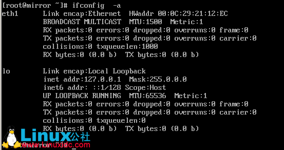
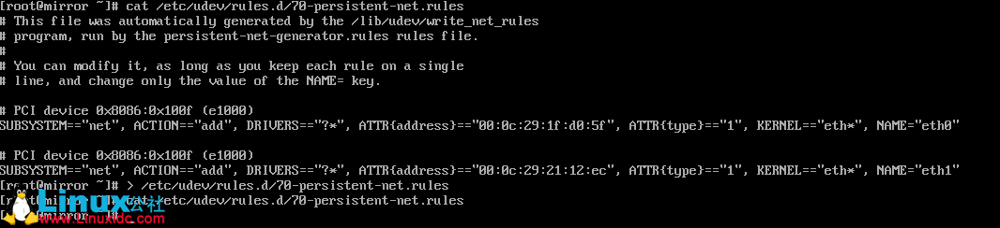
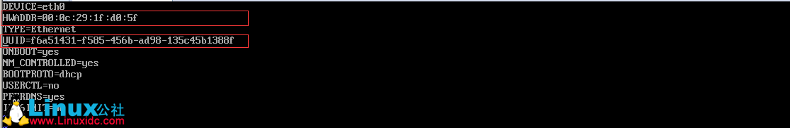
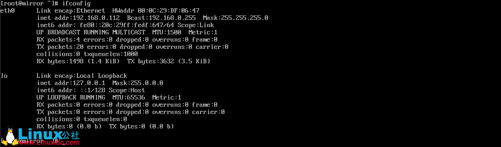

# VMware Workstation 克隆虚拟机无法上网解决

现象描述：

最近装了虚拟机系统是 [CentOS](http://www.linuxidc.com/topicnews.aspx?tid=14) 6.8，为了以后使用方便对虚拟机进行克隆或复制。当使用克隆后的虚拟机时发现原来在基本系统中的网卡eth0到了新系统却没有了。

系统版本信息

使用ifconfig -a会发现只有lo和eth1。

因为基本系统的网络相关配置都是基于eth0的，eth1没有网络相关的配置，此时要正常该虚拟机中的网络，只有添加eth1的网络配置，这样每次都要修改网卡配置在做多Linux系统测试的时候很不方便。更进一步，如果基于此克隆虚拟机继续克隆或复制新的虚拟机，网卡的标识每一次都会自动加1（第二次克隆会变成eth2），dmesg却显示内核只识别到网卡eth0。

原因分析：

很多Linux distribution使用udev动态管理设备文件，并根据设备的信息对其进行持久化命名。例如在Debian etch中，udev会在系统引导的过程中识别网卡，将mac地址和网卡名称对应起来记录在udev的规则脚本中。而VMware会自动生成虚拟机的mac地址。这样，由于基本系统的虚拟机已经记录了该虚拟机的网卡mac地址对应于网卡eth0，在克隆出的虚拟机中由于mac地址发生改变，udev会自动将该mac对应于网卡eth1。以此类推，udev会记录所有已经识别的mac与网卡名的关系，所以每次克隆网卡名称会自动加1，而其实kernel仅仅只识别到一张网卡，跟网卡名相关的网络配置也未发生任何变化。

解决方案：

\1. 将系统下/etc/udev/rules.d 路径下的 70-persistent-net.rules 文件清空或删除

\2. 将系统下/etc/sysconfig/network-scripts路径下ifcfg-eth0(eth0网上配置文件)内容删除uuid与hwaddr地址

修改前

修改后

\3. 系统重启(以下三种命令选择任意一种即可)

\1. reboot

\2. shutdown -r now

\3. init 6

\4. 重启完成后我们再通过ifconfig -a查看网卡姿态

此时我们发现eth0网卡已正常启动。

**本文永久更新链接地址**：<http://www.linuxidc.com/Linux/2017-03/141909.htm>