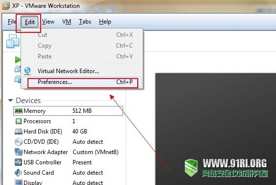
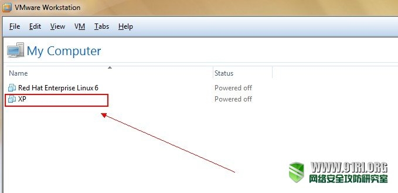
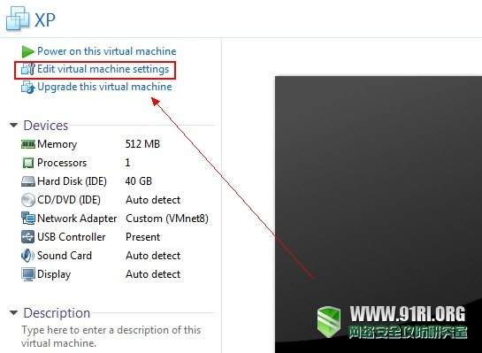
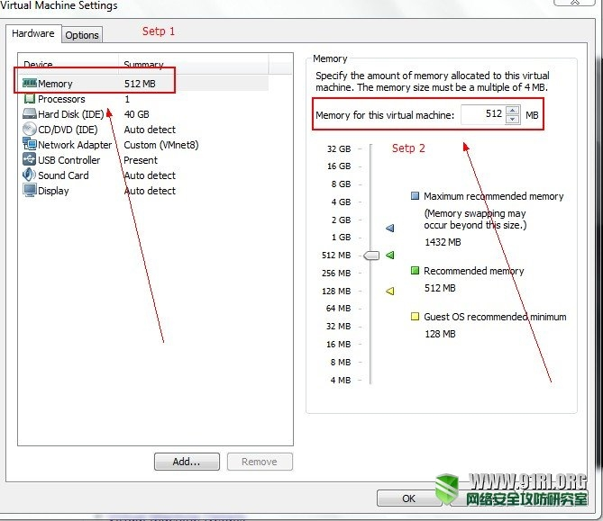

优化VMware提高虚拟机运行速度的技巧

vmware虚拟机如何设置不当的话会造成运行速度慢，并影响主机运行，甚至会出现死机。

## 1 修改preference中的选项(全局设置)

##### a 进入设置界面的方法

如下图所示：

##### b 修改虚拟机内存的使用方式(关键)

这步也是关键步骤之一，否则也会因为读硬盘而导致虚拟机速度明显下降(同时硬盘狂叫，读硬盘是虚拟机速度慢的主要原因)。选中

“Fit all virtual machinememory into reserved host RAM”。

如下图所示，这样*虚拟机*就只使用物理内存，不会读硬盘了，当然了，要保证宿主机物理内存有足够的空余供虚拟机使用，否则会出现争用。

##### c 设置priority中Input grabbed为high

## 2 单个虚拟机的设置

##### a 进入设置界面的方法如下图：

##### b 内存的设置

内存设置的原则是：所有虚拟机同时使用的最大内存上限之和不能超过宿主机系统(真实系统)的空余内存，比如我这里宿主机内存是2g，win7空闲占用 400多M，跑些软件占到1g多点。只跑一个XP虚拟机的话，分配512m的内存基本上可以保证虚拟机不会也宿主机争用内存的情况。

##### c 虚拟机高级选项设置

这里主要对下图中的两个地方进行设置：

Inputgrabbed(同上)：设置为high或者normal，我这里设置为high了。

Disablememory page trimming： 这步很关键，一定要点上，否则虚拟机会把物理内存中的一些数据同步到硬盘上去，听到虚拟机运行的时候内盘狂叫了吧？读硬盘是虚拟机慢的主要原因。

 

来源： <<https://www.91ri.org/7267.html>>