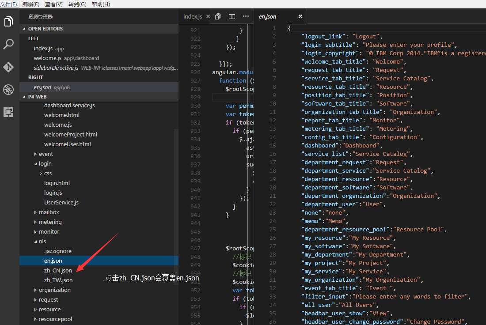
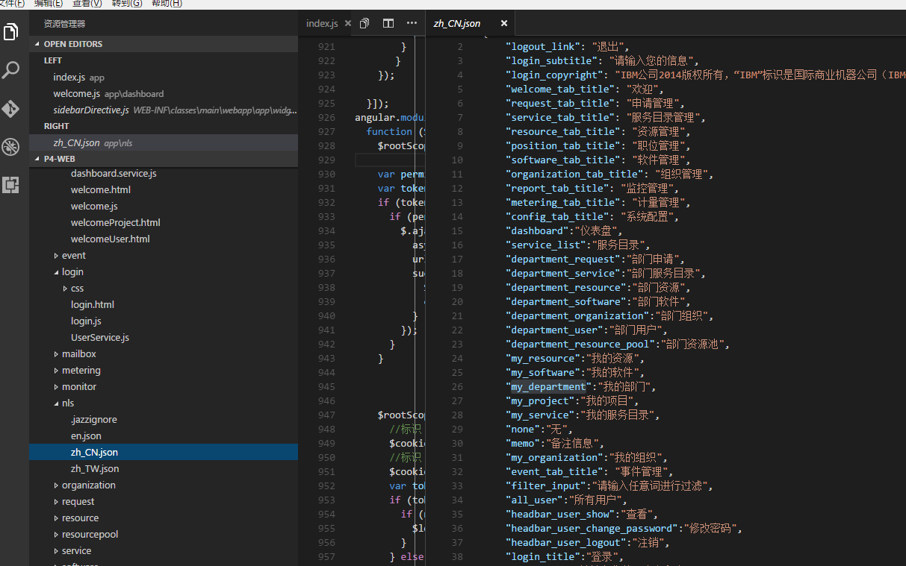
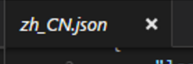
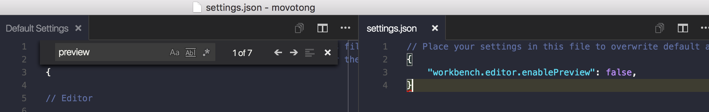

问

# [vs Code打开新的文件会覆盖窗口中的,怎么改](https://segmentfault.com/q/1010000006131199)

- [visual-studio-code](https://segmentfault.com/t/visual-studio-code)

[**wwinstay**](https://segmentfault.com/u/wwinstay) 2016年08月01日提问

- 关注 **5** 关注
- 收藏 **0** 收藏，4.7k 浏览

问题对人有帮助，内容完整，我也想知道答案0问题没有实际价值，缺少关键内容，没有改进余地





希望每次点击都打开新的而不覆盖原来的，就像sublime的ctrl+p一样

- [2016年08月01日提问](https://segmentfault.com/q/1010000006131199)
- [评论]()
- [邀请回答]()
- [编辑]()
- [更多****]()

[默认排序](https://segmentfault.com/q/1010000006131199#answers-title)[时间排序](https://segmentfault.com/q/1010000006131199?sort=created#answers-title)

## 3个回答

答案对人有帮助，有参考价值3答案没帮助，是错误的答案，答非所问

已采纳

注意到你的tab是斜体了么？如下：



> 这是因为你单击文件名的缘故，这个是“预览模式”，所以再单击其他文件时，会覆盖当前打开的文件。

如果你要每次都打开新tab，那就双击文件名好了。这个逻辑和sublime是一样的。不知道你是不是问的这个事情

补充：

预览模式是现在各类编辑器的默认功能，如果你实在不喜欢，可以关掉的，看下面：



给你配置`settings.json`里加一条：

```
"workbench.editor.enablePreview": false,
```

就关掉了，一切都会按照你的预期

- [2016年08月01日回答](https://segmentfault.com/q/1010000006131199/a-1020000006131574) · [2016年08月01日更新](https://segmentfault.com/q/1010000006131199/a-1020000006131574/revision)
- [4 评论]()
- [编辑]()

[](https://segmentfault.com/u/leftstick)

[leftstick](https://segmentfault.com/u/leftstick)23.9k 声望

答案对人有帮助，有参考价值0答案没帮助，是错误的答案，答非所问


升级版本到 1.3.1 就支持 tabs 了


ctrl+ 拆分到侧边栏 应该会好一点。 上面的描述貌似只对 侧边栏导航里面双击会打开新的tab,而ctrl+p打开的文件还是会在原tab页覆盖。


[来源： ]()<https://segmentfault.com/q/1010000006131199>