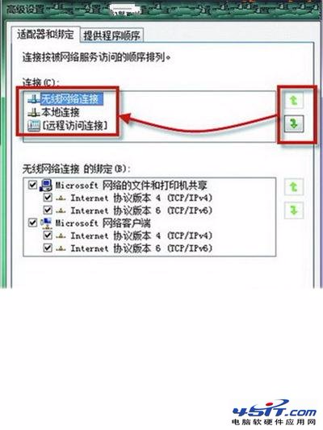

# 笔记本有线无线同时连如何设置有线网络优先

感谢 sou6 的投递 时间：2012-05-18 18:15 来源：　

　　笔记本易于携带，为我们的工作和生活带来了许多便利。但是本本在有线网络和无线网络同时连接时，系统就会优先选择使用无线网络。系统的这种默认设置，真的是不符合我们的使用习惯，毕竟有线网络的网速比无线要快一些。此时如果使用有线网络，必须得将无线网卡禁用，而以后需要使用无线网络时，还得重新启用无线网卡，这的确是非常麻烦的一件事。不过如果你本本中安装的是Win7系统，上述困扰就迎刃而解了，因为在Win7中，我们可以随时根据自己的需求调整有线网络和无线网络的优先级。

　　先右击系统托盘中的“宽带连接”图标，选择“打开网络和共享中心”，以打开“网络和共享中心”窗口;然后单击该窗口左侧的“更改适配器设置”按钮，打开 “网络连接”窗口;再按下Alt快捷键，调出菜单栏，单击菜单“高级→高级设置”，打开“高级设置”对话框的“适配器和绑定”选项卡(如图);最后在该选项卡中，选中“本地连接”，单击右边的绿色箭头，把“本地连接”提前到“无线网络连接”之前并单击“确定”按钮即可。

　　经过以上步骤的操作，当我们在有线网络和无线网络同时连接的状态下上网冲浪时，此时网络就处于有线连接的状态中了，从而让我们可以获得更为理想的上网速度。有此需求的朋友不妨一试。

来源： <http://www.3lian.com/edu/2012/05-18/28051.html>